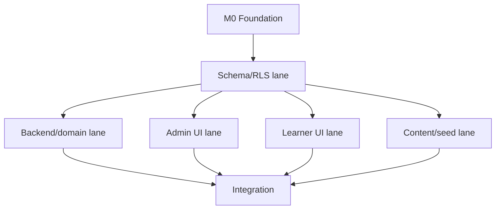

# IMPLEMENTATION_ROADMAP.md

## 1. Qoidalar

- Phase exit mezonisiz keyingi phase release hisoblanmaydi.
- Parallel ish faqat dependency yopilgach.
- Har task 0.5–2 ideal coder kunlik scope’da.
- Schema va domain qoidalari UI’dan oldin.
- Pilot content bilan mexanizm isbotlanadi, keyin 16 modulga kengayadi.

## 2. Milestonelar

### M0 — Foundation

Natija:

- repository;
- toolchain;
- local Supabase;
- CI;
- app shell;
- generated types;
- hujjatlar repo ichida.

Exit:

- clean clone’da documented commands ishlaydi;
- empty app deploy/build;
- CI green.

### M1 — Data, identity va curriculum

Natija:

- auth/profile/roles;
- specification;
- 16 module tree;
- source registry;
- content revision schema;
- assessment/mastery schema;
- RLS.

Exit:

- clean migration;
- pgTAP role matrix;
- 2026 seed valid.

### M2 — Content CMS vertical slice

Natija:

- source;
- lesson;
- Y1/Y2/Y3 editor;
- review;
- publish;
- learner published read.

Pilot:

- M01 — theory;
- M05 — calculation;
- M08 — code.

Exit:

- author→reviewer→publisher→learner E2E;
- old revision history saqlanadi.

### M3 — Learner practice

Natija:

- onboarding/dashboard;
- curriculum/lesson;
- question renderers;
- practice;
- feedback;
- errors notebook.

Exit:

- responsive Y1/Y2/Y3;
- correct answer leak yo‘q;
- offline/save error state.

### M4 — Mastery va adaptation

Natija:

- evidence;
- mastery;
- SRS;
- adaptive selector;
- readiness.

Exit:

- domain testlar;
- first/guided/retry ajralishi;
- provisional/stable/regressed E2E.

### M5 — Full mock exam

Natija:

- feasibility;
- constraint generator;
- timer/autosave;
- submit/scoring;
- results.

Exit:

- 1 000+ randomized invariant test;
- 50/120/8–35–7 exact;
- timeout/double submit/network E2E.

### M6 — Admin analytics va hardening

Natija:

- content coverage;
- import;
- item analytics;
- audit UI;
- accessibility;
- performance;
- security.

Exit:

- quality/security checklist;
- backup restore;
- staging load test.

### M7 — Content-complete release

Natija:

- M01–M16 required sources;
- ≥3 000 approved savol;
- har blueprint slot pool ≥20;
- ≥20 feasible mock combinations;
- production launch.

M14–M16 sources kelmaguncha 50-savollik production release bloklangan.

## 3. Parallel lane’lar

### Foundationdan keyin

### Ownership

- Lane DB: migration, RLS, SQL function.
- Lane Domain/API: service, selector, scoring, generator.
- Lane Admin: CMS UI.
- Lane Learner: learner UI/question renderer.
- Lane Content: seed/import/QA.
- Lane QA: test harness, E2E, security.

Bir vaqtda faqat bitta lane bir xil migration/tablega egalik qiladi.

## 4. Pilot strategiyasi

Uch modul arxitekturani turli tomonlama tekshiradi:

- M01: rich theory, atama, source;
- M05: formula va hisoblash;
- M08: code block, syntax, output reasoning.

Pilot savol target:

- har modul ≥100;
- barcha type;
- barcha cognitive;
- kamida 2 reviewer.

## 5. Release ketma-ketligi

1. Internal technical alpha — synthetic/pilot.
2. Content author alpha — CMS.
3. Closed learner beta — M01/M05/M08.
4. Informatika 35-savol beta — M01–M13.
5. Full 50-savol release candidate — M14–M16.
6. Production.

## 6. Xavf va mitigation

| Xavf | Mitigation |
|---|---|
| AI coderlar turli schema quradi | `DATABASE_SCHEMA.md`, task ownership, migration review |
| Savol banki yetmaydi | Coverage dashboard va hard feasibility |
| Noto‘g‘ri answer | Human review, source, item flag |
| Javob kaliti leak | Server DTO, RLS, leakage E2E |
| Mastery sun’iy oshadi | First-attempt evidence |
| Yangi spetsifikatsiya | Versioned specification |
| Darslik copyright | Paraphrase va private source |
| Scope o‘sadi | ADR va MVP out-of-scope |

## 7. Progress o‘lchovi

“UI necha foiz” emas:

- accepted task;
- passing acceptance criterion;
- source-backed published objective;
- feasible blueprint slot;
- critical test pass.
