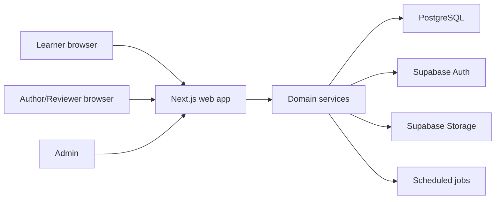
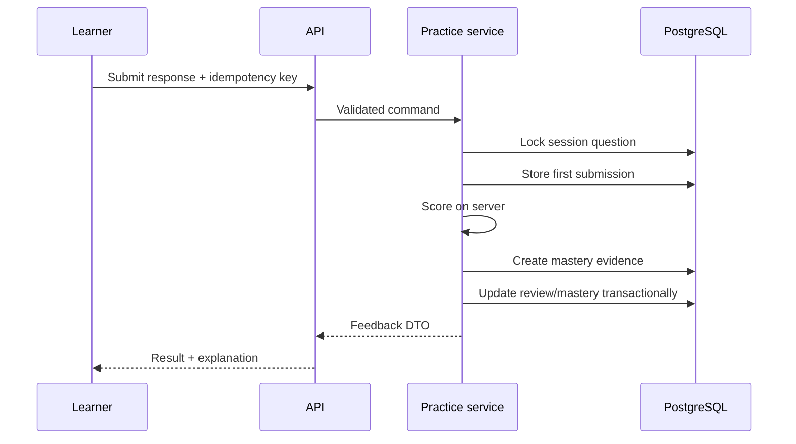

# SYSTEM_ARCHITECTURE.md

## 1. Arxitektura usuli

MVP — modular monolith:



Browser bazadagi protected domain jadvallarini to‘g‘ridan-to‘g‘ri yozmaydi. Mutationlar server service orqali o‘tadi.

## 2. Texnologiyalar

| Qatlam | Tanlov |
|---|---|
| Runtime | Node.js 24 LTS |
| Package manager | pnpm, exact lockfile |
| Web | Next.js App Router |
| Til | TypeScript strict |
| UI | React, utility CSS, accessible headless primitives |
| Validation | Zod |
| Database | PostgreSQL via Supabase |
| Auth | Supabase Auth |
| File storage | Supabase Storage |
| Migration | Supabase CLI SQL migrations |
| Unit test | Vitest |
| Database/RLS test | pgTAP |
| E2E | Playwright |
| CI | GitHub Actions yoki ekvivalent |

## 3. Domain modullari

### Identity

- profiles;
- roles;
- permission;
- session;
- audit actor.

### Specification

- specification versions;
- blueprint rules;
- module question counts;
- cognitive distribution;
- activation/archive.

### Curriculum

- modules;
- topic tree;
- prerequisites;
- learning objectives;
- mastery configuration.

### Content

- sources;
- lesson revisions;
- stimulus revisions;
- question revisions;
- review/publish workflow.

### Learning

- lesson progress;
- practice session;
- answer/feedback;
- question exposure;
- error notebook.

### Mastery

- evidence;
- mastery calculation;
- review schedule;
- regression;
- readiness estimate.

### Assessment

- diagnostic;
- checkpoint;
- review;
- mock exam assembly;
- server timer;
- scoring and result.

### Analytics

- learner aggregates;
- item analysis;
- content coverage;
- audit-safe reports.

## 4. Repository tuzilishi

```text
/
├── app/
│   ├── (public)/
│   ├── (auth)/
│   ├── (learner)/
│   ├── admin/
│   └── api/v1/
├── components/
│   ├── ui/
│   └── content/
├── features/
│   ├── auth/
│   ├── dashboard/
│   ├── learning/
│   ├── assessment/
│   └── admin/
├── domain/
│   ├── specification/
│   ├── curriculum/
│   ├── content/
│   ├── mastery/
│   └── assessment/
├── server/
│   ├── auth/
│   ├── repositories/
│   ├── services/
│   ├── jobs/
│   └── observability/
├── lib/
│   ├── validation/
│   ├── i18n/
│   ├── time/
│   └── errors/
├── supabase/
│   ├── migrations/
│   ├── tests/
│   └── seed.sql
├── tests/
│   ├── fixtures/
│   ├── integration/
│   └── e2e/
├── public/
└── docs/
```

## 5. Dependency qoidasi

Ruxsat etilgan yo‘nalish:

```text
UI → feature use-case → domain service → repository → database
```

Taqiqlangan:

- `domain/` → Next.js;
- `domain/` → Supabase client;
- component → database;
- route handler → duplicated business formula;
- admin UI → service-role secret.

## 6. Server/client chegarasi

### Server component

- dastlabki sahifa data fetch;
- curriculum va dashboard read;
- role-based route guard;
- SEO/public page.

### Client component

- interaktiv question renderer;
- timer display;
- autosave holati;
- drag/keyboard ordering;
- local optimistic UI.

### Route handler/server action

- barcha mutation;
- question assembly;
- answer scoring;
- content workflow;
- signed upload;
- admin operation.

Core domain uchun `server/services` ishlatiladi; route handler faqat auth, validation, service call va response mapping qiladi.

## 7. Asosiy request oqimlari

### Practice answer



### Mock exam

1. API specification va user’ni tekshiradi.
2. Generator deterministic seed bilan blueprint’ga mos revision ID’larni tanlaydi.
3. Session va savollar bitta transaction’da yoziladi.
4. Browserga correct answer’siz sanitized snapshot qaytadi.
5. Javoblar idempotent autosave qilinadi.
6. Submit/timeout serverda atomic finalization qiladi.
7. Natija faqat finalization’dan keyin ko‘rinadi.

### Content publish

1. Author draft revision yaratadi.
2. Static validator va duplicate scan.
3. Reviewer request.
4. Reviewer approve.
5. Publisher transaction ichida revision’ni published, parent’ni current qiladi.
6. Old current revision immutable tarix bo‘lib qoladi.

## 8. Caching

Cache qilish mumkin:

- published curriculum tree;
- public source metadata;
- published lesson sanitized content;
- static translation resources.

Cache qilinmaydi yoki user-scoped:

- exam timer;
- current answers;
- mastery;
- review queue;
- admin review state.

Specification/content publish cache invalidation event chiqaradi.

## 9. Background/scheduled jobs

MVP’da alohida message broker yo‘q. Idempotent scheduled joblar:

- due review notification state;
- nightly item analytics aggregate;
- stale draft/report;
- expired exam auto-finalization safety job;
- database backup verification signal.

Har job:

- `job_runs` jadvalida run ID;
- advisory lock;
- retry-safe;
- structured log

bilan ishlaydi.

## 10. Error handling

Domain errorlar barqaror code’ga map qilinadi:

- `AUTH_REQUIRED`
- `FORBIDDEN`
- `VALIDATION_FAILED`
- `RESOURCE_NOT_FOUND`
- `REVISION_CONFLICT`
- `SESSION_EXPIRED`
- `SESSION_FINALIZED`
- `BLUEPRINT_POOL_INSUFFICIENT`
- `IDEMPOTENCY_CONFLICT`
- `RATE_LIMITED`
- `INTERNAL_ERROR`

User-facing message o‘zbekcha, log esa context va correlation ID bilan.

## 11. Idempotency va concurrency

- Mutation endpointlar `Idempotency-Key` qabul qiladi.
- Answer save optimistic `revision` bilan.
- Exam submit `SELECT ... FOR UPDATE` yoki atomic database function bilan.
- Content update `expectedRevision` bilan.
- Duplicate publish va double scoring constraint bilan bloklanadi.

## 12. File storage

Bucketlar:

- `content-media` — published/draft image va diagrammalar;
- `source-private` — ruxsat berilgan private source fayllar;
- `avatars` — optional.

Source PDF learnerga to‘liq public URL bilan berilmaydi. Kontent media upload MIME, size va image dimension validation’dan o‘tadi.

## 13. Observability

Har request:

- `request_id`;
- user ID bo‘lsa pseudonymous actor ID;
- route;
- latency;
- status/error code

bilan structured log yozadi.

Maxsus metric:

- exam assembly failure;
- answer save failure;
- timeout finalization;
- RLS denial;
- content publish;
- job failure.

Secret, correct answer payload va raw personal data log qilinmaydi.

## 14. Scale chegarasi

MVP target:

- 10 000 registered user;
- 1 000 concurrent active learner;
- 10 000 savollik bank;
- 2 million answer event.

Bu chegarada PostgreSQL indekslari va modular monolith yetarli. Scale muammosi o‘lchanmasdan mikroservisga bo‘linmaydi.
