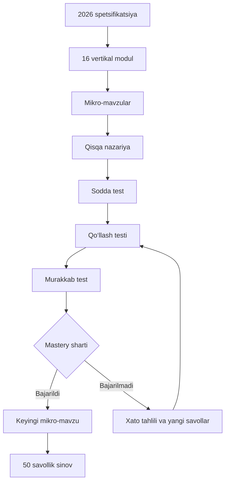

Tizimni bitta sayt emas, o‘zaro bog‘langan uchta yadro sifatida quramiz:

1. **Kontent boshqaruvi** — darslik, mavzu va savollarni kiritish.
2. **O‘rganish tizimi** — nazariya, test, xatolar va takrorlash.
3. **Attestatsiya simulyatori** — rasmiy 50 savol va 120 daqiqalik imtihon.



## 1. Platformaning asosiy bo‘limlari

### O‘quvchi qismi

* Bosh sahifa va umumiy progress.
* 16 ta vertikal modul.
* Bugungi o‘rganish rejasi.
* Qisqa nazariya.
* Y1, Y2 va Y3 testlari.
* Xatolar daftari.
* Interval takrorlash.
* 50 savollik sinov imtihoni.
* Natijalar va kuchsiz mavzular.
* “50/50 tayyorgarlik darajasi” ko‘rsatkichi.

### Kontent boshqaruv qismi

* Spetsifikatsiya versiyasini yaratish.
* Modul va mikro-mavzularni boshqarish.
* Dars yozish.
* Savol yaratish.
* Darslik va PDF sahifasini biriktirish.
* Savolni tekshiruvchi ekspertga yuborish.
* Xato yoki eskirgan savolni yangi versiya bilan almashtirish.
* Savollar statistikasi va muammoli variantlarni ko‘rish.

### Rollar

| Rol              | Vakolat                                                  |
| ---------------- | -------------------------------------------------------- |
| O‘quvchi         | O‘rganish, test va sinov topshirish                      |
| Kontent muallifi | Dars va savol tayyorlash                                 |
| Ekspert          | Mazmun, javob va manbani tekshirish                      |
| Administrator    | Foydalanuvchi, spetsifikatsiya va platformani boshqarish |

Savol muallif yozishi bilan platformaga chiqmaydi:

`Qoralama → ekspert tekshiruvi → tasdiqlangan → e’lon qilingan → arxivlangan`

## 2. Kontent tuzilishi

Har bir ma’lumot quyidagi zanjirga ega bo‘ladi:

`Spetsifikatsiya → modul → kichik bob → mikro-mavzu → dars → savollar`

Masalan:

```text
M08. Python va JavaScript
└── Python
    ├── Sintaksis va muhit
    ├── O‘zgaruvchilar
    ├── Ma’lumot turlari
    ├── Operatorlar
    ├── Shart operatorlari
    ├── Sikllar
    ├── Funksiyalar
    ├── Ro‘yxatlar
    └── Kod natijasini aniqlash
```

Har bir darsda:

* 5–10 daqiqalik qisqa nazariya;
* atamalar va muhim qoidalar;
* 1–3 ta tushuntirilgan namuna;
* 5–8 ta boshlang‘ich test;
* 8–12 ta qo‘llash testi;
* 4–6 ta murakkab test;
* xatolar asosida qayta sinov bo‘ladi.

## 3. Savol modeli

Har bir savolda quyidagi maydonlar saqlanadi:

| Maydon                | Misol                                  |
| --------------------- | -------------------------------------- |
| Modul                 | M05 — Sanoq sistemalari                |
| Mikro-mavzu           | Ikkilikdan o‘nlikka o‘tkazish          |
| Spetsifikatsiya o‘rni | 11–18-savollar sohasi                  |
| Test turi             | Y1, Y2 yoki Y3                         |
| Kognitiv daraja       | Bilish, qo‘llash, mulohaza             |
| Murakkablik           | 1–5                                    |
| Savol va variantlar   | Test tarkibi                           |
| To‘g‘ri javob         | Tekshirish kaliti                      |
| To‘liq tushuntirish   | Nima uchun to‘g‘ri/noto‘g‘ri           |
| Manba                 | Darslik, sinf va PDF sahifasi          |
| Versiya               | Dastur yoki spetsifikatsiya versiyasi  |
| Holat                 | Qoralama, tasdiqlangan, e’lon qilingan |

Kod, jadval, rasm yoki umumiy matnga bog‘langan bir nechta savol uchun alohida **stimulus** obyekti bo‘ladi.

## 4. O‘rganish mexanizmi

Mavzu darhol “o‘zlashtirildi” deb belgilanmaydi.

### Dastlabki holat

O‘quvchi yangi, ilgari ko‘rmagan savollarni mustaqil ishlaydi. Tushuntirish ko‘rilgandan keyingi javob birinchi urinish hisoblanmaydi.

### Vaqtinchalik o‘zlashtirish

Mikro-mavzu ochilishi uchun:

* kamida 15–20 ta mustaqil savol;
* umumiy natija kamida 90%;
* qo‘llash va mulohaza savollarida kamida 80%;
* xato qilingan tushunchalar bo‘yicha yangi savollardan 100% talab qilinadi.

### Barqaror o‘zlashtirish

Mavzu 3, 7, 14 va 30 kundan keyingi aralash testlarda ham muvaffaqiyatli bajarilgach barqaror o‘zlashtirilgan hisoblanadi.

Bu yerda uch xil natija ko‘rsatiladi:

* **O‘rganilmoqda**
* **Vaqtinchalik o‘zlashtirilgan**
* **Barqaror o‘zlashtirilgan**

## 5. Adaptiv savol tanlash

Oddiy testda savollar tasodifiy tashlanmaydi. Taxminan:

* 50% — kuchsiz mikro-mavzulardan;
* 25% — takrorlash muddati kelgan mavzulardan;
* 15% — yangi o‘rganilgan mavzulardan;
* 10% — kuchli mavzularni nazorat qilish uchun olinadi.

Lekin to‘liq sinovda adaptiv tanlash ishlatilmaydi. U rasmiy taqsimotni aynan takrorlaydi:

* 35 ta informatika;
* 5 ta kasb standarti;
* 7 ta umumiy pedagogika;
* 3 ta metodika;
* 8 ta bilish;
* 35 ta qo‘llash;
* 7 ta mulohaza;
* jami 120 daqiqa.

## 6. Texnik arxitektura

Dastlab alohida mobil ilova shart emas. Telefon va kompyuterda ishlaydigan responsive web/PWA yetarli.

### Tavsiya etiladigan asos

* **Frontend:** Next.js va TypeScript.
* **Ma’lumotlar bazasi:** PostgreSQL.
* **Login va fayllar:** Supabase Auth va Storage.
* **Server:** Next.js server qismi yoki alohida API.
* **Avtomatik test:** Playwright.
* **Keyinchalik:** mobil ilova uchun ayni API’dan foydalanish.

PostgreSQL savollarni asosiy relyatsion jadvallarda, Y2/Y3 kabi o‘zgaruvchan qismlarni esa `jsonb` formatida saqlash imkonini beradi; `jsonb` indekslanadi va katta savol bankida qidiruv uchun qulay. [PostgreSQL rasmiy hujjati](https://www.postgresql.org/docs/current/datatype-json.html)

O‘quvchi faqat o‘z natijalarini ko‘rishi uchun Supabase Auth bilan Row Level Security ishlatamiz. Bu foydalanuvchi darajasidagi ma’lumotlarni bazaning o‘zida cheklaydi. [Supabase Auth](https://supabase.com/docs/guides/auth), [Row Level Security](https://supabase.com/docs/guides/database/postgres/row-level-security)

Login, test topshirish, vaqt tugashi va natija hisoblash kabi asosiy jarayonlar avtomatik brauzer testlari bilan tekshiriladi. [Playwright rasmiy hujjati](https://playwright.dev/docs/writing-tests)

## 7. Asosiy ma’lumotlar bazasi

```text
users
roles
specification_versions
modules
subtopics
lessons
sources
source_references
questions
question_versions
options
stimuli
attempts
attempt_answers
mastery_records
review_queue
mock_exams
mock_exam_questions
```

Muhim tamoyil: darslik nomi va sahifasi savol matnining ichiga yozib qo‘yilmaydi. U `source_references` orqali ulanadi. Shunda bitta manba o‘zgarsa, tegishli savollarning hammasini topish mumkin.

## 8. Qurish bosqichlari

### 1-bosqich — kontent skeleti

* 2026 spetsifikatsiyasini bazaga joylash.
* 16 modul va barcha mikro-mavzularni yaratish.
* 13 darslik sahifalarini bog‘lash.
* Yetishmaydigan konstruktlarni belgilash.
* Savol yozish standarti va ekspert tekshiruvini tayyorlash.

### 2-bosqich — texnik prototip

Uch xil modul bilan mexanizmni sinaymiz:

* axborot — nazariy savollar uchun;
* sanoq sistemalari — hisoblash uchun;
* Python — kodli savollar uchun.

Prototipda:

* login;
* dars;
* Y1/Y2/Y3;
* tushuntirish;
* progress;
* mastery;
* xatolar daftari;
* admin panel ishlashi kerak.

### 3-bosqich — to‘liq informatika qismi

* 13 ta informatika modulini kiritish.
* Kamida 3 000 ta ekspert tekshirgan savol.
* Har bir savolga manba va izoh.
* 35 savollik mutaxassislik sinovlari.

### 4-bosqich — 50 savollik platforma

* Kasb standarti.
* Umumiy pedagogika.
* Informatika metodikasi.
* 50 savol/120 daqiqalik imtihon.
* Kamida 20 ta to‘liq, muvozanatlangan sinov kombinatsiyasi.

### 5-bosqich — analitika

* Qaysi mavzuda ko‘p xato qilinmoqda.
* Qaysi savol haddan tashqari oson yoki qiyin.
* Qaysi noto‘g‘ri variant ishlamayapti.
* Taxminiy imtihon natijasi.
* 50/50 uchun qolgan bilim bo‘shliqlari.

## 9. Birinchi quriladigan narsa

Birinchi bo‘lib chiroyli bosh sahifa emas, quyidagi to‘rtta asosni yaratamiz:

1. To‘liq o‘quv daraxti.
2. Ma’lumotlar bazasi sxemasi.
3. Savol va darsning aniq formati.
4. Admin paneldagi kontent tayyorlash jarayoni.

Shular to‘g‘ri qurilsa, dizayn va o‘quvchi kabinetini keyin tez ishlab chiqamiz. Eng yaqin navbatdagi ish — **16 modulni barcha mikro-mavzularigacha ochib, platformaning yakuniy kontent daraxtini tuzish**.
