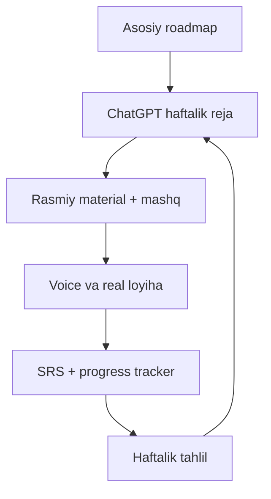
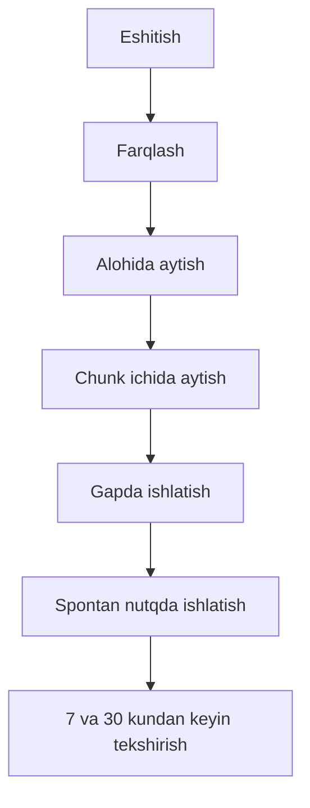
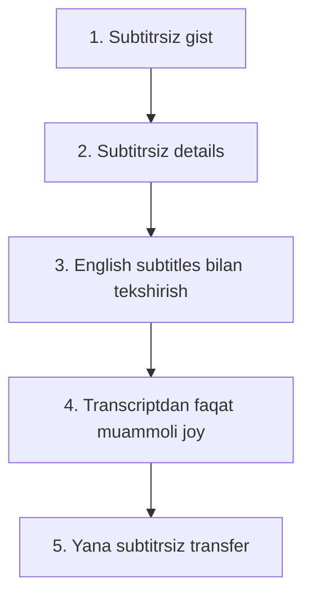
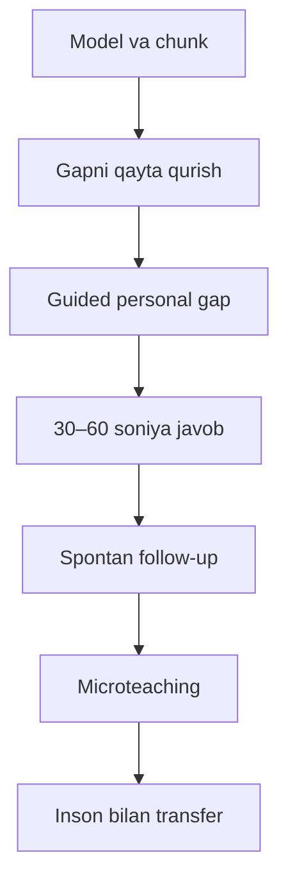
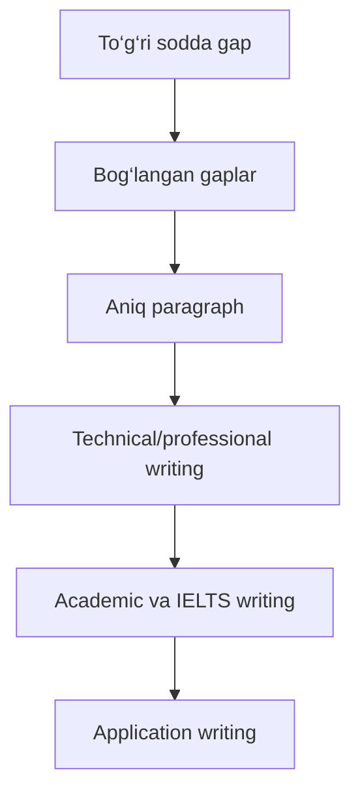
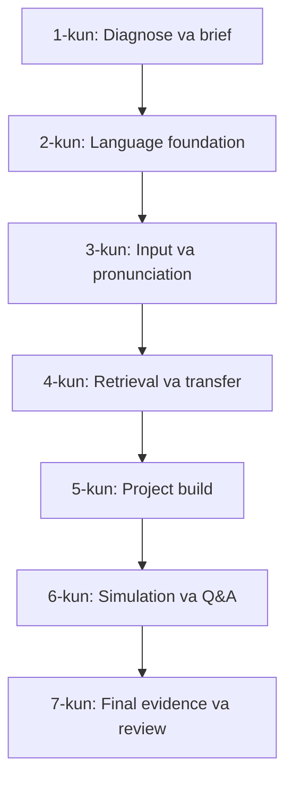

# Ingliz tili darajasi

> Manba: https://chatgpt.com/share/6a608f38-a714-83ed-9c18-7e584ebec07a
> Eksport qilingan: 2026-07-22T11:51:20.267Z
> Texnik manba: https://chatgpt.com/backend-api/share/6a608f38-a714-83ed-9c18-7e584ebec07a
> Faqat suhbatda ko‘ringan Sarvar va ChatGPT xabarlari kiritildi; ichki reasoning, tool loglari va yashirin metadata chiqarib tashlandi.

---

## Sarvar

Men ingliz tilini o'rganishni hohlayman, meni darajam qanday to'liq hisobot ber.

---

## ChatGPT

Oldingi yozma va og‘zaki topshiriqlaringizdagi dalillarni birlashtirib, har bir ko‘nikmani alohida baholayman. Buning uchun avvalgi o‘quv natijalaringizni izchil qo‘llashga yordam beradigan shaxsiy kontekst yo‘riqnomasidan foydalanaman; bahoni oshirib ham, pasaytirib ham ko‘rsatmayman.

---

## ChatGPT

# Sarvarning ingliz tili darajasi bo‘yicha hisobot

## Asosiy xulosa

**Hozirgi amaliy o‘quv darajangiz: Developing A2 (Elementary).**

Bu shuni anglatadi:

- A1 poydevoringiz ancha mustahkam;
- A2 bilimlaringiz mavjud, ammo erkin foydalanish hali barqaror emas;
- ayrim test va o‘qish vazifalarida B1 elementlarini taniysiz;
- speaking va mustaqil writing darajangiz receptive skills’dan pastroq.

**B1 darajasi hali tasdiqlanmagan.** Sizni A1 deb boshlash esa haddan tashqari past baho bo‘ladi.

## Dalillar

LangCoach testingiz:

| Bo‘lim | Natija |
|---|---:|
| A1 | 10/10 |
| A2 | 9/9 |
| B1 | 9/12 |
| B2 | 2/12 |
| C1 | 2/12 |
| Umumiy | **32/55 — 58%** |
| Test xulosasi | **A2 / Elementary** |

Bu test grammar, vocabulary va language recognition haqida foydali dalil berdi. Ammo u real speaking, pronunciation, extended writing va listening’ni yetarli tekshirmagan.

## Ko‘nikmalar profili

| Ko‘nikma | Hozirgi taxminiy daraja | Ishonchlilik |
|---|---|---|
| Grammar recognition | **A2+/B1−** | O‘rtacha–yuqori |
| Grammar in production | **A2 developing** | Yuqori |
| Passive vocabulary | **A2+/B1−** | O‘rtacha |
| Active vocabulary | **A2** | O‘rtacha |
| Reading | **A2+/B1− provisional** | Past–o‘rtacha |
| Listening | **A2 provisional** | Past |
| Writing | **A2 developing** | O‘rtacha–yuqori |
| Speaking | **A1+/early A2** | O‘rtacha |
| Pronunciation | **Hali aniqlanmagan** | Past |
| Umumiy working level | **Developing A2** | O‘rtacha–yuqori |

*Provisional* — hozircha vaqtinchalik baho; yangi mustaqil test bilan tasdiqlanishi kerak.

## Kuchli tomonlaringiz

- Oddiy savol va ko‘rsatmalarni odatda tushunasiz.
- O‘zingiz, oilangiz, kundalik hayotingiz va kasbingiz haqida gapira olasiz.
- Teaching va Computer Science bo‘yicha lug‘atingiz umumiy lug‘atingizdan kuchliroq.
- Loops va binary addition kabi mavzularni sodda ingliz tilida tushuntira olgansiz.
- Present Simple, Present Continuous, Past Simple va Present Perfect qoidalarini qisman bilasiz.
- A1 va A2 darajadagi to‘g‘ri variantlarni yaxshi taniysiz.
- Xatolardan keyin to‘g‘ri modelni tushunish qobiliyatingiz yaxshi.

Asosiy ijobiy belgi: **tushunish va tanib olish qobiliyatingiz erkin gapirishdan kuchliroq.**

## Asosiy zaifliklar

### 1. Subject–verb agreement

Takrorlangan xatolar:

- `She go` → **She goes**
- `He don't` → **He doesn't**
- `We goes` → **We go**

Bu A2 poydevoridagi eng muhim bo‘shliqlardan biri.

### 2. Auxiliary va verb form

- `Does he works?` → **Does he work?**
- `He doesn't studies.` → **He doesn't study.**
- `I have tought.` → **I have taught.**

Qoidani ba’zan taniysiz, lekin gap tuzayotganda doimiy qo‘llay olmaysiz.

### 3. Articles

`a`, `an`, `the` va artiklsiz shakl o‘rtasidagi tanlov hali barqaror emas.

### 4. Prepositions va collocations

- `prepare homework to students` → **prepare homework for students**
- `discuss about something` → **discuss something**
- `on the walk` → **on foot**
- `experience from Computer Science` → **experience in Computer Science**

Bu yerda faqat grammatika emas, tabiiy so‘z birikmalarini ham o‘rganish kerak.

### 5. Sentence structure

Ba’zi jumlalarda:

- so‘z tartibi buziladi;
- mustaqil bo‘lmagan fragmentlar paydo bo‘ladi;
- bir nechta fikr noto‘g‘ri bog‘lanadi;
- zamonlar o‘rtasida sababsiz almashish kuzatiladi.

### 6. Active vocabulary

Siz ko‘p so‘zlarni ko‘rganingizda taniysiz, lekin gapirayotganda kerakli so‘zni tez va tabiiy ishlatish qiyinroq. Ayniqsa collocations va lexical chunks yetishmaydi.

### 7. Fluency va pronunciation

Oldingi speaking namunalariga ko‘ra:

- pauza va qayta boshlashlar bor;
- gapni tuzish uchun vaqt kerak;
- nutq asosan tushunarli.

Lekin `/θ/`, `/ð/`, `/w/`, `/v/`, final sounds, word stress, rhythm va intonation bo‘yicha yetarli audio dalil yo‘q. Shuning uchun pronunciation’ga aniq CEFR darajasi berish halol bo‘lmaydi.

## Nega A1 emas?

Chunki siz:

- A1 testida 10/10 va A2 testida 9/9 olgansiz;
- faqat yodlangan iboralar bilan cheklanib qolmaysiz;
- kasbingiz va hayotiy tajribangiz haqida bir nechta bog‘langan gap tuza olasiz;
- oddiy texnik tushunchalarni tushuntira olasiz;
- o‘tgan, hozirgi va tajriba haqida turli zamonlardan foydalanishga harakat qilasiz.

Demak, **A1 bosqichidan o‘tgansiz**.

## Nega hali B1 emas?

B1 darajasida kishi asosiy grammatikani mustaqil nutqda ancha barqaror boshqarishi, tanish mavzuda bog‘langan matn yaratishi va tayyorgarliksiz suhbatni davom ettirishi kerak.

Sizda esa hali:

- third-person `-s`;
- `do/does`;
- asosiy verb forms;
- articles va prepositions;
- gap tuzilishi;
- tabiiy iboralar;
- speaking fluency

kabi fundamental jihatlarda takroriy xatolar mavjud.

Shuning uchun **B1 savollarini tanish — B1 darajada erkin ishlatish degani emas**.

## IELTS bo‘yicha xulosa

Hozirgi dalillardan IELTS band chiqarib bo‘lmaydi. Buning uchun IELTS formatidagi:

- Listening;
- Academic Reading;
- Writing Task 1 va Task 2;
- Speaking Part 1–3

alohida tekshirilishi kerak. Hozir sizga IELTS bali aytish taxminiy va ishonchsiz bo‘lardi.

## Yakuniy profil

```text
Recognition:        A2+ → B1−
Independent use:    A1+ → A2
Overall placement:  DEVELOPING A2
Immediate target:   Secure A2
Next major target:  Functional B1
Long-term targets:  Confident B2 → C1 → IELTS
```

Birinchi navbatdagi maqsad — A2 mavzularini shunchaki qayta o‘qish emas, ularni **writing va speaking’da avtomatik hamda barqaror ishlatish**.

## Fresh diagnostic — Task 1: Independent Writing

Please write **100–130 words**. Do not use a translator or grammar checker.

**Topic: My work as a Computer Science teacher**

Include:

- where and what you teach;
- what you usually do during a lesson;
- one challenge you have at work;
- one professional goal for the future.

Write naturally. I will assess task achievement, organisation, vocabulary, grammar and independent language control.

---

## Sarvar

Meni ingliz tilini o'rganishdagi talablarim, istaklarim, hohishlarim ,psixologiyam, qobiliyatlarim, xulq atvorim, umuman olganda barchasini qadamma qadam mendan so'rab, men haqida to'liq ma'lumotga ega bo'lib, meni 100% xulq  men uchun individual tayyorlanish rejasini ishlab chiqishingni hohlayman.  Mani qanday tushunding.

---

## ChatGPT

Avvalgi suhbatlardan allaqachon bilgan ma’lumotlarimni yig‘ib olaman, shunda sizdan bir xil savollarni qayta so‘ramayman. Buning uchun shaxsiy kontekst yo‘riqnomasidan foydalanaman; keyin yetishmayotgan jihatlarni bittadan savol bilan aniqlaymiz.

---

## ChatGPT

## Sizni shunday tushundim

Sizga hozirning o‘zida oddiy “haftalik ingliz tili rejasi” tuzib berishimni xohlamayapsiz. Avval men **siz qanday o‘quvchi ekaningizni chuqur o‘rganishim**, keyin aynan sizga mos tizim yaratishim kerak.

Buning uchun:

1. Sizdan **bittadan, qadamma-qadam savol** so‘rayman.
2. Oldingi suhbatlarda bergan ma’lumotlaringizni qayta so‘ramayman.
3. Faqat aytganlaringizga emas, amaliy topshiriqlardagi xulqingiz va natijalaringizga ham qarayman.
4. Quyidagi jihatlarni aniqlayman:

   - haqiqiy maqsad va ustuvorliklar;
   - barcha til ko‘nikmalaridagi real daraja;
   - kuchli va zaif qobiliyatlar;
   - xotira va yangi ma’lumotni o‘zlashtirish xususiyatlari;
   - motivatsiya va intizom;
   - charchash, zerikish va kechiktirish sabablari;
   - xato qilishdan qo‘rqish yoki speaking’dagi hayajon;
   - qaysi feedback sizni rivojlantirishi yoki aksincha, tushkunlikka tushirishi;
   - vaqt, ish, oila va energiya bilan bog‘liq sharoitlar;
   - samarali dars uzunligi va yuklama;
   - vizual, audio, matn va amaliy mashqlar orasidagi haqiqiy samaradorlik;
   - mustaqil ishlash va nazoratga ehtiyoj;
   - odatlar, rag‘batlantirish va SRS tizimi;
   - professional, classroom va Computer Science English ehtiyojlari.

5. O‘zingiz aytgan “menga vizual usul yoqadi” kabi fikrlarni ham amalda tekshiraman. Chunki inson yoqtirgan usul har doim ham u uchun eng samarali usul bo‘lavermaydi.
6. Yetarli dalil yig‘ilgach, siz uchun **Individual Learner Profile** va **English Mastery Plan** yarataman.
7. Reja tugallangan, o‘zgarmaydigan hujjat bo‘lmaydi: real natijalaringiz asosida yangilanib boradi.

## Siz haqingizda hozir bilganlarim

Hozircha quyidagi muhim talablaringiz aniq:

- yakuniy maqsadingiz — avval kuchli poydevor, keyin B2, C1 va **IELTS Academic 7.0+**;
- hech bir IELTS ko‘nikmasi 6.5 dan past bo‘lmasligi kerak;
- ingliz tilida tabiiy gapirish va Computer Science’ni ishonch bilan o‘qitishni xohlaysiz;
- barcha to‘rtta ko‘nikma boshidan parallel rivojlanishi, speaking’ga esa ko‘proq vaqt ajratilishi kerak;
- natija real dalilga asoslanishi, baholar oshirib ko‘rsatilmasligi kerak;
- darslar aniq, vizual, amaliy va natijasi ko‘rinadigan bo‘lishi kerak;
- professional reading va listening manbalari hamda tayyor to‘g‘ridan-to‘g‘ri havolalar kerak;
- vocabulary, grammar, pronunciation va takroriy xatolar SRS orqali qaytarilishi kerak;
- daftarga faqat eng muhim ma’lumotlar yozilishi kerak;
- mayda typo sababli dars to‘xtab qolmasligi kerak;
- speaking testida gapingiz bo‘linmasligi, tuzatishlar javob tugagandan keyin berilishi kerak;
- bir vaqtda eng muhim uchta xatoga e’tibor berish sizga mos;
- Core Academy 📚, Vocabulary Lab 🧠 va Speaking Lab 🗣️ alohida ishlashi kerak;
- taxminiy boshlang‘ich profilingiz **Developing A2**, lekin yakuniy daraja yangi mustaqil diagnostika bilan tasdiqlanishi kerak.

Men sizni “100% bilaman” deb da’vo qilmayman. Ammo savollar, diagnostika, kuzatish va bir necha haftalik real natijalarni birlashtirib, **juda yuqori aniqlikdagi individual tizim** yaratishimiz mumkin.

### 1-savol — ichki motivatsiya

**Agar ingliz tilingiz kuchli darajaga chiqsa, hayotingizdagi eng muhim qanday o‘zgarish sodir bo‘ladi?**

Javobingizni erkin va batafsil yozing. Hozircha faqat shu savolga javob bering.

---

## Sarvar

1. Agar ingliz tilini 7.0+ chiqsa magistratura o'qigani ga chet elga ketmoqchiman. Iloji bolsa hayotim biror havosi suvi toza rivojlangan eng yaxshi davlatda o'tkazmoqchiman. Hech bo'lmaganda istalgan manbadab erkin foydalana olish kalitiga ega bo'laman bu men uchun oltin kalitdek gap.

---

## ChatGPT

Javobingizdan muhim xulosa chiqdi: ingliz tili siz uchun shunchaki fan yoki sertifikat emas — u **hayotingizni o‘zgartiradigan vosita**.

Profilingizga quyidagilarni yozib oldim:

- **Amaliy maqsad:** IELTS Academic 7.0+ olish.
- **Ta’lim maqsadi:** xorijda magistraturada o‘qish.
- **Hayotiy maqsad:** havosi va suvi toza, rivojlangan davlatda yashash imkoniyatiga ega bo‘lish.
- **Intellektual maqsad:** ingliz tilidagi istalgan manbadan erkin foydalanish.
- **Shaxsiy ma’no:** ingliz tili siz uchun yangi imkoniyatlarni ochadigan **“oltin kalit”**.
- **Motivatsiya turi:** tashqi natijalar — IELTS, magistratura va ko‘chish; ichki natija — bilim va axborot erkinligi.

Bu kuchli motivatsiya, lekin uzoq yo‘lda uning qanchalik barqarorligini ham aniqlashimiz kerak.

### 2-savol — motivatsiya barqarorligi

**Faraz qiling, IELTS 7.0 olasiz, lekin ayrim sabablar tufayli uch yil davomida chet elga keta olmaysiz. Shunday vaziyatda ham ingliz tilini hozirgidek jiddiy o‘rganishda davom etarmidingiz? Nima uchun?**

---

## Sarvar

Yo'q menimcha sababi agar 3 yilgcha keta olmasan ozbekistonda magistraturaga topshirardim.  bu keyin doktaranturaga bo'lsa ham chet elga ketardim.

---

## ChatGPT

Bu javob motivatsiyangiz **faqat yaqin muddatda chet elga ketishga bog‘liq emasligini** ko‘rsatdi.

Profilga qo‘shdim:

- Rejangiz moslashuvchan: xorij bo‘lmasa, O‘zbekistonda magistratura.
- Uzoq muddatli maqsad saqlanadi: keyinchalik doktorantura uchun xorijga chiqish.
- Ingliz tili siz uchun vaqtinchalik imtihon emas, uzoq muddatli investitsiya.
- Bir yo‘l yopilsa, maqsaddan voz kechmay, boshqa yo‘l izlashga moyilsiz.
- Bu **qat’iyat va kechiktirilgan natijaga sabr qilish qobiliyati** borligini taxmin qilishga imkon beradi. Buni keyingi javoblar va real o‘qish jarayonida tekshiramiz.

### 3-savol — oldingi urinishlardagi to‘siq

**Oldin ingliz tilini muntazam o‘rganishga uringan paytlaringizda davomiylikni yo‘qotishingizga yoki o‘qishni to‘xtatishingizga eng ko‘p nima sabab bo‘lgan?**

---

## Sarvar

Aniq rejim yo'q ligi, mana bu vaqtgacha mana bu vazifani qilish kerak bu seni aniq maqsadingga olib boradi degan qatiy rejim yo'qligi va shu rejimga o'zim ham ishonishim kerakligi, natijalarimni ko'rib turolmasligim motivatsiyamni tushurardi.

---

## ChatGPT

Bu juda muhim javob. Muammoingiz ko‘proq **motivatsiya yetishmasligi emas, tizimga ishonch va aniqlik yetishmasligi** bo‘lgan.

Profilingizga quyidagilarni qo‘shdim:

- Sizga aniq kunlik va haftalik rejim kerak.
- Har bir vazifada muddat va tugallanish mezoni bo‘lishi kerak.
- “Bu topshiriq meni maqsadimga qanday yaqinlashtiradi?” degan savolga tushunarli javob kerak.
- Rejaga ishonishingiz uchun uning mantiqi ochiq ko‘rsatilishi kerak.
- Natijalar ko‘rinmasa, motivatsiyangiz pasayadi.
- Shuning uchun sizga CEFR/IELTS ko‘rsatkichlari, skill progress, takroriy xatolar va bajarilgan ishlarni ko‘rsatadigan halol progress tizimi kerak.
- Reja faqat va’da bermasligi, o‘z samaradorligini natijalar bilan isbotlashi kerak.

Demak, kelajakdagi tizimda quyidagi zanjir ko‘rinib turadi:

**Bugungi vazifa → haftalik ko‘nikma → CEFR bosqichi → IELTS talabi → asosiy hayotiy maqsad**

### 4-savol — nazorat va javobgarlik

**Tasavvur qiling, rejalashtirilgan darslarni ketma-ket ikki kun bajarmadingiz. Shunday vaziyatda men qanday munosabat bildirsam, siz o‘qishga qaytishingiz osonroq bo‘ladi: qat’iy talab qilish, sababni tahlil qilib rejani moslashtirish, kichik “qaytish vazifasi” berish yoki boshqa usul?**

---

## Sarvar

1. Motivatsiyamni eslatish
2. Natijalarimni ko'rsatish
3. Yaxshilab urishib berish va qat'iy talab qilish.

---

## ChatGPT

Tushundim. Sizga yumshoq tasalli emas, **maqsadni eslatadigan va javobgarlikni talab qiladigan murabbiy** kerak.

Agar vazifa bajarilmasa, tiklanish tartibi shunday bo‘ladi:

1. Nima uchun boshlaganingizni eslataman.
2. Oldingi natijalaringiz va yo‘qotayotgan imkoniyatingizni aniq ko‘rsataman.
3. Vaziyatni ochiq va qat’iy baholayman.
4. Muddatli “qaytish vazifasi” beraman.
5. U bajarilmaguncha bajarilgandek ko‘rsatmayman.

Men talabchan bo‘laman, lekin sizni haqorat qilmayman, kamsitmayman va boshqalar bilan solishtirmayman. **Xulq va bajarilmagan majburiyatni tanqid qilaman — shaxsiyatingizni emas.**

Masalan:

> “Sarvar, ikki kunlik vazifa bajarilmadi. Bu siz aytgan IELTS va magistratura maqsadiga mos harakat emas. Oldin erishgan natijalaringiz bunga qodir ekaningizni ko‘rsatadi. Bugun soat ___ gacha 20 daqiqalik qaytish vazifasini bajarishingiz kerak.”

### 5-savol — qat’iylik uslubi

**Qat’iy feedback olganingizda qaysi uslub sizga kuchliroq ta’sir qiladi: sovuqqon fakt va muddat, hissiy ruhlantirish, ball/natijadagi yo‘qotishni ko‘rsatish yoki ularning aralashmasi?**

---

## Sarvar

aralashmasi

---

## ChatGPT

Qayd qildim: sizga **aralash nazorat uslubi** mos.

Vazifa bajarilmasa, feedback tarkibi:

- asosiy maqsadingizni hissiy jihatdan eslatish;
- real progress va yo‘qotishni raqamlar bilan ko‘rsatish;
- vaziyatni bahonasiz, ochiq aytish;
- qat’iy muddat belgilash;
- kichik, ammo majburiy qaytish vazifasi berish.

### 6-savol — real o‘qish vaqti

**Dushanbadan jumagacha qaysi vaqtda chalg‘imasdan o‘qish uchun eng ko‘p kuch va imkoniyatingiz bo‘ladi? Aniq vaqt oralig‘ini yozing, masalan: `06:30–07:15` yoki `21:00–22:00`.**

---

## Sarvar

17:00 22:00

---

## ChatGPT

Demak, ish kunlari o‘qish imkoniyatingiz **17:00–22:00 oralig‘ida**. Ammo bu besh soatning hammasini ingliz tiliga ajratish real bo‘lmasligi mumkin: ish, ovqatlanish va oilaviy vaqt ham bor.

### 7-savol — himoyalangan vaqt

**17:00–22:00 orasida deyarli har kuni faqat ingliz tili uchun ajrata oladigan aniq 60–90 daqiqalik vaqtni belgilang. Masalan: `20:30–22:00`.**

---

## Sarvar

17:30-19:00

---

## ChatGPT

Qayd qilindi:

- **Dushanba–juma:** 17:30–19:00
- Kunlik himoyalangan vaqt: **90 daqiqa**
- Haftalik imkoniyat: **7,5 soat**

Bu vaqtni keyinchalik 90 daqiqa uzluksiz ishlash yoki qisqa tanaffusli bloklarga ajratishni alohida aniqlaymiz.

### 8-savol — shanba kuni

**Shanba kuni boshqa maktabda ishlashingizni hisobga olsak, ingliz tili uchun qaysi aniq vaqt oralig‘ini muntazam ajrata olasiz?**

---

## Sarvar

har kuni mana shu vaqtlarni ajarata olaman 17:30-19:00

---

## ChatGPT

Tushundim. Asosiy jadval:

- **Har kuni:** 17:30–19:00
- **Kunlik vaqt:** 90 daqiqa
- **Haftalik jami:** **10,5 soat**

Har kuni bir xil og‘ir dars bo‘lmaydi: ayrim kunlar intensiv, ayrimlari yengilroq review, speaking yoki SRS kuni bo‘lishi mumkin. Jadvalning amalda qanchalik barqarorligini dastlabki haftalarda tekshiramiz.

### 9-savol — favqulodda minimal dars

**Juda charchagan yoki band bo‘lgan kuningizda darsni butunlay tashlab yubormaslik uchun minimal majburiy variant qancha bo‘lsin: 15, 30 yoki 45 daqiqa?**

---

## Sarvar

45 daqiqa.

---

## ChatGPT

Qayd qilindi:

- **Standart dars:** 90 daqiqa
- **Favqulodda minimal dars:** 45 daqiqa
- 45 daqiqa faqat haqiqatan band yoki juda charchagan kunlar uchun; odatiy rejaga aylanmasligi kerak.
- Hatto qiyin kunda ham o‘qish zanjiri uzilmaydi.

Bu sizning o‘zingizdan ancha yuqori talab qo‘yishingizni ko‘rsatadi. Uning uzoq muddatda real ishlashini natijalar orqali tekshiramiz.

### 10-savol — chalg‘ituvchi omillar

**17:30–19:00 oralig‘ida darsingizni buzishi ehtimoli eng yuqori bo‘lgan narsa nima: telefon, ijtimoiy tarmoqlar, ish, oila, charchoq yoki boshqa sabab?**

---

## Sarvar

Hammasi bo'lsihi mumkin

---

## ChatGPT

Demak, sizdagi asosiy xavf bitta omil emas — **bir nechta chalg‘ituvchi omil bir vaqtda paydo bo‘lishi mumkin**. Rejada har biri uchun alohida himoya mexanizmi kerak bo‘ladi:

- telefon va ijtimoiy tarmoqlar;
- tugallanmagan ishlar;
- oilaviy ehtiyojlar;
- jismoniy yoki aqliy charchoq.

Lekin birinchi navbatdagi xavfni real tajriba asosida aniqlashimiz kerak.

### 11-savol — eng kuchli to‘siq

**Oxirgi bir hafta ichida shaxsiy rejangizni bajarishga eng ko‘p xalaqit bergan faqat bitta omilni tanlang: telefon, ish, oila, charchoq yoki boshqa sabab.**

---

## Sarvar

telefon

---

## ChatGPT

Asosiy chalg‘ituvchi omil: **telefon**.

Bu muammoni faqat iroda bilan emas, o‘qish vaqtida telefon bilan bog‘liq aniq qoida orqali boshqaramiz. Keyinchalik 17:30–19:00 uchun alohida “focus protocol” tuzamiz.

### 12-savol — telefon odati

**Telefonda aynan qaysi ilova yoki faoliyat vaqtingizni eng ko‘p oladi? Faqat eng asosiy bittasini ayting.**

---

## Sarvar

you tube shorts

---

## ChatGPT

Asosiy raqamli to‘siq: **YouTube Shorts**. Qisqa videolar o‘qishdan oldin yoki tanaffus paytida ochilsa, 90 daqiqalik darsning boshlanishi kechikishi va diqqatning uzoq vazifaga qaytishi qiyinlashishi mumkin.

### 13-savol — telefon qoidasi

**17:25–19:00 oralig‘ida qaysi qoidaga rostdan ham amal qila olasiz?**

1. Telefonni boshqa xonada qoldirish.
2. YouTube’ni vaqtincha bloklash.
3. Telefonni yoningizda saqlash, lekin faqat dars uchun ishlatish.
4. Boshqa usul.

---

## Sarvar

YouTube’ni vaqtincha bloklash.

---

## ChatGPT

Qayd qilindi. Kelajakdagi rejada quyidagi qoida bo‘ladi:

**17:25 — YouTube bloklanadi → 17:30 dars boshlanadi → 19:00 blok ochiladi.**

Bu qoida faqat Shorts emas, butun YouTube’ga tegishli bo‘ladi. Dars uchun YouTube videosi kerak bo‘lsa, men bergan aniq havola orqali ochiladi va tavsiya lentasi ko‘rilmaydi.

### 14-savol — dars boshidagi energiya

**Odatda ish kunlari soat 17:30 da jismoniy va aqliy energiyangizni 1 dan 10 gacha nechaga baholaysiz?**

`1 = juda charchagan`, `10 = juda tetik`.

---

## Sarvar

8/10

---

## ChatGPT

Qayd qilindi: **17:30 dagi odatiy energiya — 8/10**.

Bu yaxshi o‘quv oynasi. Demak, darsning boshiga grammar explanation emas, balki eng ko‘p diqqat talab qiladigan **speaking, writing, listening yoki active recall** vazifalarini joylashtirish mumkin. Ammo bu bahoni amaliy darslarda ham tekshiramiz.

### 15-savol — diqqat davomiyligi

**Tanaffussiz bitta vazifaga sifatli e’tibor qarata oladigan real vaqtingiz qancha: 25, 40, 60 yoki 90 daqiqa?**

---

## Sarvar

bitta vazifaga vaqt ajratishim mumkin bo'lgan vaq uni qiziqligiga bog'liq agar kirib ketsam kun bo'yi ham chalg'imasdan qilishim kumkin. Masalan AI bilan kod yozishga kunlab vaqt sarflay olaman chalg'imay. meni diqqatim e'tiborim qaratilgan narsa meni qanchalik o'ylantira olishi o'ziga jalb qilishiga bog'liq. Sezdingni sen bilan juda uzoq vaqtlar tiinmay ingliz tilini o'rganish bo'yicha tadqiqot qilayapman ba'zida uzmay 1 kunlab

---

## ChatGPT

Ha, buni sezdim. Sizda oddiy “25 yoki 40 daqiqalik diqqat” modeli ishlamasligi mumkin. Diqqatingiz ko‘proq **qiziqish va intellektual muammoga bog‘liq**:

- mavzu sizni o‘ylantirsa, juda uzoq vaqt chuqur ishlay olasiz;
- AI va coding kabi murakkab, natijasi ko‘rinadigan ishlar sizni kuchli jalb qiladi;
- tizim qanday ishlashini tushunishga katta qiziqishingiz bor;
- ingliz tilini o‘rganishning o‘zidan tashqari, **eng yaxshi o‘rganish tizimini izlashga** ham uzoq vaqt sarflayapsiz.

Bu kuchli **deep-focus qobiliyati**. Lekin tekshirishimiz kerak bo‘lgan xavf ham bor: tizimni tadqiq qilish ba’zan ingliz tilining o‘zini mashq qilish o‘rnini egallab qolishi mumkin. Shuningdek, qiziqarli loyihalarda juda uzoq ishlash, ammo zarur takroriy mashqlardan tez zerikish ehtimoli bor. Hozircha bu xulosa emas — tekshiriladigan gipoteza.

Individual darslaringizda:

- haqiqiy muammo va savollar;
- Computer Science va professional mavzular;
- tanlov, tahlil va yaratish;
- aniq ko‘rinadigan natija;
- qisqa, lekin majburiy fundamental takrorlash

birlashtirilishi kerak.

### 16-savol — zerikarli, ammo zarur mashq

**Masalan, sizga qiziq bo‘lmagan, lekin ingliz tilingiz uchun zarur bo‘lgan bir xil grammatik yoki vocabulary mashqini takrorlash kerak bo‘lsa, odatda nima qilasiz: oxirigacha bajarasizmi, kechiktirasizmi, uni qiziqarli usulga aylantirasizmi yoki tashlab ketasizmi?**

---

## Sarvar

Uni qiziqarli usulga aylantirishga harakat qilaman, masalan lug'at yodlash uchun turli o'yinlardan iborat shaxsiy lug'atimni tuzganman, u flashkard shaklida savol beradi javobini topaman, so'zni o'zbek tilida aytadi, inglizchaisni yozaman AI tekshiradi, bildim qiynaldim  bilmadim va shunga o'xshash belgilar qo'yaman. AI shu lu'gatni ishlatib tuzish mumkin bo'lgan ozbekcha gap aytadi emn inglizchasini yzoman shunday qiliqb qiziq qilaman

---

## ChatGPT

Bu javobingiz sizdagi muhim qobiliyatlarni ko‘rsatdi:

- Siz zerikarli vazifadan shunchaki qochmaysiz — uni **qayta loyihalaysiz**.
- Programming va AI ko‘nikmalaringizni o‘rganish tizimiga qo‘sha olasiz.
- Oddiy qayta o‘qishdan ko‘ra **active recall** sizga mos:
  - Uzbek → English;
  - javobni mustaqil topish;
  - AI orqali tekshirtirish;
  - `Bildim / Qiynaldim / Bilmadim` deb belgilash;
  - so‘zni yangi gapda ishlatish.
- Siz tayyor tizimning oddiy foydalanuvchisi emas, **o‘z o‘quv vositasini yaratadigan faol o‘quvchisiz**.
- Autonomy, interaktivlik va darhol feedback sizni jalb qiladi.

Bu tizimni saqlab qolamiz. Lekin keyinchalik faqat Uzbek → English tarjimaga bog‘lanib qolmaslik uchun unga context, English definition, audio, pronunciation va erkin gapirishni ham qo‘shamiz.

Asosiy ehtimoliy xavf: vositani mukammallashtirishga mashqning o‘zidan ko‘proq vaqt sarflash. Buni ham real kuzatuv orqali tekshiramiz.

### 17-savol — mukofot mexanizmi

**Quyidagilardan qaysi bittasi sizni eng ko‘p rag‘batlantiradi: ketma-ket o‘qilgan kunlar, mastery foizi, oldingi natijangizni yangilash, yangi bosqichni ochish yoki yaratgan tizimingizning yaxshi ishlashi?**

---

## Sarvar

yaratgan tizimingizning yaxshi ishlashi

---

## ChatGPT

Bu juda muhim: sizni eng ko‘p rag‘batlantiradigan narsa ball yoki streak emas, **yaratilgan tizimning real natija berishi**.

Profilga qo‘shdim:

- Sizda **muhandisona fikrlash** kuchli: muammo → tizim → sinov → natija → takomillashtirish.
- Rejaga ko‘r-ko‘rona emas, ishlayotganini ko‘rgandan keyin ishonasiz.
- Jarayonning mantiqi va feedback loop’i siz uchun muhim.
- Progress tizimi bezakli ballardan emas, haqiqiy til natijalaridan iborat bo‘lishi kerak.
- Rejani yaratishga berilib, mashqni kamaytirib yubormaslik uchun “system-building” va “language practice” vaqtini ajratamiz.

### 18-savol — tizim ishlayotganining isboti

**Ingliz tili tizimi haqiqatan ishlayotganiga sizni ishontiradigan eng muhim bitta natija nima: test ballining oshishi, kamroq xato qilish, erkinroq gapirish, murakkab manbalarni tushunish yoki ingliz tilida dars bera olish?**

---

## Sarvar

Asosiy ikkitasi kamroq xato qilish, erkinroq gapirish. Qolganlari ham zarur faqat bular darajasida emas. test ballining oshishi deyarli qiziqmas.

---

## ChatGPT

Asosiy muvaffaqiyat mezonlaringiz aniqlandi:

1. **Accuracy:** takroriy va asosiy xatolarning kamayishi.
2. **Fluency:** kamroq pauza bilan erkinroq gapirish.

Qolgan natijalar — reading, listening, classroom English va IELTS — zarur, ammo sizning asosiy ichki motivatoringiz emas. Test ballari esa maqsadga kirish talabi sifatida kerak, lekin o‘zi sizni kuchli rag‘batlantirmaydi.

Shuning uchun progress dashboard’da asosiy ko‘rsatkichlar:

- 100 ta so‘zga to‘g‘ri keladigan muhim xatolar;
- tuzatilgan xatoning keyingi vazifada qaytish darajasi;
- mustaqil gapirish davomiyligi;
- pauza va qayta boshlashlar;
- bir daqiqada yetkazilgan tushunarli fikrlar;
- oldingi audio bilan yangi audioni taqqoslash.

Fluency va accuracy’ni bir vaqtda majburlash ba’zan nutqni sekinlashtiradi. Shu sababli erkin gapirish bosqichi va keyingi correction/repair bosqichi alohida bo‘ladi.

### 19-savol — accuracy va fluency tanlovi

**Olti oydan keyin faqat bittasini tanlashga majbur bo‘lsangiz, qaysi holatni afzal ko‘rardingiz: sekinroq, ammo ancha to‘g‘ri gapirishmi yoki ravonroq, ammo ko‘proq grammatik xato bilan gapirishmi?**

---

## Sarvar

sekinroq, ammo ancha to‘g‘ri gapirishni

---

## ChatGPT

Qayd qilindi: sizning tabiiy ustuvorligingiz — **accuracy first**.

Bu shuni anglatadi:

- avval ishonchli sentence patterns quramiz;
- asosiy grammatik xatolarni kamaytiramiz;
- keyin shu to‘g‘ri tuzilmalarni tezlashtirib, fluency’ga aylantiramiz;
- yangi mavzuga o‘tishdan oldin bilimning mustaqil qo‘llanishini tekshiramiz.

Ammo ehtimoliy xavf bor: “to‘g‘ri gapirishim kerak” degan ichki nazorat ortib ketsa, uzoq pauza qilish yoki umuman gapirmaslik mumkin. Shuning uchun darslarda **accuracy practice** va xato qilishga ruxsat berilgan **fluency round** alohida bo‘ladi.

### 20-savol — gapirishdagi ichki holat

**Ingliz tilida boshqa odam oldida gapirayotganda xato qilishingiz mumkinligini sezsangiz, odatda nima qilasiz: jim qolasiz, gapni soddalashtirasiz, o‘zbekchaga o‘tasiz, uzoq o‘ylaysiz yoki xato bo‘lsa ham davom etasiz?**

---

## Sarvar

gapni soddalashtirasiz

---

## ChatGPT

Bu — foydali **communication strategy**. Siz jim qolish yoki o‘zbekchaga o‘tish o‘rniga, bilgan tilingiz bilan fikrni yetkazishga harakat qilasiz.

Lekin uning ikki tomoni bor:

- **Kuchli tomoni:** suhbat uzilmaydi va fikr yetkaziladi.
- **Xavfi:** doim sodda gaplarda qolib, yangi va murakkab tuzilmalarni faol nutqqa chiqarmaslik mumkin.

Shuning uchun speaking mashqlarida ikki bosqich bo‘ladi:

1. **Communicate:** fikrni mavjud til bilan yetkazish.
2. **Upgrade:** o‘sha fikrni boyroq va aniqroq ingliz tilida qayta aytish.

### 21-savol — ko‘p xatoga munosabat

**Bir vazifadan keyin javobingizda ko‘p xato borligini ko‘rsangiz, ichingizda qanday reaksiya paydo bo‘ladi va odatda keyin nima qilasiz?**

---

## Sarvar

Bu holat menda ko'p uchraydi nahotki shuncha qilganlarim befoydami degan hayol keladi xafa bolib ketaman

---

## ChatGPT

Bu juda muhim psixologik signal. Ko‘p xato ko‘rganingizda siz faqat vazifani baholamaysiz, balki:

> “Shuncha qilganlarim behuda bo‘ldimi?”

degan umumiy xulosaga o‘tib ketasiz. Bu esa xafalik va motivatsiyaning keskin pasayishiga olib kelishi mumkin.

Ko‘p xato har doim rivojlanish bo‘lmaganini anglatmaydi. Masalan, murakkabroq fikr bildirishga uringaningizda xatolar soni vaqtincha ko‘payishi mumkin. Buni faqat bir xil sharoitdagi eski va yangi natijani solishtirish orqali aniqlash mumkin.

Sizga feedback quyidagi tartibda berilishi kerak:

1. Oldingi ish bilan aniq taqqoslash.
2. **Yaxshilangan**, **takrorlangan** va **yangi** xatolarni ajratish.
3. Barcha muhim xatolarni qayd etish, ammo faqat eng ustuvor uchtasini faol tuzatish.
4. Darhol qisqa qayta urinish berish.
5. “Behuda bo‘lmadi” deb shunchaki tasalli bermasdan, buni natija bilan ko‘rsatish.
6. Rivojlanish bo‘lmasa, uni ham ochiq aytib, sabab va rejani o‘zgartirish.

### 22-savol — xafalikdan tiklanish

**Shunday paytda qaysi narsa sizni eng tez tiklaydi: eski va yangi natijangizni taqqoslash, xatolar nima uchun ko‘payganini tushuntirish, darhol qayta urinib yaxshilanishni ko‘rish, asosiy maqsadingizni eslatish yoki qisqa tanaffus?**

---

## Sarvar

xatolar nima uchun ko‘payganini tushuntirish, darhol qayta urinib yaxshilanishni ko‘rish

---

## ChatGPT

Qayd qilindi. Xato ko‘payganda sizga oddiy maqtov yoki tasalli emas, **sabab va darhol dalil** kerak.

Correction protokoli:

1. Xatolar nima sababdan ko‘payganini tushuntirish.
2. Faqat eng muhim pattern’ni tanlash.
3. Qisqa qoida yoki model berish.
4. Darhol bir marta qayta urinish.
5. Yangi javobni oldingisi bilan taqqoslash.
6. Hali o‘zlashtirilmasa, to‘g‘ri modelni berib, xatoni keyingi SRS’ga qo‘shish.

Bu sizning “tizim ishlayotganini ko‘rish” ehtiyojingizga ham mos keladi.

### 23-savol — natijani ko‘rish tezligi

**Rejaga bo‘lgan ishonchingiz saqlanishi uchun o‘zgarishni qanchalik tez-tez ko‘rib turishingiz kerak: har bir darsdan keyin, haftada bir marta yoki oy yakunida?**

---

## Sarvar

dars oxirida, haftalik va oylik.

---

## ChatGPT

Demak, sizga uch qatlamli progress tizimi kerak:

| Davr | Ko‘rsatiladigan natija |
|---|---|
| Har dars oxirida | Bugungi yutuq, ustuvor xatolar va qisqa qayta urinish natijasi |
| Har hafta | Accuracy, fluency, vocabulary, grammar, reading va listening’dagi o‘zgarish |
| Har oy | Bir xil sharoitdagi qayta test, oldingi oy bilan taqqoslash va reja yangilanishi |

Dars natijasi kichik dalil beradi, haftalik hisobot yo‘nalishni ko‘rsatadi, oylik test esa tizim haqiqatan ishlayotganini tekshiradi.

### 24-savol — tabiiy o‘rganish usulingiz

**Yangi programming yoki Computer Science mavzusini o‘rganayotganda qaysi usul bilimni eng mustahkam qiladi: nazariyani o‘qish, videoni ko‘rish, misollarni tahlil qilish, amaliy loyiha yaratish, masalalar yechish yoki boshqalarga tushuntirish?**

---

## Sarvar

Hammasi qadamma qadam: 
1. kuchli, aniq, professinal tushuntirish. bunga nazariyani o‘qish, videoni ko‘rish kirishi ham mumkin
2. bilganlarini osondan murakkabga qarab amaliyot va misollarda sinash av shu asosda Kamchiliklarni topib qayta tuzatish.
3. keyin real sinov va amaliy loyiha.
Boshqalarfga tushuntirish eng yaxshi o'rganishku lekin bizda buni imkoni bormikan.

---

## ChatGPT

Sizning tabiiy o‘rganish modelingiz aniq:

```text
Professional explanation
        ↓
Oson → murakkab amaliyot
        ↓
Xatoni aniqlash va tuzatish
        ↓
Mustaqil real sinov
        ↓
Amaliy loyiha
        ↓
Boshqalarga tushuntirish
```

Bu sizga mos, chunki siz faqat qoidani bilishni emas, uning qanday ishlashini tushunishni va amalda isbotlashni xohlaysiz.

Ha, **boshqalarga tushuntirish imkoniyati bizda bor**. Men o‘quvchi rolini bajaraman:

1. Siz biror grammar, vocabulary yoki Computer Science tushunchasini ingliz tilida menga tushuntirasiz.
2. Men Cambridge AS/A Level o‘quvchisi kabi savollar beraman.
3. Ba’zan ataylab noto‘g‘ri tushunaman yoki keng tarqalgan xatoni qilaman.
4. Siz meni tuzatasiz va boshqa misol bilan qayta tushuntirasiz.
5. Men Computer Science mazmuni va ingliz tilingizni alohida baholayman.
6. Siz muhim xatolarni tuzatib, tushuntirishni yana bir marta yaxshiroq shaklda berasiz.

Bu bir vaqtning o‘zida **Feynman usuli, speaking, classroom English, retrieval practice va professional English** mashqi bo‘ladi.

### 25-savol — teach-back formati

**Boshqalarga tushuntirish mashqini qaysi shaklda qilishni afzal ko‘rasiz: jonli Voice suhbat, oldindan tayyorlanmagan 2–3 daqiqalik audio yoki yozma mini-dars?**

---

## Sarvar

jonli Voice suhbat

---

## ChatGPT

Qayd qilindi: **teach-back mashqlarining asosiy formati — jonli Voice suhbat**.

Jarayon:

- men o‘quvchi rolida bo‘laman;
- siz ingliz tilida tushuntirasiz;
- gapirayotganingizda sizni bo‘lmayman;
- keyin o‘quvchi sifatida tabiiy savollar beraman;
- yakunda mazmun, accuracy, fluency, classroom language va pronunciation bo‘yicha alohida feedback beraman;
- eng muhim joyni tuzatib, qisqa qayta tushuntirish qilasiz.

Bu kelajakda Computer Science’ni ingliz tilida o‘qitish maqsadingizga bevosita xizmat qiladi.

### 26-savol — qiziqish mavzulari

**Computer Science va AI’dan tashqari, sizni uzoq vaqt qiziqtira oladigan uchta mavzuni yozing.**

---

## Sarvar

kino, qiziqarli factlar ilmiy va dunyoviy, trading.

---

## ChatGPT

Qiziqish profilingizga qo‘shildi:

- 🎬 **Kino:** dialoglar, voqealar, character motivation va film tahlili.
- 🔬 **Ilmiy va dunyoviy qiziqarli faktlar:** discovery, technology, tabiat, jamiyat va “nima uchun?” savollari.
- 📈 **Trading:** bozor harakati, grafiklar, risk, qaror va natijalarni tahlil qilish.

Bu mavzular reading, listening, vocabulary, speaking va writing uchun ishlatiladi. Trading materiallari til va tahlil mashqi sifatida olinadi, moliyaviy tavsiya sifatida emas.

### 27-savol — zeriktiradigan kontent

**Qaysi mavzular yoki dars turlari sizni tez zeriktiradi va “buni davom ettirgim kelmayapti” degan holatga olib keladi?**

---

## Sarvar

faqat uzunda uzun yozuv, mavzuga mos rasmlar eslab qolishga oson suratlar bilan tushuntirilmagan bezalmagan, odatda bir xillik, ayniqsa vazifalarning xilma xil bo'lmagani.

---

## ChatGPT

Dars dizayni bo‘yicha talablaringiz aniq:

- uzun matnlar kichik, mantiqiy qismlarga bo‘linadi;
- vizuallar bezak uchun emas, ma’noni tushuntirish va xotirani qo‘llab-quvvatlash uchun ishlatiladi;
- rasmlar mavzu va so‘z bilan bevosita bog‘liq bo‘ladi;
- jadval, diagramma, timeline va rangli belgilar kerakli joyda qo‘llanadi;
- dars tuzilishi tartibli bo‘ladi, ammo vazifalar bir xil takrorlanmaydi;
- matching, gap tuzish, audio, role-play, error hunt, diagram explanation, quiz va teach-back kabi formatlar almashadi.

Bu yerda muhim muvozanat bor: sizga **barqaror tizim**, lekin uning ichida **xilma-xil faoliyatlar** kerak.

### 28-savol — so‘zni eslab qolish

**Yangi inglizcha so‘zni bir haftadan keyin eslab qolishingizga eng ko‘p yordam beradigan ikkita narsa qaysi: rasm, talaffuzini eshitish, o‘zbekcha ma’no, misol gap, o‘zingiz gapda ishlatish yoki bir necha marta qayta uchratish?**

---

## Sarvar

Hammasi yordam beradi:
1. birinchi bu so'z bilan tanishish uchun albatta rasm
2.  undan keyin o‘zingiz gapda ishlatish yoki bir necha marta qayta uchratish
3. talaffuzini eshitish, o‘zbekcha ma’no, misol gap

---

## ChatGPT

Sizning vocabulary o‘rganish zanjiringiz:

```text
Visual tanishuv
      ↓
Ma’no + audio + misol
      ↓
Gapda mustaqil ishlatish
      ↓
Turli kontekstlarda qayta uchratish
      ↓
SRS orqali qayta chaqirish
```

- Aniq predmet va harakatlarda real rasm ishlatiladi.
- Mavhum so‘zlarda esa vaziyat, mini-story, diagramma yoki qarama-qarshi misol ishlatiladi.
- So‘zni faqat tanish emas, **gapirish va yozishda mustaqil chiqarish** mastery mezoni bo‘ladi.
- Talaffuzni xato shaklda yodlab olmaslik uchun audio model so‘z bilan dastlabki tanishuvdayoq beriladi.

### 29-savol — qayd qilish vositasi

**Muhim qoidalar, model gaplar va shaxsiy xatolaringizni muntazam saqlash uchun qaysi vositadan foydalanasiz: qog‘oz daftar, raqamli tizim yoki ikkalasi?**

---

## Sarvar

ikkalasi

---

## ChatGPT

Qayd qilindi: sizga **hybrid note system** mos.

- 📓 **Qog‘oz daftar:** eng muhim qoida, model gaplar, shaxsiy xatolar va qisqa dars xulosasi.
- 💻 **Raqamli tizim:** vocabulary bazasi, audio, rasmlar, SRS sanalari, natijalar va uzoq muddatli progress.
- Bir xil ma’lumot ikkala joyga to‘liq ko‘chirilmaydi; har birining alohida vazifasi bo‘ladi.

Dastlabki kundalik daftar chegarasi: 1 qoida, 6 ta muhim chunk, 2 ta model gap, ko‘pi bilan 3 ta ustuvor xato va 1 ta pronunciation eslatmasi.

### 30-savol — hozirgi English exposure

**Rejalashtirilgan darsdan tashqari, odatiy bir kunda ingliz tilini tinglash, o‘qish, yozish yoki gapirishga taxminan necha daqiqa sarflaysiz?**

---

## Sarvar

30

---

## ChatGPT

Qayd qilindi:

- Rejalashtirilmagan yoki qo‘shimcha English exposure: **kuniga taxminan 30 daqiqa**
- Haftalik qo‘shimcha exposure: **taxminan 3,5 soat**
- 90 daqiqalik asosiy darslar bilan birga umumiy imkoniyat: **haftasiga taxminan 14 soat**

Lekin bu 30 daqiqaning sifati va faol/passivligi vaqt miqdoridan ham muhimroq.

### 31-savol — exposure turi

**Ushbu 30 daqiqada asosan nima qilasiz: video ko‘rasiz, matn o‘qiysiz, musiqa tinglaysiz, ijtimoiy tarmoq ko‘rasiz, yozasiz yoki gapirasiz?**

---

## Sarvar

bilmsymsn nima qilsam ham menga eng foydalsini qilishim kerak.

---

## ChatGPT

Tushundim. Siz bu 30 daqiqada faoliyatni o‘zingiz tasodifiy tanlashni emas, **o‘sha paytdagi eng muhim kamchiligingizga qarab tizim belgilashini** xohlaysiz.

Shuning uchun bu vaqt **Adaptive Booster** bo‘ladi:

- pronunciation zaif bo‘lsa — audio va shadowing;
- vocabulary qaytishi kerak bo‘lsa — active recall;
- fluency ortda qolsa — qisqa Voice task;
- listening sust bo‘lsa — maqsadli tinglash;
- eski xato qaytsa — repair va SRS.

Faoliyat diagnostika va haftalik natija asosida o‘zgaradi. Hozir yakuniy diagnostikasiz “eng foydali mashq shu” deyish ishonchli bo‘lmaydi.

### 32-savol — ishdagi ingliz tili

**Hozir Computer Science darslaringizning taxminan necha foizini ingliz tilida olib borasiz? `0%` dan `100%` gacha baholang.**

---

## Sarvar

0%

---

## ChatGPT

Qayd qilindi: hozirgi **classroom English baseline — 0%**.

Demak, kelajakda progress faqat mashqdagi speaking bilan emas, real darsda ingliz tilidan foydalanishning bosqichma-bosqich oshishi bilan ham o‘lchanadi. Masalan, avval salomlashish va oddiy instructions, keyin savollar, feedback, qisqa tushuntirishlar va oxirida to‘liq mavzu.

### 33-savol — asosiy to‘siq

**Hozir darsda ingliz tilidan foydalanmasligingizning eng asosiy sababi nima: o‘z til darajangizga ishonmaslik, o‘quvchilarning tushunmasligi, xato qilishdan xavotir, maktab talabi, odat yoki boshqa sabab?**

---

## Sarvar

o‘z til darajangizga ishonmaslik va xato qilishdan xavotir

---

## ChatGPT

Bu javob professional speaking’dagi asosiy psixologik to‘siqni ko‘rsatdi:

- ingliz tilingizga bo‘lgan ishonch hali yetarli emas;
- xato qilishni oddiy o‘rganish jarayoni sifatida emas, o‘qituvchilik sifatiga ta’sir qilishi mumkin bo‘lgan xavf sifatida his qilasiz;
- shu sababli real darsda sinab ko‘rishdan oldin tilning to‘g‘riligiga ishonch hosil qilishni xohlaysiz.

Shuning uchun sizni birdan to‘liq inglizcha darsga majburlamaymiz. Avval tekshirilgan classroom phrases, rehearsal, Voice role-play va qisqa real classroom experiment’lar bo‘ladi.

### 34-savol — eng katta xavotir

**Darsda inglizcha xato qilsangiz, eng ko‘p nimadan xavotir olasiz: o‘quvchilar xatoni sezishi, o‘qituvchi sifatidagi obro‘yingiz pasayishi, fikrni tushuntira olmay qolish, savolga javob topolmaslik yoki talaffuzingiz tushunarsiz bo‘lishi?**

---

## Sarvar

fikrni tushuntira olmay qolish, talaffuzingiz tushunarsiz bo‘lishi

---

## ChatGPT

Asosiy xavotiringiz obro‘ emas, **kommunikatsiya muvaffaqiyatsizligi** ekan:

1. Murakkab fikrni ingliz tilida aniq tushuntira olmay qolish.
2. Talaffuz sababli o‘quvchilar sizni tushunmay qolishi.

Shuning uchun professional speaking dasturida:

- `definition → example → steps → check question → rephrase` tushuntirish modeli;
- bir fikrni ikki xil usulda aytish;
- o‘quvchi tushunmaganida ishlatiladigan rescue phrases;
- Computer Science terminlaridagi word stress;
- final sounds, rhythm va tushunarlilik

ustuvor bo‘ladi. Maqsad aksentni yo‘qotish emas, **aniq va tushunarli nutq**.

### 35-savol — o‘quvchilar darajasi

**Cambridge AS va A Level o‘quvchilaringizning odatiy ingliz tili darajasi taxminan qanday: A2, B1, B2, C1 yoki aralash?**

---

## Sarvar

B2 va C1 ba'zida C2

---

## ChatGPT

Demak, o‘quvchilaringizning ingliz tili ko‘pincha **B2–C1**, ba’zilarida **C2**. Bu sizdagi xavotirni tushuntiradi:

- ular grammatik yoki talaffuz xatolarini tez sezishi mumkin;
- siz esa o‘qituvchi sifatida fikrni ulardan aniqroq tushuntirishni xohlaysiz;
- muammo Computer Science bilimingizda emas, shu bilimni ingliz tilida ishonchli yetkazishda.

Shuning uchun dastlab spontan murakkab ma’ruza emas, oldindan tekshirilgan va mashq qilingan kichik qismlar ishlatiladi:

- salomlashish va lesson objectives;
- oddiy classroom instructions;
- comprehension-check questions;
- qisqa feedback;
- 1–2 daqiqalik tayyorlangan CS tushuntirishi.

### 36-savol — real darsga chiqish

**B2 darajaga yetishni kutmasdan, oldindan tekshirib va Voice’da mashq qilib olgan 2–3 ta inglizcha classroom phrase’ni real darsda ishlatishga tayyormisiz?**

---

## Sarvar

Ha albatta meni kutib yashayapman. faqat darslarimiz sentabrdan boshlanadida ungacha nacha yxshi bo'lib qolsam kerak.

---

## ChatGPT

Bu javobingiz real classroom practice’ga ichki tayyorligingiz yuqori ekanini ko‘rsatdi. Siz undan qochmayapsiz — aksincha, boshlanishini kutyapsiz. Asosiy to‘siq istak emas, **tilga ishonch**.

Bugun 22-iyul. Agar darslar 1-sentabrda boshlansa, taxminan **41 kun — qariyb 6 hafta** bor. Har kuni 90 daqiqalik dars va 30 daqiqalik qo‘shimcha exposure barqaror bajarilsa, bu davrda sezilarli tayyorgarlik qilish mumkin.

Lekin halol chegarani aytaman: Developing A2’dan to‘liq B2’ga olti haftada chiqishni va’da qilib bo‘lmaydi. Sentabrgacha quyidagilar realroq:

- darsni ingliz tilida ochish va yakunlash;
- tekshirilgan asosiy classroom phrases;
- instructions, questions va qisqa feedback;
- tushunmagan o‘quvchiga fikrni boshqacha aytish;
- asosiy CS terminlarini tushunarli talaffuz qilish;
- 2–5 daqiqalik tayyorlangan CS tushuntirishlari;
- eng ko‘p takrorlanadigan grammatik xatolarni kamaytirish.

Ya’ni sentabrga kelib birdan 100% inglizcha dars emas, **kichik, ammo ishonchli English teaching zone** yaratishimiz mumkin.

### 37-savol — aniq muddat

**Sentabrdagi birinchi darsingizning aniq yoki taxminiy sanasi qaysi?**

---

## Sarvar

2 sentabr

---

## ChatGPT

Qayd qilindi:

- **Real classroom deadline:** 2-sentabr
- **Qolgan vaqt:** 42 kun — aniq 6 hafta
- **Birinchi amaliy milestone:** 2-sentabrdagi darsda oldindan tayyorlangan inglizcha qismlarni ishonch bilan ishlatish

Bu muddat rejamizga kuchli real maqsad beradi. Olti haftalik tayyorgarlik natijasi 2-sentabr kuni amalda sinovdan o‘tadi.

### 38-savol — birinchi dars mavzusi

**2-sentabrdagi birinchi Computer Science darsingizda qaysi sinfga va taxminan qaysi mavzuni o‘tasiz?**

---

## Sarvar

dara representation.

---

## ChatGPT

Kichik tuzatish: **dara representation → data representation**.

Bu birinchi English micro-lesson uchun qulay mavzu: binary, text, image va sound representation’ni diagramma hamda aniq misollar bilan tushuntirish mumkin.

### 39-savol — sinf darajasi

**Bu Data Representation darsi AS Level o‘quvchilarigami yoki A Level o‘quvchilarigami?**

---

## Sarvar

Ikkalasiga ham

---

## ChatGPT

Qayd qilindi: **Data Representation mavzusi AS Level va A Level guruhlarida ham o‘tiladi.**

Demak, bitta umumiy dars emas, til murakkabligi va tushuntirish chuqurligi bo‘yicha ikki versiya kerak bo‘ladi:

- **AS Level:** aniq ta’riflar, asosiy jarayon va sodda misollar.
- **A Level:** chuqurroq sabablar, taqqoslash, murakkab savollar va texnik izohlar.

### 40-savol — birinchi real sinov

**2-sentabr kuni inglizcha micro-teaching’ni avval qaysi guruhda sinashni xohlaysiz: AS Level yoki A Level?**

---

## Sarvar

Ikkalasida ham

---

## ChatGPT

Qayd qilindi: **2-sentabr kuni ikkala guruhda ham English micro-teaching qilasiz.**

Bu ikkita alohida real sinov bo‘ladi:

- AS Level uchun moslashtirilgan tushuntirish;
- A Level uchun chuqurroq tushuntirish;
- ikkalasida ham bir xil asosiy classroom routine;
- darsdan keyin natija, qiyinchilik va o‘quvchilar reaksiyasi alohida qayd etiladi.

### 41-savol — 2-sentabrdagi muvaffaqiyat mezoni

**Birinchi darsda qaysi darajani real va muvaffaqiyatli boshlanish deb hisoblaysiz: faqat opening va instructions, 2–5 daqiqalik Data Representation tushuntirishi yoki 10–15 daqiqalik inglizcha dars qismi?**

---

## Sarvar

Aniq aytolmayman o'sha davrdagi ingliz tili holatimga qarash kerak bo'ladi

---

## ChatGPT

Bu to‘g‘ri yondashuv: **sana qat’iy, vazifa hajmi esa dalilga qarab belgilanadi**.

2-sentabr uchun readiness gate qo‘yamiz:

- 🟢 **GREEN:** 10–15 daqiqalik qism — rehearsal va pronunciation barqaror bo‘lsa.
- 🟡 **AMBER:** 2–5 daqiqalik tushuntirish — asosiy mazmun to‘g‘ri, lekin fluency hali sust bo‘lsa.
- 🔴 **FOUNDATION:** opening va instructions — murakkab tushuntirish hali ishonchli bo‘lmasa.

30–31-avgustdagi real Voice sinovi qaysi variant xavfsiz ekanini belgilaydi. Natijani sun’iy oshirmaymiz va tayyor bo‘lmagan vazifaga chiqarmaymiz.

### 42-savol — uyqu rejimi

**Odatda kechasi soat nechada uxlaysiz va ertalab soat nechada uyg‘onasiz?**

---

## Sarvar

10-11 oralig'i uyquga ketaman 6:00 da turaman

---

## ChatGPT

Qayd qilindi:

- Uyqu vaqti: **22:00–23:00**
- Uyg‘onish: **06:00**
- Umumiy uyqu: taxminan **7–8 soat**

Bu 17:30 dagi 8/10 energiyangiz bilan mos keladi va muntazam o‘qish uchun yetarli ko‘rinadi. Endi uyquning faqat davomiyligini emas, sifatini ham hisobga olish kerak.

### 43-savol — uyqu sifati

**Uyquingiz odatda tonggacha uzluksiz bo‘ladimi yoki farzandlar, ish haqidagi o‘ylar yoxud boshqa sabablar bilan tez-tez bo‘linadimi?**

---

## Sarvar

Vaziyatga qarab agar muammoyim bo'lsa beqaror bo'lmasa tinch

---

## ChatGPT

Demak, uyquingiz odatda yetarli, lekin **stressga sezgir**:

- muammo bo‘lmasa — tinch va barqaror;
- jiddiy muammo bo‘lsa — uyqu va diqqat beqarorlashishi mumkin.

Rejada oddiy sustkashlik bilan haqiqiy stressli vaziyatni bir xil baholamaslik kerak. Qat’iylik saqlanadi, ammo yuklama holatga qarab 45 daqiqalik minimal variantga tushirilishi mumkin.

### 44-savol — stress paytidagi o‘qish

**Jiddiy muammo yoki kuchli xavotir bo‘lgan kuni ingliz tili bilan shug‘ullanish sizni chalg‘itib yengillashtiradimi yoki umuman diqqat jamlay olmay qolasizmi?**

---

## Sarvar

diqqat jamlay olmay qolaman odatda

---

## ChatGPT

Qayd qilindi: kuchli stress paytida sizda **diqqatni jamlash vaqtincha keskin pasayadi**. Bunday kunda odatdagi 90 daqiqalik murakkab dars samarali bo‘lmasligi mumkin.

Bu holatni sustkashlik bilan aralashtirmaymiz:

- oddiy charchoq yoki bandlik → 45 daqiqalik minimal dars;
- kuchli stress yoki jiddiy muammo → alohida recovery protocol;
- keyin o‘qishga qaytish uchun aniq sana va vazifa belgilanadi.

### 45-savol — stress kuni qoidasi

**Kuchli stressli kunda qaysi variant realroq: baribir 45 daqiqa ishlash yoki faqat 10 daqiqalik SRS/check-in qilib, asosiy darsni keyingi kunga ko‘chirish?**

---

## Sarvar

10 daqiqalik

---

## ChatGPT

Qayd qilindi. Yuklama tizimi uch darajali bo‘ladi:

| Holat | Majburiy minimum |
|---|---:|
| Oddiy kun | 90 daqiqa |
| Band yoki charchagan kun | 45 daqiqa |
| Kuchli stress/jiddiy muammo | 10 daqiqalik SRS va check-in |

Stress kuni muvaffaqiyatsizlik sifatida baholanmaydi. Lekin u cheksiz tanaffusga aylanmasligi uchun keyingi darsga qaytish vaqti aniq belgilanadi.

### 46-savol — oilaviy qo‘llab-quvvatlash

**Oilangiz 17:30–19:00 vaqtini ingliz tili uchun himoyalangan vaqt sifatida ajratishingizni biladimi va bunga muntazam sharoit yaratib bera oladimi?**

---

## Sarvar

har doim sharoit yaratib beradi

---

## ChatGPT

Bu katta ustunlik. Profilga qo‘shildi:

- oilaviy qo‘llab-quvvatlash kuchli;
- 17:30–19:00 vaqtini muntazam himoyalash mumkin;
- jadvalning buzilishi oilaviy qarshilikdan emas, asosan telefon, ish yoki ichki holatdan kelishi ehtimoli yuqori.

Demak, reja individual bo‘lsa ham, uni bajarish uchun tashqi muhit mavjud.

### 47-savol — o‘qish muhiti

**17:30–19:00 da odatda qayerda shug‘ullanasiz va u joy jonli Voice suhbat hamda audio yozish uchun yetarlicha tinchmi?**

---

## Sarvar

ha tinch, uyda va maktabda bo'laman

---

## ChatGPT

Qayd qilindi:

- asosiy o‘qish joylari — **uy va maktab**;
- ikkala muhit ham tinch;
- Voice, listening va speaking mashqlarini tashqi shovqinsiz bajarish mumkin.

Bu rejaning joyga bog‘lanib qolmasligiga yordam beradi: bir xil dars protokoli uyda ham, maktabda ham ishlashi kerak.

### 48-savol — texnik imkoniyat

**Uyda ham, maktabda ham noutbuk yoki kompyuter, barqaror internet, quloqchin va sifatli mikrofon mavjudmi?**

---

## Sarvar

barchasi mavjud

---

## ChatGPT

Texnik cheklov yo‘q:

- kompyuter/noutbuk;
- barqaror internet;
- quloqchin;
- mikrofon;
- tinch muhit

uyda ham, maktabda ham mavjud. Demak, reja Voice, professional listening, interactive visuals, AI feedback va raqamli SRS’dan to‘liq foydalana oladi.

### 49-savol — oldingi English ta’limi

**Avval ingliz tilini qayerlarda va qancha vaqt o‘rgangansiz: maktab, universitet, o‘quv markazi, xususiy ustoz, ilova yoki mustaqil o‘rganish?**

---

## Sarvar

Odatda o'zim va ilovalarda, lekin bir necha kun ustozga ham borganman, lekin ko'pincha msutaqil va duolinga va obrat farzandlari applardan.

---

## ChatGPT

Qayd qilindi:

- Asosiy tajribangiz — **mustaqil o‘rganish**.
- Duolingo va **Ibrat Farzandlari** kabi ilovalardan foydalangansiz.
- Ustoz bilan o‘qish tajribasi faqat bir necha kun davom etgan.
- Uzoq muddatli, o‘qituvchi boshqaradigan va barcha ko‘nikmalarni birlashtiradigan kurs tajribasi deyarli bo‘lmagan.

Bu profilingizdagi ayrim holatlarni tushuntirishi mumkin:

- mustaqil yechim yaratish qobiliyatingiz kuchli;
- ayrim so‘z va qoidalarni tanish qobiliyati yaxshi;
- lekin speaking, writing va pronunciation bo‘yicha muntazam professional feedback kam bo‘lgan;
- turli ilovalar orasida umumiy, ishonchli yo‘l xaritasi yetishmagan.

### 50-savol — ustoz bilan o‘qish tajribasi

**Ustozga bir necha kun borgandan keyin davom ettirmaganingizning asosiy sababi nima edi?**

---

## Sarvar

tizimi yaxshi emasdek tuyilgan o'zim o'qituvchi bo'lganim uhcun o'rgatish pedaggik qobilyitiga qiyin narslani oson p'rgatishiga e'tibor beraman.

---

## ChatGPT

Bu javobingiz muhim xulqiy xususiyatni ko‘rsatdi:

- Siz o‘quvchi bo‘lish bilan birga darsni **professional o‘qituvchi ko‘zi bilan ham baholaysiz**.
- Ustozning ingliz tilini bilishi siz uchun yetarli emas; uni tushunarli va bosqichma-bosqich o‘rgata olishi kerak.
- Murakkab narsani soddalashtirish, mashqlar ketma-ketligi va natijani tekshirish siz uchun ishonch mezoni.
- Pedagogik mantiq ko‘rinmasa, tizimga ishonchingiz tez pasayadi.

Shuning uchun sizga har bir mashqning maqsadi tushuntiriladi. Lekin darsni haddan tashqari tahlil qilib, mashqning o‘zidan chalg‘ib qolmaslik uchun tizim alohida belgilangan muddatlarda baholanadi.

### 51-savol — ishonchni buzgan belgi

**O‘sha ustozning tizimi yaxshi emas degan fikrga kelishingizga eng katta sabab nima bo‘lgan: aniq roadmap yo‘qligi, tushuntirish sifati, vazifalarning tasodifiyligi, amaliyot kamligi, feedback yoki natijaning ko‘rinmasligi?**

---

## Sarvar

Bularning barchasi lekin asosiy 3 tasi: aniq roadmap yo‘qligi, tushuntirish sifati, vazifalarning tasodifiyligi

---

## ChatGPT

Sizning tizimga ishonchingiz uchun uchta majburiy shart aniqlandi:

1. **Aniq roadmap:** qayerdan boshlaymiz, qayerga boramiz va har bosqichning mastery mezoni.
2. **Professional tushuntirish:** murakkab mazmunni sodda, aniq, vizual va misollar bilan tushuntirish.
3. **Mantiqiy vazifalar ketma-ketligi:** har bir topshiriq oldingisiga tayanishi va keyingi maqsadga tayyorlashi kerak.

Shuning uchun sizga “bugun shuni qilamiz” deyish yetarli emas. **Nima uchun aynan shu vazifa, nima o‘lchanadi va keyin nima bo‘ladi** — ko‘rinib turishi kerak.

### 52-savol — tizimni sinash muddati

**Roadmap va mashqlar mantiqi oldindan tushuntirilsa, tizimni o‘zgartirishga urinmasdan to‘liq bajarib ko‘rish uchun necha hafta berishga tayyorsiz: 1 hafta, 2 hafta yoki 4 hafta?**

---

## Sarvar

2-3 hafta, chunki 1 hafta yetarli emas, 2 haftada gumon bo'lihsi mumkin lekin natija oydinlasha boshlaydi, 3 haftada aniq natija ko'rinadi

---

## ChatGPT

Bu sizning tizimni baholash usulingizni aniq ko‘rsatdi:

- **1-hafta:** tizimga moslashish va baseline yig‘ish; hukm chiqarish uchun erta.
- **2-hafta:** dastlabki signal paydo bo‘ladi; gumon tug‘ilishi mumkin, lekin darhol reja almashtirilmaydi.
- **3-hafta:** bir xil sharoitdagi natijalar orqali tizim ishlayotgani yoki ishlamayotgani baholanadi.

Demak, asosiy **pilot cycle — 3 hafta**. Uchinchi hafta oxirida accuracy va fluency’da o‘lchanadigan o‘zgarish bo‘lmasa, “yana davom etavering” demaymiz: sababni topib, tizimning tegishli qismini qayta loyihalaymiz.

### 53-savol — tanlov darajasi

**Kundalik darsda qaysi usul sizga mos: barcha vazifalarni tizim aniq belgilashi, bir maqsadga olib boradigan 2–3 vazifadan tanlash yoki mavzuni o‘zingiz tanlab, tizim faqat natija mezonini belgilashi?**

---

## Sarvar

archa vazifalarni tizim aniq belgilashi

---

## ChatGPT

Qayd qilindi: **kundalik vazifalarni tizim to‘liq belgilaydi**.

Bu quyidagicha ishlaydi:

- siz “bugun nima qilaman?” deb vaqt sarflamaysiz;
- vazifaning tartibi, davomiyligi va yakun mezoni oldindan aniq bo‘ladi;
- tanlov dars ichida emas, haftalik review paytida reja yangilanayotganda beriladi;
- tizim natijalaringizga qarab keyingi vazifani o‘zi moslashtiradi;
- sizdan talab qilinadigan narsa — rejani halol va to‘liq bajarish.

### 54-savol — darsni tugatish chegarasi

**Soat 19:00 bo‘lib, vazifa hali tugamagan bo‘lsa, odatda qaysi variantni afzal ko‘rasiz: tugaguncha davom ettirish yoki to‘xtab, qolgan qismini tizim keyingi kunga rejalashtirishi?**

---

## Sarvar

shak shubhasiz tugaguncha davom ettirish

---

## ChatGPT

Bu sizda **completion drive** kuchli ekanini ko‘rsatadi: boshlagan vazifani ochiq qoldirish sizga yoqmaydi. Bu qat’iyat uchun foydali, ammo hyperfocus bilan birlashsa, rejalashtirilgan 90 daqiqa bir necha soatga cho‘zilishi mumkin.

Shuning uchun tizim:

- majburiy vazifalarni 90 daqiqada tugaydigan qilib hisoblaydi;
- “tugallandi” mezonini oldindan aniq beradi;
- qo‘shimcha qiziqarli ishni **Optional Extension** sifatida ajratadi;
- muntazam ortiqcha vaqt talab qilinsa, buni sizning sustligingiz emas, reja dizaynidagi muammo sifatida tekshiradi.

### 55-savol — maksimal uzaytirish

**Majburiy dars 19:00 da tugamasa, uni ko‘pi bilan qancha uzaytirishga tayyorsiz: 15, 30 yoki 60 daqiqa?**

---

## Sarvar

60

---

## ChatGPT

Qayd qilindi:

- Standart dars: **17:30–19:00**
- Zarur bo‘lsa maksimal uzaytirish: **19:00–20:00**
- Mutlaq chegara: **20:00**
- Maksimal umumiy davomiylik: **150 daqiqa**

60 daqiqalik uzaytirish odatiy holat bo‘lmaydi. Agar haftada bir necha marta kerak bo‘lsa, bu vazifalar noto‘g‘ri hajmlanganini bildiradi va reja qayta kalibrlanadi.

### 56-savol — tanaffus usuli

**90 daqiqalik darsni bitta uzluksiz blok sifatida ishlashni afzal ko‘rasizmi yoki masalan `45 daqiqa + 5 daqiqa tanaffus + 40 daqiqa` shaklidami?**

---

## Sarvar

aniq vaqtda emas qaysidir vazifalardan ekyin tanaffuz yaxshi

---

## ChatGPT

Qayd qilindi: sizga **soatga bog‘langan Pomodoro emas, vazifa chegarasidagi tanaffus** mos.

Masalan:

```text
1-vazifa: tushunish va guided practice
                    ↓
                tanaffus
                    ↓
2-vazifa: independent production
                    ↓
                tanaffus
                    ↓
3-vazifa: test, repair va lesson close
```

Bu deep focus’ni sun’iy ravishda bo‘lmaydi. Tanaffus vazifa tugagach yoki mantiqiy bosqich yakunlangach beriladi.

### 57-savol — tanaffusdagi odat

**Qisqa tanaffus paytida odatda nima qilish sizni yaxshi tiklaydi: yurish, suv/choy ichish, ko‘zni dam oldirish, telefon ko‘rish yoki boshqa narsa?**

---

## Sarvar

yurish, suv/choy ichish, ko‘zni dam oldirish

---

## ChatGPT

Tanaffus protokoli aniqlandi:

- vazifa tugagandan keyin;
- qisqa yurish;
- suv yoki choy;
- ko‘zni ekrandan dam oldirish;
- telefon va YouTube Shorts yo‘q.

Bu tanaffus diqqatni tiklaydi, lekin keyingi vazifaga qaytishni qiyinlashtirmaydi.

### 58-savol — homework vaqti

**Homework 17:30–19:00 dagi 90 daqiqalik dars tarkibida bo‘lsinmi yoki undan tashqari alohida vaqt talab qilishi mumkinmi?**

---

## Sarvar

alohida vaqt

---

## ChatGPT

Qayd qilindi: **homework asosiy 90 daqiqalik darsdan tashqari bajariladi**.

Hozir uchta vaqt turi paydo bo‘ldi:

1. Asosiy dars — 90 daqiqa.
2. Qo‘shimcha English exposure / Adaptive Booster — 30 daqiqa.
3. Homework — alohida vaqt.

Ortiqcha yuklama va charchash yuzaga kelmasligi uchun homework’ning maksimal hajmini aniq belgilash kerak.

### 59-savol — homework chegarasi

**Bir kunda alohida homework uchun muntazam ravishda ko‘pi bilan qancha vaqt ajrata olasiz: 30, 45 yoki 60 daqiqa?**

---

## Sarvar

darsdan tashqari 30

---

## ChatGPT

Aniqlashtirildi: oldin aytilgan 30 daqiqalik qo‘shimcha vaqtning o‘zi **homework / Adaptive Booster** bo‘ladi. Ustiga yana boshqa majburiy 30 daqiqa qo‘shilmaydi.

- Asosiy dars: **90 daqiqa**
- Homework/Booster: **30 daqiqa**
- Kunlik maksimum: **120 daqiqa**
- Haftalik imkoniyat: **14 soat**

Homework o‘sha kungi natijaga qarab SRS, listening, pronunciation, reading yoki qisqa speaking vazifasiga aylanishi mumkin.

### 60-savol — homework vaqti

**Ushbu 30 daqiqalik homework’ni qaysi vaqtda muntazam bajarish sizga qulay: asosiy darsdan oldin, darsdan keyin, ishdagi tanaffusda yoki yo‘lda?**

---

## Sarvar

ertalab 6:00 6:30

---

## ChatGPT

Kunlik jadval aniqlandi:

| Vaqt | Vazifa |
|---|---|
| 06:00–06:30 | Homework / SRS / qisqa preview |
| 17:30–19:00 | Asosiy dars |
| Zaruratda 19:00–20:00 | Tugatish uchun maksimal uzaytirish |

Ertalabki 30 daqiqa bilan kechki dars orasidagi vaqt tabiiy spacing yaratadi. Ertalab ko‘proq retrieval, vocabulary, pronunciation yoki qisqa listening; kechqurun esa tushuntirish, amaliyot, speaking va writing bo‘ladi.

### 61-savol — subyektiv eng zaif ko‘nikma

**Hozir o‘zingizga ko‘ra eng qiyin ko‘nikma qaysi: speaking, listening, writing, reading, grammar, vocabulary yoki pronunciation? Faqat bittasini tanlang.**

---

## Sarvar

Aniq speaking va gaplarni to'g'ri qo'shmcha artikllar bilan tzua olmaslik.

---

## ChatGPT

Asosiy subyektiv zaiflik aniqlandi:

- **Birinchi muammo:** speaking.
- **Speaking ichidagi asosiy sabab:** gapni grammatik jihatdan to‘g‘ri tuzish.
- Ayniqsa verb endings, yordamchi fe’llar, artikllar va gap tuzilishini real vaqtda boshqarish qiyin.

Demak, sizdagi muammo faqat “gapirishga jur’at yetishmasligi” emas. Bilgan qoidalaringiz hali tezkor nutqda avtomatik ishlamaydi.

Dars zanjiri shunday bo‘ladi:

```text
Aniq sentence pattern
        ↓
Nazoratli gap tuzish
        ↓
Tezkor retrieval
        ↓
Voice’da mustaqil ishlatish
        ↓
Xatoni tuzatib qayta aytish
```

### 62-savol — speaking’ni sekinlashtiradigan jarayon

**Gapirayotganda sizni eng ko‘p nima sekinlashtiradi: gapni o‘zbekchadan tarjima qilish, kerakli so‘zni topish, zamonni tanlash, artikl/qo‘shimchani tekshirish, so‘z tartibi yoki talaffuz? Faqat eng kuchli bittasini tanlang.**

---

## Sarvar

gapni o‘zbekchadan tarjima qilish

---

## ChatGPT

Asosiy speaking bottleneck: **Uzbek → English mental translation**.

Bu jarayon working memory’ni band qiladi:

```text
Fikrni o‘zbekcha tuzish
→ inglizcha so‘zlarni qidirish
→ so‘z tartibini almashtirish
→ zamon va artiklni tekshirish
→ talaffuz qilish
```

Shu sababli pauza ko‘payadi va artikl, verb ending hamda word order xatolari paydo bo‘lishi mumkin.

Rejada asta-sekin quyidagiga o‘tamiz:

```text
Vaziyat / ma’no
→ tayyor English chunk
→ English sentence
```

Shuning uchun vocabulary tizimida Uzbek → English saqlanadi, lekin u yagona usul bo‘lmaydi. Rasm → English, audio → ma’no, English definition → word va spontaneous response ham qo‘shiladi.

### 63-savol — tinglashdagi tarjima

**Inglizcha audio tinglaganingizda ham gaplarni ichingizda o‘zbekchaga tarjima qilasizmi yoki ko‘p qismini bevosita tushuna olasizmi?**

---

## Sarvar

ko‘p qismini bevosita tushuna olaman

---

## ChatGPT

Bu muhim farqni ko‘rsatdi:

- **Listening/receptive processing:** ma’noni ko‘pincha bevosita tushunasiz.
- **Speaking/productive processing:** fikrni avval o‘zbekcha tuzib, keyin tarjima qilasiz.

Demak, ingliz tilidagi ma’no bilan to‘g‘ridan-to‘g‘ri bog‘lanish qobiliyati sizda mavjud, lekin u hali mustaqil nutqqa to‘liq ko‘chmagan. Speaking mashqlari mavjud receptive language’ni active language’ga aylantirishga qaratiladi.

Buni hali listening darajasi haqidagi xulosa deb olmaymiz; professional audio diagnostika bilan tekshiramiz.

### 64-savol — subtitles ta’siri

**Inglizcha videoni ko‘p hollarda qaysi sharoitda bevosita tushunasiz: subtitlesiz, English subtitles bilan yoki o‘zbekcha/ruscha subtitles bilan?**

---

## Sarvar

English subtitles bilan

---

## ChatGPT

Qayd qilindi: sizning “bevosita tushunish” qobiliyatingizda **English subtitles muhim tayanch** bo‘lib turibdi.

Bu listening va reading birgalikda ishlayotganini anglatadi. Mustaqil listening darajasini subtitlesiz alohida tekshirish kerak.

Kelajakdagi listening protokoli:

1. Birinchi tinglash — subtitlesiz.
2. Javob va tushunishni tekshirish.
3. English transcript/subtitles bilan tahlil.
4. Qiyin tovush va chunk’larni ajratish.
5. Yana subtitlesiz tinglash.

### 65-savol — subtitlesiz tushunish

**O‘zingizga tanish mavzudagi videoni English subtitles’ni o‘chirib ko‘rsangiz, taxminan necha foizini tushunasiz: 20%, 40%, 60% yoki 80%+?**

---

## Sarvar

darjamda bo'lsa 60-80 oddiy video bo'lsa 20-30%

---

## ChatGPT

Listening profilingiz aniqroq bo‘ldi:

- **Darajangizga mos, soddalashtirilgan audio:** taxminan 60–80%.
- **Oddiy autentik video:** taxminan 20–30%.
- **English subtitles:** tushunishni sezilarli oshiradi.

Bu graded listening uchun poydevor borligini, lekin tabiiy tezlikdagi nutqqa o‘tishda katta bo‘shliq mavjudligini ko‘rsatadi. Hozircha bu self-assessment; real foiz diagnostika bilan tekshiriladi.

### 66-savol — autentik audiodagi asosiy muammo

**Oddiy inglizcha videoni tushunishni eng ko‘p nima qiyinlashtiradi: tez gapirish, so‘zlarni bir-biriga ulab talaffuz qilish, notanish lug‘at, aksent yoki uzun gaplar?**

---

## Sarvar

barchasi

---

## ChatGPT

Demak, autentik listening’da bitta emas, bir nechta omil birlashadi:

- tabiiy tezlik;
- connected speech;
- notanish vocabulary;
- turli aksentlar;
- uzun va murakkab gaplar.

Shuning uchun birdan qiyin videolarni ko‘paytirish samarali bo‘lmaydi. Har bosqichda bitta asosiy qiyinchilik nazorat qilinadi, keyin omillar birlashtiriladi.

### 67-savol — tushunmagandagi odat

**Videodagi gapni tushunmay qolsangiz, odatda birinchi nima qilasiz: qayta tinglaysiz, subtitles’ni yoqasiz, tarjimasini qidirasiz, kontekstdan taxmin qilasiz yoki videoni almashtirasiz?**

---

## Sarvar

ubtitles’ni yoqasiz

---

## ChatGPT

Qayd qilindi: tushunmagan zahoti **English subtitles**’ga o‘tasiz.

Bu ma’noni tez aniqlashga yordam beradi, lekin quloqning tovushni mustaqil ajratish mashqini qisqartiradi. Shuning uchun listening’da **subtitle delay** ishlatiladi:

1. Birinchi tinglash — umumiy ma’no.
2. Ikkinchi tinglash — aniq so‘z/chunk’ni ushlash.
3. Shundan keyingina English subtitles.
4. Oxirida yana subtitlesiz tinglash.

### 68-savol — reading strategiyasi

**Inglizcha matnda notanish so‘z uchrasa, odatda darhol tarjima qilasizmi, kontekstdan topishga harakat qilasizmi yoki uni tashlab davom etasizmi?**

---

## Sarvar

odatda darhol tarjima qilaman

---

## ChatGPT

Reading’dagi odatingiz: **notanish so‘zni darhol tarjima qilib aniqlik olish**.

Kuchli tomoni — noto‘g‘ri tushunib qolish ehtimoli kamayadi. Xavfi — o‘qish tezligi pasayadi, matnning umumiy oqimi buziladi va har bir so‘zga qaramlik paydo bo‘lishi mumkin.

Reading protokoli:

1. Birinchi o‘qish — lug‘atsiz umumiy ma’no.
2. So‘zni `zarur / taxmin qilsa bo‘ladi / hozir kerak emas` deb ajratish.
3. Faqat mazmun uchun zarur so‘zlarni tekshirish.
4. Matndan dalil topish.
5. Kerakli yangi so‘zlarni SRS’ga qo‘shish.

### 69-savol — noaniqlikka munosabat

**Matnning 80% ini tushunib, ayrim so‘zlar noma’lum qolsa, bu siz uchun yetarlimi yoki hamma so‘zning ma’nosini bilmaguningizcha o‘zingizni noqulay his qilasizmi?**

---

## Sarvar

yetarli

---

## ChatGPT

Bu yaxshi farqni ko‘rsatdi: sizda noaniqlikka kuchli qarshilik yo‘q. Matnning asosiy ma’nosini tushunsangiz, 100% so‘zma-so‘z tushunish shart emas.

Demak, darhol tarjima qilish ehtimol **odat**, majburiy ehtiyoj emas. Uni dictionary-delay va kontekstdan topish mashqlari bilan o‘zgartirish mumkin.

### 70-savol — writing jarayoni

**Inglizcha matn yozayotganda fikrni avval o‘zbekcha tuzib tarjima qilasizmi yoki boshidan inglizcha yozishga harakat qilasizmi?**

---

## Sarvar

Albatta miyamda o'zbekcha tuzib keyi tarjima shuning chun gapirish va tarjimalarim to'g'ridan to'g'ri o'zbecha ketma ketlikda bo'lib ketadi

---

## ChatGPT

Asosiy sabab aniqlandi: speaking va writing’dagi ko‘plab word-order xatolari tasodifiy emas, **o‘zbekcha gap tuzilishini ingliz tiliga ko‘chirish** natijasi.

Hozirgi jarayon:

```text
O‘zbekcha to‘liq gap
→ so‘zma-so‘z tarjima
→ o‘zbekcha ketma-ketlikdagi English sentence
```

Maqsad birdan “faqat inglizcha o‘ylash” emas. Bosqichma-bosqich:

```text
Ma’no / rasm
→ English sentence frame
→ English chunk
→ to‘g‘ri gap
```

Buning uchun sentence-building, word-order mapping, chunk retrieval va Uzbekcha gapni so‘zma-so‘z emas, **ma’no bo‘yicha qayta qurish** mashqlari kerak bo‘ladi.

### 71-savol — yozishda AI va tarjimon

**Inglizcha matn yozayotganda AI yoki tarjimondan gapni tuzish jarayonidayoq foydalanasizmi, avval o‘zingiz yozib bo‘lgach tekshirtirasizmi yoki umuman foydalanmaysizmi?**

---

## Sarvar

avval o‘zingiz yozib bo‘lgach tekshirtiraman,

---

## ChatGPT

Qayd qilindi: writing’da avval **mustaqil javob**, keyin AI tekshiruvi qilasiz. Bu yaxshi diagnostik tartib, chunki dastlabki matn haqiqiy til nazoratingizni ko‘rsatadi.

Kelajakdagi qoida:

1. Birinchi draft — AI va tarjimonsiz.
2. Xatolarni tahlil qilish.
3. Eng muhim uchta pattern’ni tanlash.
4. Bitta mustaqil rewrite.
5. Qaytgan xatolarni SRS’ga qo‘shish.

Yopiq testlarda tekshiruv faqat javob topshirilgandan keyin beriladi.

### 72-savol — correction’dan keyingi harakat

**AI xatolaringizni tuzatgandan keyin odatda nima qilasiz: faqat o‘qib chiqasiz, to‘g‘ri gaplarni qayta yozasiz, qoidani o‘rganasiz yoki yangi gaplarda ishlatib ko‘rasiz?**

---

## Sarvar

faqta oqib chiqaman

---

## ChatGPT

Bu hozirgacha topilgan eng muhim muammolardan biri.

Siz xatoni ko‘rasiz va to‘g‘ri variantni tushunasiz, lekin uni **mustaqil qayta ishlab chiqarmaysiz**. Natijada miyaga:

> “Bu variantni taniyman”

degan signal boradi, ammo:

> “Bu variantni o‘zim tuza olaman”

qobiliyati shakllanmaydi.

Shuning uchun bir xil xatolar qaytishi va “shuncha qilganlarim nega natija bermadi?” degan hissiyot paydo bo‘lishi mumkin.

Yangi repair loop majburiy bo‘ladi:

```text
Xatoni ko‘rish
→ sababini tushunish
→ to‘g‘ri modelni yopish
→ xotiradan qayta tuzish
→ yangi vaziyatda ishlatish
→ SRS’da qayta tekshirish
```

### 73-savol — passiv correction sababi

**Correction’ni faqat o‘qib qo‘yishingizning asosiy sababi nima: qayta yozish zerikarli, tushundim deb o‘ylaysiz, aniq keyingi vazifa berilmaydi yoki vaqt sarflashni xohlamaysiz?**

---

## Sarvar

qayta yozish zerikarli tuyiladi.

---

## ChatGPT

Demak, muammo correction’ni tushunmaslik emas — **bir xil gapni qayta ko‘chirish sizni zeriktiradi**. Bu sizning interest-driven attention profilingiz bilan mos.

Shuning uchun repair mashqlari nusxa ko‘chirish shaklida bo‘lmaydi. Bir xil xato turli, qisqa formatlarda tuzatiladi:

- gapni Voice’da to‘g‘ri qayta aytish;
- shu pattern bilan yangi shaxsiy gap yaratish;
- error hunt;
- noto‘g‘ri gapni transform qilish;
- AI o‘quvchisining xatosini tushuntirish;
- tezkor challenge;
- keyingi kuni yopiq SRS testi.

### 74-savol — qiziqarli repair

**Qaysi ikkita correction formati sizga eng qiziqarli ko‘rinadi: Voice’da qayta aytish, yangi shaxsiy gap yaratish, error hunt, AI o‘quvchisining xatosini tushuntirish yoki tezkor challenge?**

---

## Sarvar

yangi shaxsiy gap yaratish, tezkor chellange practikada sinash

---

## ChatGPT

Qayd qilindi. Sizga mos repair formati:

1. Xatoning sababini qisqa tushunish.
2. Xuddi shu pattern bilan **yangi shaxsiy gap yaratish**.
3. Bir oz keyin **tezkor challenge**.
4. Uni writing yoki Voice practice’da ishlatish.
5. Keyingi SRS’da mustaqil tekshirish.

Bir xil to‘g‘ri gapni qayta-qayta ko‘chirish asosiy usul bo‘lmaydi.

### 75-savol — pronunciation muammosi

**O‘z talaffuzingizda qaysi muammolarni o‘zingiz sezgansiz: `/θ/–/ð/`, `w–v`, so‘z oxiridagi tovushlar, word stress, intonation, tezlik yoki qaysi joy noto‘g‘ri ekanini hali bilmayapsizmi?**

---

## Sarvar

Hali umuman bexabarman.

---

## ChatGPT

Qayd qilindi: pronunciation bo‘yicha hozirgi holat **“zaif” emas, “o‘lchanmagan”**. Matnli javoblardan talaffuz haqida ishonchli xulosa chiqarib bo‘lmaydi.

Pronunciation baseline’da quyidagilar alohida tekshiriladi:

- individual sounds va minimal pairs;
- `-s`, `-ed` va boshqa final sounds;
- word stress;
- sentence stress va rhythm;
- connected speech;
- intonation;
- spontan nutqdagi tushunarlilik.

Baholash uchun audio dalil kerak bo‘ladi. Maqsad aksentni yo‘qotish emas, o‘quvchilar va suhbatdoshlar uchun aniq tushunarli bo‘lish.

### 76-savol — talaffuz maqsadi

**Qaysi talaffuz yo‘nalishini xohlaysiz: aniq xalqaro English, British English, American English yoki hozircha farqi yo‘qmi?**

---

## Sarvar

Qaysi birini tavsiya berasan?

---

## ChatGPT

Sizning IELTS, Cambridge teaching va tushunarlilik maqsadlaringiz uchun qaysi talaffuz yo‘nalishi eng foydali ekanini rasmiy mezonlar bilan tekshirib, aniq tavsiya beraman.

---

## ChatGPT

Sizga **aniq xalqaro English, British reference bilan** tavsiya qilaman.

Ya’ni:

- maqsad sun’iy “native British accent” qilish emas;
- talaffuz modeli sifatida zamonaviy, neytral British English ishlatiladi;
- asosiy mezon — o‘quvchilaringiz va IELTS examiner sizni oson tushunishi;
- listening’da esa British, American va boshqa xalqaro aksentlarni ham o‘rganasiz.

Nega aynan shu yo‘nalish:

- Cambridge va British Council materiallariga mos;
- Cambridge AS/A Level muhitiga tabiiy;
- bitta barqaror output modeli aralash talaffuzni kamaytiradi;
- IELTS’da ma’lum bir aksentni taqlid qilish talab qilinmaydi: rasmiy mezonda asosiy e’tibor intelligibility, stress, rhythm va nutqning tushunarliligiga qaratiladi. [IELTS Speaking band descriptors](https://ielts.org/cdn/ielts-guides/ielts-speaking-band-descriptors.pdf)
- Cambridge ham mukammal native aksentni emas, oson tushuniladigan nutqni maqsad qilishni va turli aksentlarni tinglashni tavsiya qiladi. [Cambridge B2 Speaking teacher guide](https://www.cambridgeenglish.org/Images/735850-teacher-guide-for-speaking-b2-first-for-schools.pdf)

Sizning pronunciation maqsadingiz:

> **Clear international pronunciation with a consistent British model.**

### 76-savol — yakuniy tanlov

**Shu yo‘nalishni pronunciation modelingiz sifatida belgilaymizmi?**

---

## Sarvar

Ha albatta

---

## ChatGPT

Qayd qilindi:

- **Output pronunciation modeli:** clear international English with a consistent British reference.
- **Asosiy mezon:** intelligibility — nutqning oson tushunilishi.
- **Listening exposure:** British, American va boshqa xalqaro aksentlar.
- **Ustuvorliklar:** tovush aniqligi, word stress, final sounds, rhythm va intonation.

### 77-savol — o‘z ovozingizni tinglash

**Inglizcha gapirgan audiongizni qayta tinglash sizga qulaymi yoki o‘z ovozingizni eshitganda noqulaylik his qilasizmi?**

---

## Sarvar

o‘z ovozingizni eshitganda noqulaylik his qilaman

---

## ChatGPT

Qayd qilindi: o‘z ovozingizni qayta tinglash sizda noqulaylik uyg‘otadi. Bu pronunciation va fluency tahlilida hisobga olinishi kerak.

Audio review birdan uzoq yozuvlardan boshlanmaydi:

- avval 10–20 soniyalik audio;
- har safar faqat bitta mezon;
- “ovozim yoqdimi?” emas, “target sound tushunarlimi?” degan savol;
- eski va yangi audioni dalil asosida taqqoslash;
- keyin asta-sekin uzunroq nutqqa o‘tish.

### 78-savol — noqulaylik sababi

**O‘z audiongizni tinglaganda ko‘proq nima noqulay qiladi: ovozingizning tabiiy jarangi, aksentingiz, xatolarni eshitish yoki boshqalar ham eshitib qolishi?**

---

## Sarvar

bilmayman shunchaki noqulay?

---

## ChatGPT

Tushundim. Sabab hozircha aniq emas va uni majburan nomlash shart emas. Profilga:

**“Self-recording discomfort — mavjud, sababi aniqlanmagan”**

deb yozaman. Qisqa audio mashqlar jarayonida bu hissiyot kamayadimi yoki nimaga bog‘liqligi tabiiy ravishda ko‘rinadi.

### 79-savol — audio progress dalili

**Har oy fluency va pronunciation’dagi o‘zgarishni solishtirish uchun 1–2 daqiqalik qisqa audio yozuvlarni saqlab borishga tayyormisiz?**

---

## Sarvar

Ha albatta

---

## ChatGPT

Qayd qilindi: **audio portfolio** yuritishga tayyorsiz.

- boshlang‘ich baseline audio;
- haftalik qisqa Voice samples;
- har oy bir xil turdagi 1–2 daqiqalik qayta test;
- fluency, pauza, tushunarlilik va ustuvor pronunciation target’lari bo‘yicha taqqoslash.

Audio “yaxshi/yomon” taassuroti bilan emas, oldindan belgilangan mezonlar bilan baholanadi.

### 80-savol — vaqt bosimi

**Vaqt chegarasi qo‘yilgan test yoki speaking task sizni ko‘proq jamlaydimi yoki hayajonlantirib, odatdagidan ko‘proq xato qilishingizga sabab bo‘ladimi?**

---

## Sarvar

ko‘proq jamlaydi

---

## ChatGPT

Qayd qilindi: **vaqt chegarasi sizga salbiy bosim emas, fokus beradi**.

Shuning uchun:

- explanation bosqichi shoshilmasdan;
- practice bosqichida qisqa timed challenge;
- speaking’da 30 soniya tayyorgarlik + belgilangan nutq vaqti;
- writing’da bosqichma-bosqich vaqt chegarasi;
- final testlar real IELTS vaqtiga yaqin

bo‘ladi.

### 81-savol — suhbatdagi hayajon

**Ingliz tilida gapirish sizga qaysi vaziyatda eng qiyin tuyuladi: AI bilan, o‘quvchi bilan, hamkasb bilan, notanish xorijlik bilan yoki examiner bilan?**

---

## Sarvar

AI dan boshqa hamma vaziyatda,

---

## ChatGPT

Qayd qilindi:

- **AI muhiti:** xavfsiz, xato qilish va qayta urinish oson.
- **Real inson bilan suhbat:** hayajon sezilarli oshadi.
- Muammo faqat til bilimida emas; insonning reaksiyasi va real vaqtda javob berish bosimi ham ta’sir qiladi.

Shuning uchun speaking faqat AI ichida qolmaydi. Tayyorlik oshgach, bosqichma-bosqich AI → tanish inson → real classroom → notanish suhbat → examiner formatiga o‘tamiz.

### 82-savol — inson oldidagi asosiy qo‘rquv

**Real odam bilan inglizcha gaplashganda eng ko‘p nimadan xavotir olasiz: xatolaringizni baholashi, sizni tushunmasligi, uning gapini tushunmay qolishingiz yoki tez javob bera olmasligingiz?**

---

## Sarvar

tez javob bera olmaslik va Xato qilishdan qo'rqish

---

## ChatGPT

Asosiy real-speaking xavotirlari:

1. Tez javob topa olmaslik.
2. Grammatik yoki talaffuz xatosi qilish.

Bu accuracy’ni yuqori qadrlashingiz bilan bog‘liq: avval to‘g‘ri gapni tayyorlashga harakat qilasiz, real suhbat esa darhol javob talab qiladi.

Speaking dasturida:

- tayyor response frames;
- tabiiy thinking phrases;
- vaqt yutadigan rescue language;
- tezkor savol-javob;
- oldindan aytilmagan follow-up questions;
- xatodan keyin suhbatni davom ettirish

alohida mashq qilinadi.

### 83-savol — javob topolmagandagi holat

**Real suhbatda darhol javob topolmasangiz, odatda nima qilasiz: jim qolib ketasiz, hayajonlanasiz, o‘zbekchaga o‘tasiz yoki biror oddiy gap bilan vaqt yutishga harakat qilasiz?**

---

## Sarvar

jim qolib ketaman hayajonlanaman osonlashtirishga harakat qilaman.

---

## ChatGPT

Hozirgi real-time speaking zanjiri:

```text
Savol
→ tez javob topilmaydi
→ jim qolish
→ hayajon oshadi
→ gapni keskin soddalashtirish
```

Maqsadli zanjir:

```text
Savol
→ tabiiy vaqt yutish iborasi
→ sodda, to‘g‘ri javob
→ bitta qo‘shimcha detail
```

Masalan: *“Let me think for a moment.”* Bu xato yoki ojizlik emas — tabiiy conversation strategy.

### 84-savol — xavfsiz real hamkor

**Haftada bir marta 5–10 daqiqa inglizcha mashq qilish mumkin bo‘lgan ishonchli insoningiz bormi: turmush o‘rtog‘ingiz, hamkasbingiz, do‘stingiz yoki boshqa odam?**

---

## Sarvar

Mavjud emas

---

## ChatGPT

Qayd qilindi: hozir muntazam mashq qilish uchun **xavfsiz real speaking partner mavjud emas**.

Dastlab:

- jonli AI Voice;
- kutilmagan follow-up savollar;
- role-play;
- timed responses;
- audio portfolio;
- sentabrdan real classroom micro-teaching

asosiy ko‘prik bo‘ladi.

Lekin AI bilan erkin gapirish real inson oldidagi hayajonni to‘liq yo‘qotmasligi mumkin. Keyingi bosqichda nazoratli real-human practice kerak bo‘lishi ehtimoli bor.

### 85-savol — kelajakdagi real suhbat

**Tizim zarur deb ko‘rsatsa, keyinchalik haftada bir marta online tutor yoki conversation partner bilan qisqa jonli suhbat qilishga tayyormisiz?**

---

## Sarvar

Ha albatta

---

## ChatGPT

Qayd qilindi: kelajakda **real-human speaking practice**’ga tayyorsiz. Bu bosqich darhol boshlanmaydi; avval AI Voice’da asosiy response frames va confidence quriladi, keyin real suhbatga o‘tiladi.

Real partner bilan vazifa oddiy suhbat emas, o‘lchanadigan bo‘ladi: oldindan belgilangan mavzu, speaking target, recording/notes va keyingi repair.

### 86-savol — moliyaviy format

**Real speaking bosqichida pullik professional tutor ham mumkinmi yoki faqat bepul conversation partner variantlarini xohlaysizmi?**

---

## Sarvar

Tekin xohlayman, sentabrdan ish boshlanadiku shunda hamkasblarimdan iltimos qilishim mumkin

---

## ChatGPT

Qayd qilindi:

- Pullik tutor rejaning majburiy qismi bo‘lmaydi.
- Sentabrgacha asosiy speaking muhiti — AI Voice.
- Sentabrdan boshlab hamkasblar bilan qisqa, bepul real-human practice tashkil qilish mumkin.
- Suhbat tasodifiy emas, 5–10 daqiqalik mavzu va aniq speaking target bilan bo‘ladi.

### 87-savol — hamkasb feedback’i

**Hamkasbingizdan suhbat tugagach faqat 1–2 ta eng muhim xatongizni aytib berishini so‘rashga ham tayyormisiz?**

---

## Sarvar

ha albata

---

## ChatGPT

Qayd qilindi: sentabrdan boshlab hamkasb bilan suhbatdan keyin **faqat 1–2 ta ustuvor xato** bo‘yicha feedback olishga tayyorsiz. Bu real inson oldidagi hayajonni bosqichma-bosqich kamaytiradi va ortiqcha correction bilan suhbatni buzmaydi.

### 88-savol — IELTS muddati

**IELTS Academic imtihonini taxminan qaysi oy va yilda topshirishni rejalashtiryapsiz?**

---

## Sarvar

Hali rajalashtirmadim. Shu yil davomida bo'lsa yaxshi bo'lardi.

---

## ChatGPT

Qayd qilindi:

- **Istalgan muddat:** 2026-yil oxirigacha.
- **Qat’iy IELTS sanasi:** hali yo‘q.
- Bu hozircha **stretch target**, kafolatlangan muddat emas.

Bugundan yil oxirigacha taxminan besh oy bor. Developing A2’dan IELTS 7.0+ va har bir ko‘nikmada kamida 6.5 ga shu vaqt ichida chiqishni diagnostikasiz va’da qilish halol bo‘lmaydi.

Imtihon sanasi hissiyot bilan emas, readiness gate orqali belgilanadi:

- barcha ko‘nikmalar to‘liq diagnostika qilinadi;
- IELTS formatidagi to‘liq mock testlar olinadi;
- bir martalik omadli natija emas, ketma-ket barqaror natija talab qilinadi;
- shundan keyin real imtihon oynasi tanlanadi.

### 89-savol — tashqi deadline

**IELTS sertifikati kerak bo‘ladigan aniq universitet yoki magistratura ariza topshirish muddati bormi, yoki 2026-yil oxiri hozircha o‘zingiz belgilagan maqsadmi?**

---

## Sarvar

2027 yoz oyining boshi

---

## ChatGPT

Bu muhim aniqlik berdi:

- **Magistratura arizasi uchun tashqi deadline:** 2027-yil yozining boshi.
- Bugundan taxminan **10–11 oy** vaqt bor.
- 2026-yil oxirigacha IELTS olish — yaxshi tezlashtirilgan maqsad, lekin yakuniy chegarangiz emas.
- Birinchi imtihonni ariza muddatiga juda yaqin qoldirmaslik kerak; qayta topshirish uchun vaqt zaxirasi bo‘lishi zarur.

Diagnostikadan keyin taxminiy IELTS oynasi belgilanadi. Dastlabki mantiq bo‘yicha 2027-yilning dastlabki oylarida tayyorlikka chiqish xavfsizroq, ammo aniq sana faqat real mock natijalaridan keyin qo‘yiladi.

### 90-savol — magistratura yo‘nalishi

**Xorijda magistraturani qaysi mutaxassislik yoki yo‘nalish bo‘yicha o‘qimoqchisiz?**

---

## Sarvar

Informatika fani o'qituvchisi yoki biror IT sohasi

---

## ChatGPT

Magistratura uchun ikki ehtimoliy yo‘nalish bor:

1. **Computer Science Education / Informatics Teaching** — pedagogika, curriculum, assessment, educational technology va CS teaching.
2. **Technical IT field** — Computer Science, Software Engineering, AI, Data Science yoki boshqa texnik yo‘nalish.

English rejasining asosiy qismi ikkalasiga ham xizmat qiladi: academic reading, research vocabulary, technical explanation, lecture listening va professional writing. Keyinchalik yo‘nalishga xos vocabulary alohida qo‘shiladi.

### 91-savol — ustuvor yo‘nalish

**Agar ikkala yo‘nalishda ham bir xil yaxshi imkoniyat bo‘lsa, qaysi birini tanlardingiz: Computer Science Education yoki texnik IT sohasi?**

---

## Sarvar

Computer Science Education

---

## ChatGPT

Qayd qilindi: magistratura uchun asosiy yo‘nalish — **Computer Science Education**.

Demak, uzoq muddatli English dasturiga quyidagilar kiradi:

- CS tushunchalarini sodda va aniq tushuntirish;
- classroom management va feedback language;
- education research maqolalarini o‘qish;
- academic discussion va presentation;
- lesson design, assessment va curriculum vocabulary;
- statement of purpose va magistratura yozishmalari;
- research proposal asoslari.

### 92-savol — davlat yo‘nalishi

**Hozir magistratura va yashash uchun sizni qiziqtirayotgan aniq davlatlar bormi yoki hali faqat rivojlangan, havosi-suvi toza davlat mezoni mavjudmi?**

---

## Sarvar

Yevropa davlatlari,  yaponiya, janubiy koreya, avstraliya

---

## ChatGPT

Qiziqish geografiyangiz:

- Yevropa davlatlari;
- Yaponiya;
- Janubiy Koreya;
- Avstraliya.

Bu tanlovlarda ta’lim tili, grantlar, yashash xarajati, ekologiya, oila bilan ko‘chish imkoniyati va Computer Science Education dasturlarining sifati keyinchalik alohida tekshiriladi. Hozircha davlat tanlamaymiz; English va IELTS poydevorini quramiz.

### 93-savol — til muhiti

**Siz uchun kundalik hayot ham ingliz tilida bo‘ladigan davlat muhimmi yoki magistratura dasturi ingliz tilida bo‘lsa, mahalliy tili boshqa davlatda ham yashashga tayyormisiz?**

---

## Sarvar

tayyorman qaytaga bu yaxshiku boshqa tillarni ham o'rganaman

---

## ChatGPT

Bu sizda yangi madaniyat va tillarga nisbatan **ochiqlik hamda moslashuvchanlik** borligini ko‘rsatadi. Ingliz tili siz uchun oxirgi manzil emas, boshqa bilim va tillarga kirish eshigi.

Lekin IELTS va 2027-yilgi magistratura muddati sababli bir vaqtning o‘zida yangi tilni jiddiy boshlash diqqatni bo‘lishi mumkin. Dastlab English asosiy loyiha bo‘lib qolishi ma’qul.

### 94-savol — til ustuvorligi

**IELTS maqsadiga yetguningizcha rejalashtirilgan til o‘rganish faqat ingliz tili bo‘lishiga rozimisiz?**

---

## Sarvar

Albatta

---

## ChatGPT

Qayd qilindi: IELTS va magistratura maqsadiga yetguningizcha **asosiy til loyihasi faqat English** bo‘ladi. Boshqa tillar keyingi bosqichga qoldiriladi.

## Profil yaratish holati

| Yo‘nalish | Holat |
|---|---|
| Maqsad va ichki motivatsiya | ✅ Yetarli ma’lumot |
| Rejim va vaqt | ✅ Yetarli ma’lumot |
| Diqqat va chalg‘ituvchilar | ✅ Yetarli ma’lumot |
| O‘rganish hamda correction usuli | ✅ Yetarli ma’lumot |
| Feedback va psixologik reaksiya | ✅ Yetarli ma’lumot |
| Speaking xavotiri | ✅ Yetarli ma’lumot |
| O‘qish muhiti va texnika | ✅ Yetarli ma’lumot |
| Professional va magistratura maqsadi | ✅ Yetarli ma’lumot |
| Haqiqiy til qobiliyatlari | ⏳ Mustaqil diagnostika kerak |

Self-report bosqichida yetarlicha keng ma’lumot yig‘dik. Endi siz haqingizda faqat aytganlaringizga emas, real ishlashingizga asoslangan profil yaratish uchun grammar, vocabulary, reading, listening, writing, speaking va pronunciation diagnostikasi kerak.

### 95-savol — diagnostika kelishuvi

**Diagnostika vaqtida tarjimon, AI, lug‘at va tashqi yordamdan foydalanmasdan, bilmagan joyingizda taxmin qilish yoki “bilmayman” deb yozishga rozimisiz?**

---

## Sarvar

Har doim shunday qilaman

---

## ChatGPT

Qayd qilindi: diagnostikada mustaqil ishlash odatingiz bor. Bu natijalarning ishonchliligini oshiradi.

## Diagnostic 1 — Independent Writing ✍️

**Time:** 15 minutes  
**Length:** 100–130 words  
**Tools:** No AI, translator, dictionary or grammar checker.

### Topic

**A change I want to make in my professional life**

Write about:

- your current professional situation;
- the change you want to make;
- why it is important;
- the steps you need to take;
- one possible difficulty.

Write naturally. Do not try to make every sentence perfect. Stop after 15 minutes and send your original text without correcting it.

---

## Sarvar

hello. My name is Sarvar. I'm 32. I'm a Computer Science teacher at Presidential School in Navoi. I'm a hight level Computer Science teacher in Uzbekistan. I teach grade 10 and 11's students.
I love job because my students clever and hard work. If I need to change anythiing, I'll increse teachers' salary becasu high salary is high motivation. In our counry teachers' salary is very low, it is about 500$. May be this is impossible. My school is international school so there are all students smart but public schools students are crazy and lazy. This stuation is Uzbekistan teaching system. A few students smart and other students gietting out from teaching system. I want to change this system. I want every student will equal status.

---

## ChatGPT

## Writing Diagnostic 1 — Result

**Length:** 126 words ✅  
**Provisional writing level:** **Developing A2**  
**Overall score:** **4.8/10**

| Criterion | Score | Evidence |
|---|---:|---|
| Task achievement | 7/10 | You explained your situation, desired change, reason and difficulty. Concrete steps were missing. |
| Organisation | 5/10 | The ideas follow a general order, but some connections are unclear. |
| Vocabulary | 5/10 | You communicated professional and social ideas, but several expressions were unnatural. |
| Grammar | 3/10 | Frequent missing verbs, article problems and incorrect verb patterns. |
| Spelling & punctuation | 4/10 | Several spelling mistakes and run-on sentences. |

### Honest conclusion

Your message is understandable, and you can express opinions, reasons and ambitions. This is above basic A1 writing. However, fundamental grammar is not yet stable enough for B1 writing.

The larger number of errors does **not** mean your previous study was useless. You attempted a complex topic—teacher salaries, educational inequality and systemic change—using language that is not yet automatic.

### Three priority patterns

1. **`be + adjective`**

   ❌ *My students clever and hard work.*  
   ✅ *My students are clever and hard-working.*

2. **`want + person + to + verb`**

   ❌ *I want every student will equal status.*  
   ✅ *I want every student to have equal opportunities.*

3. **Natural professional language**

   ❌ *Students are crazy and lazy.*  
   ✅ *Some students are disengaged or lack sufficient support.*

“Crazy and lazy” sounds too judgmental and overgeneralised in professional English.

Spelling to track, but not rewrite repeatedly:

`high, anything, increase, because, country, situation, getting`

## Quick Repair Challenge

Write exactly **three new personal sentences**:

1. One sentence using **`are + two adjectives`**.
2. One sentence using **`want + person + to + verb`**.
3. One sentence using **`drop out of the education system`**.

Do not rewrite your whole paragraph.

---

## Sarvar

1. My student are clever and hard-working.
2. My principal wants whole staff to learn English.
3. So many students are drop out of the education systeam

---

## ChatGPT

## Quick Repair Result

**Fully correct:** 0/3  
**Target pattern correctly used:** 1/3  
**Partial:** 2/3

1. ❌ *My student are clever and hard-working.*  
   ✅ **My students are clever and hard-working.**

   `are` requires the plural subject `students`.

2. ❌ *My principal wants whole staff to learn English.*  
   ✅ **My principal wants the whole staff to learn English.**

   The target pattern `wants + person + to + verb` was correct. Only `the` was missing.

3. ❌ *So many students are drop out of the education systeam.*  
   ✅ **Many students drop out of the education system.**

   Use either:

   - `students drop out` — general situation;
   - `students are dropping out` — happening now.

Do not rewrite these sentences again. The errors are now recorded for SRS.

## Diagnostic 2 — Grammar Recognition

Choose `a`, `b`, or `c`. Do not use outside help.

1. My brother ___ at a secondary school.  
   a) teach b) teaches c) teaching

2. ___ your students use laptops in class?  
   a) Do b) Does c) Are

3. We ___ the lesson yesterday.  
   a) prepare b) prepared c) have prepared

4. I have worked here ___ 2022.  
   a) for b) since c) from

5. She is ___ experienced teacher.  
   a) a b) an c) the

6. This task is ___ than the previous one.  
   a) more difficult b) most difficult c) difficulter

7. Students need to focus ___ the main idea.  
   a) in b) on c) at

8. If I had more free time, I ___ another language.  
   a) will learn b) would learn c) learned

9. By the time I arrived, the lesson ___.  
   a) started b) has started c) had started

10. The teacher asked the students ___ their phones away.  
    a) put b) to put c) putting

Reply like this: `1b, 2a, 3…`

---

## Sarvar

1. teaches
2. Do
3. prepared
4. since
5. an
6. more difficult
7. on
8. will learn
9. had started
10 put

---

## ChatGPT

## Grammar Recognition Result

**Score: 8/10**

Correct: **1–7 and 9**  
Incorrect: **8 and 10**

8. ❌ *If I had more free time, I will learn another language.*  
   ✅ **If I had more free time, I would learn another language.**

Pattern: `If + Past Simple, would + base verb`

10. ❌ *The teacher asked the students put their phones away.*  
✅ **The teacher asked the students to put their phones away.**

Pattern: `ask + person + to + verb`

### Evidence-based conclusion

- **A2 grammar recognition:** secure in this short test.
- **Some B1 recognition:** present—you correctly identified Past Perfect.
- **B1 grammar control:** not confirmed.
- **Provisional recognition level:** **A2+/early B1**.

The important gap is clear:

| Type | Result |
|---|---:|
| Multiple-choice recognition | 8/10 |
| Independent sentence repair | 0/3 fully correct |
| Grammar in extended writing | 3/10 |

You often recognise the correct form when you see it, but cannot yet retrieve it reliably while writing or speaking.

## Quick Production Challenge

Write exactly **two new personal sentences**:

1. One sentence using: `If I had…, I would…`
2. One sentence using: `asked + person + to + verb`

Do not copy the model sentences.

---

## Sarvar

If I had  a car, I will be a taxi driver
I asked him  to teach me.

---

## ChatGPT

Ikkinchi conditional hali faol qo‘llanishda barqaror emas; uni SRS’ga qo‘shaman. Keyingi bosqich uchun sizga mos, professional manbadagi haqiqiy Reading diagnostikasini tanlab, havolasini tekshiraman.

---

## ChatGPT

## Production Challenge Result

**Score: 1/2**

1. ❌ *If I had a car, I will be a taxi driver.*  
   ✅ **If I had a car, I would be a taxi driver.**

The Second Conditional is still **RED**:

`If + Past Simple, would + base verb`

2. ✅ **I asked him to teach me.**

This pattern was used correctly:

`ask + person + to + verb`

No second retry now. The conditional pattern is added to SRS.

## Diagnostic 3 — Reading, Step 1 📖

Official source: [British Council — Professional profile summaries](https://learnenglish.britishcouncil.org/free-resources/reading/a2/professional-profile-summaries)

Instructions:

1. Set a timer.
2. Skip the **Preparation** activity.
3. Read only the official profiles of **Maria** and **Emily**.
4. Complete **Task 1 only**.
5. Do not use a dictionary, translator or AI.
6. Do not read the comments below the lesson.

Send me:

- your Task 1 score;
- how many minutes you used.

---

## Sarvar

Total score is 6 out of 6 (100%)
3-4 min

---

## ChatGPT

## Reading Diagnostic — Step 1 Result

**Score:** 6/6 — 100%  
**Time:** 3–4 minutes

Evidence from this task:

- A2 professional text was comfortable.
- You found specific information accurately.
- Your reading speed was efficient for this short text.
- **A2 reading comprehension appears secure**, but one exercise is not enough to confirm your upper limit.

## Reading — Step 2

On the same [British Council page](https://learnenglish.britishcouncil.org/free-resources/reading/a2/professional-profile-summaries):

1. Complete **Task 2 only**.
2. You may read Maria and Emily’s profiles again.
3. Do not use a dictionary or translator.
4. Record your time separately.

Send:

- Task 2 score;
- time used.

---

## Sarvar

Total score is 8 out of 8 (100%)
5 min 
lekin readingga qarab

---

## ChatGPT

A2 Reading’da ikkala vazifani ham xatosiz bajardingiz; endi chegarangizni aniqlash uchun darajani B1’ga oshiraman. “Reading’ga qarab” deganingiz to‘g‘ri — mavzu, matn zichligi va savol turi natijani o‘zgartiradi, shuning uchun keyingi professional manbani ham tekshiraman.

---

## ChatGPT

## A2 Reading — Confirmed Result

| Task | Score | Time |
|---|---:|---:|
| Task 1 | 6/6 | 3–4 min |
| Task 2 | 8/8 | 5 min |
| Total | **14/14 — 100%** | **8–9 min** |

Current conclusion: **A2 Reading is secure for this professional text.**

Sizning “reading’ga qarab” deganingiz to‘g‘ri. Natija mavzu, matn uzunligi, vocabulary va savol turiga bog‘liq. Shu sababli darajani adaptiv ravishda oshiramiz.

## Diagnostic 4 — B1 Reading, Step 1 🤖

Official source: [British Council — Robot teachers](https://learnenglish.britishcouncil.org/free-resources/reading/b1/robot-teachers)

1. Set a timer.
2. Skip **Preparation**.
3. Read the official article once.
4. Complete **Task 1 only**.
5. Do not complete Task 2 yet.
6. Do not use a dictionary, translator or AI.
7. Do not read the discussion/comments.

Send:

- Task 1 score;
- time used;
- whether the text felt `easy`, `manageable`, or `difficult`.

---

## Sarvar

B1 ga otmaylik maksimal darajamniA2 deb tasavvur qilsak bo'lmaydimi?

---

## ChatGPT

Maksimal darajangizni oldindan A2 deb belgilashimiz **halol diagnostika bo‘lmaydi**. Bu darajangizni oshirib ko‘rsatish kabi, sun’iy ravishda pasaytirish ham noto‘g‘ri.

Muhim farq:

- **Overall working level:** hozircha Developing A2.
- **Reading darajasi:** kamida A2; yuqori chegarasi hali noma’lum.
- **B1 vazifasini bajarish:** B1 kursiga o‘tish degani emas.
- **A2 mavzularini o‘zlashtirmasdan tashlab ketish:** bo‘lmaydi.

A2 Reading’da 14/14 natija olganingiz uchun test sizning chegarangizni ko‘rsatmadi. Agar shu yerda to‘xtasak, faqat:

> “Sarvar kamida A2 matnni tushunadi”

deya olamiz. “Maksimal A2” deya olmaymiz.

B1 vazifa faqat chegarani tekshiradi:

- natija past bo‘lsa — Reading A2/A2+ deb to‘xtaymiz;
- qisman bajarilsa — B1 developing;
- yaxshi bajarilsa — boshqa B1 matn bilan qayta tasdiqlaymiz.

Bu sizni B1 deb e’lon qilish emas. **Diagnostikada yuqori darajani sinash — darsda o‘sha darajaga o‘tish bilan bir xil emas.**

Shuning uchun tavsiyam: umumiy o‘qishni A2 poydevoridan boshlaymiz, ammo Reading’ning haqiqiy chegarasini aniqlash uchun bitta B1 vazifani sinaymiz. Xato qilish bu yerda muvaffaqiyatsizlik emas, kerakli o‘lchov.

**Faqat diagnostika maqsadida B1 Reading Task 1’ni bajarishga rozimisiz?**

---

## Sarvar

Ha roziman

---

## ChatGPT

Yaxshi. Umumiy working level hozircha **Developing A2** bo‘lib qoladi. Bu vazifa faqat Reading chegarasini o‘lchaydi.

## B1 Reading Diagnostic — Step 1 🤖

Open: [British Council — Robot teachers](https://learnenglish.britishcouncil.org/free-resources/reading/b1/robot-teachers)

1. Start a timer.
2. Skip **Preparation**.
3. Read the article once.
4. Complete **Task 1 only**.
5. Do not complete Task 2.
6. No dictionary, translator or AI.
7. Do not read the comments.

Send:

- Task 1 score;
- time used;
- `easy`, `manageable`, or `difficult`.

---

## ChatGPT

## B1 Reading — Step 1 Result

**Score: 4/6 — 67%**  
**Time: 7 minutes**  
**Feeling: manageable**

### Incorrect answers

2. Correct answer: **False**

The text says robots perform better than doctors **“in some cases”**, not **always**.

6. Correct answer: **False**

The text says office workers currently use software for emails. Robot marking for teachers is presented as a possibility, not something some teachers already do.

### Diagnostic evidence

Your two errors have the same pattern:

- missing a limiting word such as `always` versus `in some cases`;
- accepting a reasonable inference that the text does not explicitly confirm.

These are important IELTS Reading targets: **qualifiers and evidence-first reading**.

| Evidence | Result |
|---|---:|
| A2 Reading | 14/14 — secure |
| B1 Task 1 | 4/6 — developing |
| Current Reading profile | **A2+ / developing B1** |

This does not move your overall level to B1. It shows that you understand the main meaning of a B1 text, but precision is not yet stable.

## B1 Reading — Step 2

On the same [British Council — Robot teachers](https://learnenglish.britishcouncil.org/free-resources/reading/b1/robot-teachers) page:

1. Complete **Task 2 only**.
2. You may read the article again.
3. Look carefully for exact textual evidence.
4. No dictionary, translator or AI.
5. Record the time separately.

Send your score and time.

---

## Sarvar

1/6
10 min
hard

---

## ChatGPT

Task 2’dagi keskin pasayish muhim diagnostik signal. Nega Task 1’dan ancha qiyin bo‘lganini aniq tushuntirish uchun rasmiy mashqning savol turini tekshiraman.

---

## ChatGPT

## Reading Diagnostic — Final Result

| Level | Result | Interpretation |
|---|---:|---|
| A2 | 14/14 — 100% | Secure |
| B1 Task 1 | 4/6 — 67% | Main ideas manageable |
| B1 Task 2 | 1/6 — 17% | Detailed comprehension difficult |
| B1 total | **5/12 — 42%** | Not secure |

**Final Reading placement: strong A2 / emerging A2+.**  
B1 Reading is **developing but not yet your working level**.

Task 2 required more paraphrase recognition and distractor comparison. This explains the sharp fall: you understood the general article, but precise option discrimination became difficult.

We stop B1 Reading here. Main lessons will use A2/A2+ texts; occasional B1 material will be a controlled stretch task, not the default.

## Diagnostic 5 — A2 Listening, Step 1 🎧

Official source: [British Council — Instructions for an assignment](https://learnenglish.britishcouncil.org/free-resources/listening/a2/instructions-assignment)

Instructions:

1. Skip **Preparation**.
2. Do **not** read or scroll to the transcript.
3. Listen to the audio **once only**.
4. Complete **Task 1 only**.
5. Do not complete Task 2 yet.
6. No subtitles, dictionary, translator or AI.

Send:

- Task 1 score;
- `easy`, `manageable`, or `difficult`.

---

## Sarvar

Men buni avval bajarganman, shuning uchun o'chov to'g'ri chiqmaydi menimcha

---

## ChatGPT

To‘g‘ri: oldin bajarilgan listening natijasi xotira ta’siri sabab diagnostika uchun yaroqsiz. Uni hisobga olmaymiz va yangi, ko‘rmagan professional audio tanlayman.

---

## ChatGPT

## Reading bo‘yicha yakuniy xulosa

B1 Task 2:

- **1/6 — 17%**
- **10 daqiqa**
- **Hard**

Bu natija oldingi xulosani tasdiqladi:

- A2 Reading — mustahkam;
- B1 matnning umumiy mazmuni — qisman tushunarli;
- B1 paraphrase va o‘xshash variantlarni ajratish — hozircha qiyin;
- asosiy Reading placement — **strong A2**.

B1’ni sinash foydali bo‘ldi: endi darajangizni taxmin bilan emas, dalil bilan A2’dan boshlaymiz. Sizni yana B1 Reading bilan qiynamaymiz; bu bosqich diagnostika uchun tugadi.

Oldin bajarilgan listening topshirig‘i hisobga olinmaydi.

### Yangi listening manbasi

British Council: **[A morning briefing](https://learnenglish.britishcouncil.org/free-resources/listening/a2/morning-briefing)**

**Hozircha havolani ochmang.**

Bu listening topshirig‘ini ilgari bajarganmisiz yoki mazmunini eshitganmisiz?

---

## Sarvar

Ha bajarganman

---

## ChatGPT

Bu manbani ham hisobga olmaymiz. Takrorlangan testlardan qochish uchun British Council ro‘yxatidan tasodifiy tanlash o‘rniga, boshqa rasmiy provayderdan yangi A2 listening topaman.

---

## ChatGPT

To‘g‘ri, avval bajarilgan materiallarni qayta ishlatish diagnostikani buzadi. British Council’dagi bu ikki listening natijaga kiritilmaydi.

Yangi provayderdan tanladim:

**Cambridge English — “See Asia!”**  
A1–A2 listening, factual information va meaning checking.

Hozircha materialni ochmang.

**“See Asia!” listening mashqini ilgari bajarganmisiz yoki audio mazmuni sizga tanishmi?**

---

## Sarvar

yo'q

---

## ChatGPT

## Diagnostic 5 — Fresh Listening 🎧

Official source: [Cambridge English — See Asia!](https://www.cambridgeenglish.org/learning-english/activities-for-learners/a2l003-see-asia)

Instructions:

1. Open the link and select **Start**.
2. Do not use subtitles, transcript, dictionary, translator or AI.
3. Listen once and answer the questions.
4. You may listen a **second time only** to check your answers.
5. Do not listen more than twice.

Send:

- final score;
- whether you listened once or twice;
- total time;
- `easy`, `manageable`, or `difficult`.

---

## Sarvar

60%
4 min
manegaeble

---

## ChatGPT

Kichik tuzatish: **manegaeble → manageable**.

Hozirgi natija:

- **Score:** 60%
- **Time:** 4 minutes
- **Perceived difficulty:** manageable

Bu A2 Listening hali to‘liq barqaror emasligini ko‘rsatishi mumkin, lekin aniq talqin qilish uchun bitta ma’lumot yetishmayapti.

**Audioni bir marta tingladingizmi yoki ikki marta?**

---

## Sarvar

1 marta

---

## ChatGPT

## Listening — First-pass Result

- First listening: **60%**
- Time: **4 minutes**
- Difficulty: **manageable**

Bu shuni ko‘rsatadi:

- umumiy ma’noni ushlay olasiz;
- birinchi tinglashdayoq ma’lumotning ko‘p qismini tushunasiz;
- ayrim aniq tafsilotlar yo‘qoladi;
- A2 Listening hozircha **developing**, lekin zaif A1 darajasida emas.

## Second-listen Check

Xuddi shu [Cambridge English — See Asia!](https://www.cambridgeenglish.org/learning-english/activities-for-learners/a2l003-see-asia) audiosini:

1. Yana **faqat bir marta** tinglang.
2. Javoblaringizni qayta bajaring yoki tuzating.
3. Transcript, subtitles va tarjimadan foydalanmang.

Yangi score’ni yuboring.

---

## Sarvar

73%

---

## ChatGPT

Ikkinchi tinglash natijani 60% dan 73% ga oshirdi, lekin A2 Listening’ni tasdiqlash uchun boshqa, mutlaqo yangi Cambridge audiosida qayta tekshirish kerak. Yangi manbani oldindan tanish bo‘lmaganini tekshirib olaman.

---

## ChatGPT

## Listening Diagnostic — First Source

| Attempt | Score |
|---|---:|
| First listening | 60% |
| Second listening | 73% |
| Improvement | **+13 percentage points** |

Hozirgi dalil:

- A1–A2 audioning umumiy mazmunini tushunasiz;
- ikkinchi tinglash aniq yordam beradi;
- ayrim tafsilotlar ikki tinglashdan keyin ham yo‘qolmoqda;
- vaqtinchalik profil: **developing A2 Listening**.

Buni tasdiqlash uchun boshqa, ko‘rmagan audio kerak.

Yangi rasmiy manba: **Cambridge English — “An unusual hobby”**. Unda Kate bonsai daraxtlarini o‘stirish hobbi haqida radio dasturida gapiradi.

**Bu listening mashqini ilgari bajarganmisiz yoki mazmuni sizga tanishmi?**

---

## Sarvar

yo'q bajarmaganman

---

## ChatGPT

## Diagnostic 6 — Fresh Listening 🎧

Official source: [Cambridge English — An unusual hobby](https://www.cambridgeenglish.org/learning-english/activities-for-learners/a2l001-an-unusual-hobby)

Instructions:

1. Open the link and select **Start**.
2. Do not use transcript, subtitles, dictionary, translator or AI.
3. Listen **once only**.
4. Complete all questions.
5. Do not replay the audio yet.

Send:

- score;
- total time;
- `easy`, `manageable`, or `difficult`.

---

## Sarvar

71.42
5 min
71.42

---

## ChatGPT

Natija qayd qilindi:

- **First listening:** 71.42%
- **Time:** 5 minutes
- Bu taxminan **5/7** to‘g‘ri javobga teng.

Bitta ma’lumot yetishmayapti: audio sizga **easy**, **manageable** yoki **difficult** tuyuldimi?

---

## Sarvar

manageable

---

## ChatGPT

Qayd qilindi:

- Birinchi tinglash: **71.42%**
- Vaqt: **5 daqiqa**
- Subyektiv qiyinchilik: **manageable**

Bu birinchi Cambridge audio natijasidan (60%) yaxshiroq. Ikki mustaqil audioda ham asosiy mazmun tushunilgan, ammo tafsilotlar to‘liq barqaror emas.

## Second-listen Check

[An unusual hobby](https://www.cambridgeenglish.org/learning-english/activities-for-learners/a2l001-an-unusual-hobby) audiosini:

1. Yana **faqat bir marta** tinglang.
2. Javoblarni qayta bajaring yoki tuzating.
3. Transcript, subtitles va tarjimadan foydalanmang.

Yangi score’ni yuboring.

---

## Sarvar

100%

---

## ChatGPT

## Listening Diagnostic — Final Result

| Audio | First listening | Second listening |
|---|---:|---:|
| *See Asia!* | 60% | 73% |
| *An unusual hobby* | 71.42% | 100% |
| Average | **65.71%** | **86.5%** |

### Evidence-based conclusion

- You understand the main meaning of level-matched audio without subtitles.
- Some details are lost on the first listening.
- Repetition produces a strong improvement.
- **First-pass Listening:** developing A2.
- **Listening with two plays:** secure A2 range.
- **Overall provisional Listening level:** **A2**.
- B1 Listening has not been tested and is unnecessary now.

## Diagnostic 7 — Active Vocabulary 🧠

Translate each phrase into natural English. Write only the English phrase.

1. maqsadga erishmoq  
2. rivojlanmoq / yaxshilanmoq  
3. qaror qabul qilmoq  
4. muammoni hal qilmoq  
5. biror narsa uchun mas’ul bo‘lmoq  
6. fikr bildirmoq  
7. aniq ko‘rsatma bermoq  
8. ishonchli manba  
9. dalilga asoslangan  
10. talabaning ehtiyojiga moslashtirmoq

No dictionary, translator or AI.

---

## Sarvar

1. esimga kelmadi
2. growing up
3. to decide
4. problem solving
5. esimga kelmadi
6. opinion
7. give instruction
8. trusted nimadirda
9. bilmayman
10. changr to students wants

---

## ChatGPT

## Active Vocabulary Result

**Score: 3/10**  
**Profile measured:** professional/academic collocations—not your total vocabulary.

| Your answer | Natural English | Result |
|---|---|---|
| esimga kelmadi | **achieve/reach a goal** | ❌ |
| growing up | **improve/develop** | ❌ |
| to decide | **decide / make a decision** | ✅ |
| problem solving | **solve a problem** | ◑ |
| esimga kelmadi | **be responsible for** | ❌ |
| opinion | **express/give an opinion** | ◑ |
| give instruction | **give clear instructions** | ◑ |
| trusted… | **a reliable/trustworthy source** | ◑ |
| bilmayman | **evidence-based** | ❌ |
| change to students wants | **adapt to students’ needs** | ❌ |

Important distinction:

- `grow up` = become an adult;
- `improve` = become better;
- `problem-solving` = a noun/adjective;
- `solve a problem` = an action.

### Honest conclusion

Your active professional vocabulary is currently **developing A2**, with some A1-level gaps in common collocations. This does not measure vocabulary recognition, which is probably stronger and will be tested separately.

The main problem is not knowing zero English words. You often know an individual word—`opinion`, `instruction`, `problem`—but cannot retrieve the complete natural chunk.

## Quick Personal Challenge

Write exactly three new sentences about your real life:

1. Use **achieve a goal**.
2. Use **be responsible for**.
3. Use **give clear instructions**.

---

## Sarvar

qila olmayman

---

## ChatGPT

Tushundim. Bu yerda vazifa ketma-ketligi sizga mos tuzilmadi: men modeldan darhol mustaqil gap yaratishga o‘tib ketdim. Sizga avval **guided practice**, keyin personal production kerak.

To‘g‘ri modellar:

- **I want to achieve my goal of getting IELTS 7.0.**
- **I am responsible for teaching Grade 10 and Grade 11 students.**
- **I give clear instructions before my students start a task.**

Hozir ularni ko‘chirib yozmang.

## Guided Practice

Phrases:

a) `achieve my goal`  
b) `responsible for`  
c) `give clear instructions`

1. I am ___ teaching Computer Science.  
2. Teachers need to ___ before students begin a task.  
3. I study English every day because I want to ___.

Reply: `1…, 2…, 3…`

---

## Sarvar

I am teaching Computer Science.
Teachers need to give instructions before students begin a task.
I study English every day because I want to teach in English.

---

## ChatGPT

Uchala gapingiz ham grammatik jihatdan to‘g‘ri. Shaxsiylashtirib yozganingiz ham yaxshi.

Lekin mashqdagi yangi birikmalarni tanish birikmalar bilan almashtirdingiz:

- `I teach Computer Science.` — nima qilishingizni bildiradi.
- `I am responsible for teaching Computer Science.` — bu ish sizning mas’uliyatingiz ekanini bildiradi.
- `give clear instructions` — aniq ko‘rsatmalar bermoq.
- `achieve my goal` — maqsadimga erishmoq.

Demak, grammatika: **3/3**.  
Yangi birikmalarni faol ishlatish: **hali mustahkam emas**. Bu foydali aniqlik: siz yangi iborani tushunsangiz ham, gap tuzishda xavfsiz va tanish so‘zlarga qaytyapsiz. Bu uchta iborani SRSga kiritamiz; hozir qayta yozish shart emas.

Keyingi vazifa — yangi so‘zlarni tushunish darajangizni tekshiramiz. Lug‘atsiz moslashtiring:

1. meet a deadline  
2. make progress  
3. deal with a problem  
4. improve performance  
5. provide feedback  
6. explain clearly  

a. natijani yaxshilamoq  
b. muammoni hal qilishga kirishmoq  
c. aniq tushuntirmoq  
d. belgilangan muddatga ulgurmoq  
e. fikr-mulohaza bildirmoq  
f. rivojlanmoq / oldinga siljimoq  

Javob shakli: `1-d, 2-…, 3-…`

---

## Sarvar

meet a deadline - belgilangan muddatga ulgurmoq
make progress - rivojlanmoq / oldinga siljimoq
provide feedback - fikr-mulohaza bildirmoq
deal with a problem - muammoni hal qilishga kirishmoq
improve performance - natijani yaxshilamoq
explain clearly - aniq tushuntirmoq

---

## ChatGPT

Hammasi to‘g‘ri: **6/6 (100%)**.

Muhim diagnostik xulosa:

- Inglizcha birikmani ko‘rib ma’nosini tushunish: kuchli.
- Uni mustaqil gapda eslab ishlatish: ancha qiyin.
- Demak, asosiy muammo lug‘atning kamligi emas, **passiv lug‘atni faol nutqqa chiqarish**.

Endi haqiqiy speaking namunasini olamiz.

### 60–90 soniyalik Voice vazifa

Grade 10 o‘quvchilariga ingliz tilida **“The difference between a bit and a byte”** mavzusini tushuntiring.

Quyidagilar bo‘lsin:

1. Introduce the topic.
2. Explain *bit* and *byte*.
3. Give one example.
4. Ask students one question or give one instruction.

Tayyorlanish: **maksimal 2 daqiqa**. Tarjimon va AI yordamisiz. Xato qilsangiz to‘xtamang — soddalashtirib davom eting.

Voice xabar yoki audio yuboring. Men mazmun, grammatika, lug‘at, ravonlik va tushunarlilikni alohida baholayman.

---

## ChatGPT

Audio keldi. Hozir uni avval matnga ko‘chirib, keyin mazmun, grammatika, ravonlik va tushunarlilikni alohida baholayman; aksentni emas, tinglovchi uchun qanchalik tushunarli ekanini tekshiraman.

---

## ChatGPT

Audio 83 soniya ekan. Tahlilni ishonchli qilish uchun avtomatik transkriptni ham tekshiryapman; ayniqsa texnik so‘zlarni noto‘g‘ri “tuzatib” yubormaslik muhim.

---

## ChatGPT

Birinchi avtomatik transkript texnik so‘zlarni (`bit`, `byte`) bir necha joyda noto‘g‘ri tanidi. Shuning uchun uni yakuniy baho sifatida olmayapman: pauzalarni ajratib, kuchliroq model bilan qayta tekshiraman. Audio sifati yetarli, muammo asosan o‘rganuvchi nutqi + texnik terminlarni avtomatik tanishda.

---

## ChatGPT

Audio speaking diagnostikasi yakunlandi. Bu namunada sizning **asosiy fikringiz yetib bordi**, ammo uni inglizcha shakllantirish tezligi va aniqligi hozircha cheklayapti.

### Natija: Developing A2

| Yo‘nalish | Baho | Kuzatuv |
|---|---:|---|
| Vazifani bajarish | 4/5 | Mavzu, ta’rif, misol va yakuniy savol mavjud |
| Grammatika | 2/5 | Artikl, `be`, birlik–ko‘plik va fe’l moslashuvi takroran buzildi |
| Lug‘at | 3/5 | Kerakli CS terminlari bor, lekin tabiiy birikmalar yetishmaydi |
| Ravonlik | 2/5 | Fikrni shakllantirishda ko‘p pauza qilindi |
| Tushunarlilik | 2.5/5 | Umumiy mazmun tushunarli, ayrim asosiy so‘zlar noaniq |

Audio 83 soniya davom etdi. Unda taxminan **30 ta sezilarli pauza**, jumladan 11 ta bir soniyadan uzun pauza bor. Bu siz aytgan muammoni tasdiqladi: fikr bor, lekin gapni real vaqtda tuzish avtomatiklashmagan.

Asosiy tuzatishlar:

- `difference between bit and byte` → `the difference between a bit and a byte`
- `What is bit?` → `What is a bit?`
- `Bytes collect from bits.` → `A byte is made up of eight bits.`
- `One byte equal eight bits.` → `One byte equals eight bits.`
- `Two byte equal...` → `Two bytes equal...`

Talaffuzda:

- `bit` — /bɪt/, qisqa **i**
- `byte` — /baɪt/; bu `bite` bilan bir xil talaffuz qilinadi
- `bits` — oxiridagi /ts/ aniq eshitilishi kerak
- `eight` — /eɪt/

Bu natija qilgan ishlaringiz befoyda ekanini anglatmaydi. Aksincha, siz texnik mazmunni bilasiz va tushuntirish strukturasini ham qurdingiz. Hozirgi to‘siq — **bilim emas, gap qoliplarining avtomatiklashmaganligi**.

### Bir martalik tuzatish audiosi

Quyidagi matnni 30–45 soniyada ovoz chiqarib ayting. Hozir matnga qarash mumkin — maqsad aniqlik va talaffuz:

> Hello, everyone. Today we are going to learn the difference between a bit and a byte. A bit is the smallest unit of data. A byte is made up of eight bits. For example, two bytes equal sixteen bits. How many bits are there in four bytes?

Faqat bitta audio yuboring. Birinchi va ikkinchi urinishdagi o‘zgarishni aniq taqqoslayman.

---

## ChatGPT

Ikkinchi audio keldi. Uni birinchi urinish bilan bir xil mezonda solishtiraman: davomiylik, pauzalar, gaplarning to‘liqligi va ayniqsa `bit / byte / bits / eight` talaffuzi. Bu safar matndan o‘qilganligi sababli grammatika emas, tuzatishni qanchalik aniq va ravon bajarganingiz o‘lchanadi.

---

## ChatGPT

Speaking testi ham yakunlandi. Shu bilan diagnostika uchun yetarli real dalil yig‘ildi. Endi siz so‘ragan to‘liq profil, 2-sentabrgacha 6 haftalik yo‘l xaritasi va 2027 IELTS yo‘lini bitta qayta foydalaniladigan hisobotga yig‘aman. Uni yo‘qolib ketmaydigan hujjat sifatida saqlash uchun Library ko‘rsatmalaridan foydalanaman.

---

## ChatGPT

Hisobot tayyor: unda daraja faqat bitta umumiy yorliq bilan emas, har bir ko‘nikma, psixologik profil, kunlik rejim, 6 haftalik sinfga tayyorgarlik va 2027 IELTS bosqichlari bilan ajratildi. Endi faylni saqlayapman.

---

## ChatGPT

Ikkinchi audioda ravonlik aniq yaxshilandi:

- Sezilarli pauzalar: **30 → 8**
- Bir soniyadan uzun pauzalar: **11 → 1**
- Umumiy pauza vaqti: **28.05 → 6.12 soniya**

Bu matndan o‘qilgan mashq edi, shuning uchun darajangiz o‘zgardi demaymiz. Lekin to‘g‘ri model berilganda nutq ritmingiz tez yaxshilanishi isbotlandi.

Talaffuzda SRSga o‘tadigan nuqtalar:

- `bit/bits`: /ɪ/ tovushi `bee/beet` kabi cho‘zilmoqda;
- `byte`ning `bite` kabi eshitilishi — to‘g‘ri;
- `eight bits` so‘z chegarasi;
- `sixTEEN` va `SIXty` urg‘usi;
- `made up of` iborasidagi /p/.

Umumiy darajangiz: **CEFR A2** — receptive ko‘nikmalar kuchliroq, productive ko‘nikmalar rivojlanmoqda. Asosiy to‘siq passiv bilimingizni tez va to‘g‘ri faol nutqqa chiqarishdir.

To‘liq diagnostika va individual reja: [Sarvarning ingliz tili hisoboti va yo‘l xaritasi](sandbox:/workspace/scratch/89373c45f4bc/Sarvar_English_Diagnostic_and_Personal_Roadmap_2026-2027.md)

Bugun 17:30 dagi darsni boshlash uchun `1-kun` deb yozing. Birinchi mavzu: **artikllar + be fe’li + Data Representation ta’riflari**.

---

## Sarvar

Sen bilan avval umumiy, reja, keyin bo'lim, rejalar, oylik, haftalik ishlar, yo'nalish haqida to'liq gaplashib roadmap tuzmaymizmi? har tomonlama reja tuzaylik avval, darsni qay tartibda olib boramiz, shular haqida gaplashaylik

---

## ChatGPT

Ha, aynan shunday qilishimiz kerak. Men diagnostikadan keyin darsga o‘tishga shoshildim. Hozirgi hujjatni **yakuniy reja emas, diagnostik draft** deb hisoblaymiz.

Avval birgalikda quyidagi qatlamlarni ishlab chiqamiz:

1. Umumiy strategiya va o‘rganish yo‘nalishi.
2. 2027-yilgacha katta roadmap.
3. 2-sentabrgacha alohida maqsad.
4. Grammar, vocabulary, speaking, pronunciation, listening, reading va writing bo‘limlari.
5. IELTS bosqichi qachon va qanday boshlanishi.
6. Oylik va haftalik rejalar.
7. Har bir darsning qat’iy tartibi.
8. Ertalabki vazifalar va mustaqil mashqlar.
9. Progressni o‘lchash tizimi.
10. Feedback, intizom va motivatsiya protokoli.
11. Charchagan, stressli yoki vazifa bajarilmagan kun rejimi.
12. Materiallar, ilovalar, AI va jonli suhbatdan foydalanish.
13. Uch haftalik sinovdan keyin rejani yangilash qoidasi.
14. Barchasini siz tasdiqlagach, yagona yakuniy roadmap tuzish.

Har birini alohida muhokama qilamiz. Men professional tavsiyamni beraman, sizning fikringizni olaman va tasdiqlangan qarorni rejaga kiritaman. Hozircha dars boshlamaymiz.

### 1-qadam: o‘quv tizimining arxitekturasi

Men sizga **gibrid spiral tizimni** tavsiya qilaman:

- Har haftada bitta asosiy real mavzu bo‘ladi, masalan, *Data Representation*.
- Shu mavzu orqali grammatika, lug‘at, talaffuz, tinglash, yozish va gapirish bir-biriga bog‘lanadi.
- Har haftaning bitta ustuvor til muammosi bo‘ladi.
- Hafta oxirida real loyiha yoki micro-teaching qilinadi.
- Keyingi haftalarda eski bilimlar murakkabroq shaklda yana qaytadi.

Masalan:

> Mavzu: Bits and bytes  
> Grammar: `a/an/the`, `is/are`, birlik–ko‘plik  
> Vocabulary: `is made up of`, `equals`, `represents`  
> Pronunciation: `bit–byte`, `bits`, `sixteen–sixty`  
> Listening: qisqa texnik tushuntirish  
> Speaking: 2 daqiqalik micro-teaching  
> Yakuniy loyiha: o‘quvchiga bit va byte farqini tushuntirish

Bu tizim siz yoqtirmaydigan tasodifiy vazifalarni yo‘qotadi, lekin mashqlarni bir xil va zerikarli qilib qo‘ymaydi.

**Birinchi qaror:** shu gibrid spiral tizimni roadmapimizning asosiy arxitekturasi sifatida qabul qilamizmi?

---

## Sarvar

Aniq va to'liqroq ma'lumot berchi.

---

## ChatGPT

Albatta. Hozir faqat o‘quv tizimining arxitekturasini tushuntiraman. Oylik va haftalik mavzularni hali tasdiqlamaymiz.

# Gibrid spiral tizim nima?

Bu tizim uchta yondashuvni birlashtiradi:

1. **Chiziqli yo‘l** — grammatika va ko‘nikmalar tartibsiz emas, oldindan belgilangan ketma-ketlikda rivojlanadi.
2. **Mavzuga asoslangan o‘rganish** — barcha ko‘nikmalar real, qiziqarli mavzu atrofida birlashadi.
3. **Spiral takrorlash** — o‘rganilgan narsa bir marta tugatilib tashlab ketilmaydi; keyinchalik murakkabroq vazifalarda yana ishlatiladi.

Masalan, `a/an/the` artikllarini bir hafta o‘rganib, keyin unutib yubormaymiz. Ular:

- avval oddiy gaplarda;
- keyin Computer Science ta’riflarida;
- keyin spontan speakingda;
- keyin writingda;
- keyin micro-teachingda;
- keyin IELTS javoblarida

qayta-qayta uchraydi.

## Nega boshqa tizim emas?

| Tizim | Kuchli tomoni | Asosiy muammosi |
|---|---|---|
| Faqat grammatika ketma-ketligi | Tartibli va tushunarli | Zerikarli; real nutqqa ko‘chmasligi mumkin |
| Faqat speaking | Ko‘p gapiriladi | Xatolar avtomatiklashib qolishi mumkin |
| Faqat mavzular bo‘yicha | Qiziqarli | Grammatik bo‘shliqlar yashirin qoladi |
| Faqat IELTS | Testga yo‘naltirilgan | Hozirgi A2 poydevoringiz uchun erta va motivatsiyangizga mos emas |
| Gibrid spiral | Tartib, qiziqish, amaliyot va takrorlash birlashadi | To‘g‘ri boshqarilmasa ortiqcha murakkablashishi mumkin |

Sizga oxirgi variant mos, chunki sizga bir vaqtning o‘zida:

- aniq roadmap;
- professional tushuntirish;
- qiziqarli vazifalar;
- real loyiha;
- ko‘rinadigan natija;
- xatolar ustida tizimli ishlash

kerak.

# Tizimning ikkita asosiy o‘qi

## 1. Til dasturi — o‘zgarmaydigan yo‘nalish

Bu sizning ingliz tili bo‘yicha asosiy syllabusingiz bo‘ladi. Mavzular qiziqishimizga qarab o‘zgarishi mumkin, lekin til dasturi tasodifiy o‘zgarmaydi.

Taxminiy rivojlanish:

1. To‘g‘ri oddiy gap qurish.
2. `be`, artikllar, birlik–ko‘plik va ega–kesim.
3. Hozirgi, o‘tgan va kelasi zamonlar.
4. Savollar va inkor gaplar.
5. Modal fe’llar.
6. Taqqoslash.
7. Sabab va natija.
8. Shart gaplar.
9. Murakkab gaplarni bog‘lash.
10. Fikrni tushuntirish va himoya qilish.
11. Akademik speaking va writing.
12. IELTS strukturalari.

Shuning uchun biror qiziqarli video chiqib qolsa, butun reja o‘sha video atrofida tasodifiy o‘zgarib ketmaydi. Video faqat rejamizdagi til maqsadiga xizmat qiladi.

## 2. Amaliy mavzu — mazmuniy yo‘nalish

Til qoidalari kattalar va professional darajadagi mazmun orqali mashq qilinadi:

- Computer Science;
- AI;
- ta’lim;
- ilmiy va dunyoviy faktlar;
- filmlar;
- texnologiya;
- ma’lumotlar va trading tushunchalari;
- xorijda o‘qish va yashash;
- IELTS akademik mavzulari.

Bunda muhim qoida bor:

> Til darajasi soddalashtiriladi, lekin fikr darajasi bolalarcha qilinmaydi.

Siz A2 ingliz tilida bo‘lishingiz mumkin, lekin Computer Science va pedagogik fikrlashingiz yuqori. Shuning uchun sizga “This is a red apple” atrofidagi uzundan-uzoq bolalarcha darslar mos kelmaydi. Biz murakkab fikrni sodda va to‘g‘ri inglizcha bilan ifodalashni o‘rganamiz.

# Har bir mavzu qanday o‘zlashtiriladi?

Bitta til birligi oltita bosqichdan o‘tadi.

## 1. Tushunish

Qoida yoki iboraning:

- ma’nosi;
- tuzilishi;
- nima uchun ishlatilishi;
- keng tarqalgan xatosi;
- to‘g‘ri talaffuzi

aniq tushuntiriladi.

Masalan:

> `A byte is made up of eight bits.`

Bu gapda:

- `a byte` — umumiy bitta narsa;
- `is` — birlikdagi `be`;
- `made up of` — qismlardan tashkil topgan;
- `eight bits` — ko‘plik

alohida ko‘rsatiladi.

## 2. Tanib olish

Siz to‘g‘ri variantni topasiz:

- `A byte is/are...`
- `eight bit/bits`
- `made up of/made from`

Bu bosqichda hali mustaqil gap talab qilinmaydi.

## 3. Yo‘naltirilgan ishlab chiqarish

Gap ramkasi beriladi:

> A ___ is made up of ___.

Siz uni to‘ldirasiz:

> A byte is made up of eight bits.

## 4. Shaxsiy va yangi gap

Modelni ko‘chirmasdan, yangi kontekst yaratasiz:

> An IP address is made up of four octets.

Shu bosqich passiv bilimni faol bilimga aylantiradi.

## 5. Vaqtli challenge

Masalan:

- 30 soniyada uchta ta’rif;
- 60 soniyada `bit` va `byte` farqi;
- savolga besh soniyada boshlang‘ich javob;
- o‘zbekchadan so‘zma-so‘z tarjimasiz gapirish.

Bu avtomatiklikni rivojlantiradi.

## 6. Real loyiha

O‘rganilgan qolip haqiqiy vazifada ishlatiladi:

- micro-teaching;
- talaba savoliga javob;
- doskada tushuntirish;
- mini-presentation;
- yozma professional izoh;
- AI o‘quvchiga dars berish.

Shundan keyingina til birligi “o‘rganildi” deb hisoblanadi.

# “Spiral” qanday ishlaydi?

Har bir muhim birlik taxminan quyidagi oraliqlarda qaytadi:

- shu darsning oxirida;
- ertasi kuni;
- uch kundan keyin;
- yetti kundan keyin;
- ikki haftadan keyin;
- bir oydan keyin.

Ammo aynan bir xil mashq takrorlanmaydi.

Masalan, `is made up of`:

1. To‘g‘ri variantni tanlash.
2. Bo‘shliqni to‘ldirish.
3. Computer Science gapi yaratish.
4. Audioda aytish.
5. Micro-teachingda ishlatish.
6. Boshqa mavzuga ko‘chirish.
7. Bir haftadan keyin tayyorgarliksiz eslash.

Demak, **til birligi barqaror, vazifa shakli xilma-xil** bo‘ladi. Bu sizning bir xillikdan zerikishingizga qarshi ishlaydi.

# Haftaning ichki tuzilishi

Har haftada:

- bitta real asosiy mavzu;
- bitta ustuvor grammatik oila;
- 15–24 ta faol chunk;
- 1–2 ta talaffuz muammosi;
- kamida ikkita listening;
- kamida bitta reading;
- qisqa writing vazifalari;
- har kuni speaking;
- hafta oxirida real loyiha

bo‘ladi.

Taxminiy haftalik sikl:

| Kun | Asosiy vazifa |
|---|---|
| 1-kun | Mavzuni ochish, boshlang‘ich sinov va professional tushuntirish |
| 2-kun | Yo‘naltirilgan grammatika va faol chunklar |
| 3-kun | Listening va pronunciation |
| 4-kun | Tezkor speaking, savol-javob va writing |
| 5-kun | Micro-teaching qismlarini qurish |
| 6-kun | Real loyiha va kutilmagan savollar |
| 7-kun | Yangi test, xato tahlili va haftalik hisobot |

Bu hali yakuniy haftalik jadval emas. Hozir faqat tizim qanday ishlashini ko‘rsatmoqda.

# Data Representation bo‘yicha namunaviy hafta

### Asosiy real natija

Hafta oxirida 3–5 daqiqada bit, byte va data units haqida tushuntira olish.

### Til maqsadlari

- `a/an/the`;
- `is/are`;
- birlik–ko‘plik;
- `is made up of`;
- `equals`;
- `is used to`;
- `How many ... are there?`

### Vocabulary

- bit;
- byte;
- binary digit;
- data unit;
- represent;
- store;
- consist of;
- be made up of;
- equal;
- calculate.

### Pronunciation

- `bit–beat–byte`;
- `bit–bits`;
- `eight bits`;
- `sixteen–sixty`;
- `byte–bytes`.

### Amaliy bosqichlar

1. Bit va byte ta’riflarini tushunish.
2. To‘g‘ri gaplarni tanlash.
3. Gap ramkalarini to‘ldirish.
4. Yangi CS ta’riflari yaratish.
5. Sonlarni inglizcha tushuntirish.
6. O‘quvchiga instruction berish.
7. AI o‘quvchi savollariga javob berish.
8. Yakuniy micro-teaching.

Shunday qilib grammatika, lug‘at va talaffuz alohida-alohida uzilib qolmaydi. Ularning barchasi bitta real natijaga xizmat qiladi.

# Darsning doimiy tartibi

Sizga har kuni butunlay boshqa ko‘rinishdagi tasodifiy dars berilmaydi. **Dars arxitekturasi doimiy**, uning ichidagi faoliyatlar xilma-xil bo‘ladi.

## 1. Kirish va nazorat

- Bugungi energiya: Green, Yellow yoki Red.
- Kechagi bitta muhim natija.
- Oldingi targetdan tezkor recall.
- Bugungi aniq natija.

Masalan:

> Dars oxirida Data Representation bo‘yicha artikllarni kamida 80% aniqlikda ishlatasiz va 60 soniyalik tushuntirish berasiz.

## 2. Kuchli tushuntirish

- qoida;
- vizual ko‘rsatish;
- to‘g‘ri va noto‘g‘ri misol;
- talaffuz;
- sizda nima sababdan xato yuz berayotgani.

## 3. Yo‘naltirilgan mashq

- tanlash;
- moslashtirish;
- gapni to‘ldirish;
- xatoni topish;
- osondan murakkabga o‘tish.

## 4. Faol ishlab chiqarish

- shaxsiy gap;
- vaqtli challenge;
- voice;
- qisqa savol-javob;
- o‘zbekcha ketma-ketlikdan chiqish.

## 5. Real loyiha

- micro-teaching;
- mini-presentation;
- professional dialog;
- yozma tushuntirish;
- AI student bilan savol-javob.

## 6. Feedback va natija

Feedback quyidagicha beriladi:

1. Nima yaxshilandi?
2. Qaysi eski xato qaytdi?
3. Qaysi yangi xato paydo bo‘ldi?
4. Xato nima sababdan ko‘paydi?
5. Eng muhim uchta muammo qaysi?
6. Bittasini darhol qayta sinash.
7. Qolganlarini SRSga kiritish.

Shuning uchun dars oxirida “bugun ko‘p xato qildim” degan umumiy hissiyot bilan qolmaysiz. Raqam va dalil ko‘rasiz.

# Bir ko‘nikma boshqalardan ortda qolsa nima bo‘ladi?

Tizim hamma ko‘nikmaga teng vaqt berishga majbur emas. Diagnostikangizga ko‘ra 2-sentabrgacha taxminiy ustuvorlik quyidagicha bo‘lishi mumkin:

| Yo‘nalish | Taxminiy ulush |
|---|---:|
| Speaking va micro-teaching | 30% |
| Grammatikani faol qo‘llash | 20% |
| Faol vocabulary/chunks | 15% |
| Listening | 15% |
| Pronunciation | 10% |
| Reading | 5% |
| Writing | 5% |

Bu reading va writing kerak emas degani emas. Yaqin maqsadingiz sinfda gapirish bo‘lgani uchun vaqtning katta qismi faol nutqqa beriladi.

IELTS bosqichi boshlanganda bu nisbat o‘zgaradi. Masalan, writing va reading ulushi sezilarli oshadi.

# Qachon keyingi mavzuga o‘tiladi?

Faqat mashqni tugatish yetarli emas. Uchta dalil kerak:

1. Yo‘naltirilgan mashqda taxminan 80% aniqlik.
2. Yordamsiz yangi gapda taxminan 70% aniqlik.
3. Real loyiha ichida qolipni ishlata olish.

Agar uchinchi bosqich ishlamasa, butun haftani boshidan takrorlamaymiz. Muammo keyingi haftaga **carry-over target** sifatida o‘tadi.

Masalan, `a/an/the` hali zaif bo‘lsa:

- keyingi mavzu baribir boshlanadi;
- lekin yangi mavzudagi gaplarda artikllar yana baholanadi;
- ertalabki SRSda artikl xatolari qoladi;
- haftalik loyihada ular yana tekshiriladi.

Bu bir joyda cheksiz qolib ketishning oldini oladi.

# Tizim qanday moslashadi?

## Juda oson bo‘lsa

- tayanch gaplar olib tashlanadi;
- vaqt qisqartiriladi;
- kutilmagan savol beriladi;
- boshqa mavzuga transfer qilinadi;
- speaking davomiyligi oshiriladi.

## Juda qiyin bo‘lsa

- mazmun bolalarcha qilinmaydi;
- gap strukturasi soddalashtiriladi;
- ko‘proq model beriladi;
- vazifa kichik bosqichlarga ajratiladi;
- yangi birliklar soni kamaytiriladi.

## Zerikarli bo‘lsa

Til maqsadi o‘zgarmaydi, vazifa formati o‘zgaradi:

- o‘yin;
- audio;
- rasm;
- xatoni ovlash;
- vaqtli challenge;
- AI student;
- micro-teaching;
- mini loyiha.

## Xatolar birdan ko‘paysa

Bu darajangiz tushib ketdi deb baholanmaydi. Avval sabab aniqlanadi:

- vazifa murakkablashdimi?
- yordam kamaytirildimi?
- vaqt bosimi qo‘shildimi?
- charchoq bormi?
- eski xatomi yoki yangi xatomi?

Keyin bitta tezkor retry orqali yaxshilanish ko‘rsatiladi.

# Ushbu tizimning sizga mos tomonlari

1. **Aniq roadmap beradi:** har bir vazifa haftalik loyiha va uzoq maqsadga bog‘lanadi.
2. **Tasodifiylikni yo‘qotadi:** grammar dasturi oldindan belgilangan bo‘ladi.
3. **Bir xillikni kamaytiradi:** maqsad bir xil qolib, mashq shakli o‘zgaradi.
4. **Passiv–faol bo‘shliqni yopadi:** har bir yangi birlik real nutqqa chiqariladi.
5. **Computer Science bilimidan foydalanadi:** mazmun o‘ylab topishga kamroq, inglizchaga ko‘proq kuch qoladi.
6. **Natijani ko‘rsatadi:** baseline, retry, haftalik loyiha va audio taqqoslanadi.
7. **O‘zbekchadan tarjimani kamaytiradi:** tushuncha to‘g‘ridan-to‘g‘ri inglizcha qolip bilan bog‘lanadi.
8. **Sizning pedagogik talabingizga mos:** tushuntirish → mashq → tuzatish → real sinov.
9. **IELTSga olib boradi:** hozir poydevor quriladi, keyin akademik va test bosqichi qo‘shiladi.
10. **Rejani haddan tashqari o‘rganib, amaliyotni unutishdan himoya qiladi:** darsning asosiy mahsuloti har doim output bo‘ladi.

# Taklif qilinayotgan oltita asosiy qoida

Roadmapni quyidagi prinsiplarga qurishni tavsiya qilaman:

1. Til mavzulari qat’iy va mantiqiy ketma-ketlikda boradi.
2. Har hafta bitta mazmunli real mavzu bo‘ladi.
3. Har darsda faol output bo‘ladi.
4. Har hafta real loyiha yoki micro-teaching bilan tugaydi.
5. Muhim bilimlar 1–3–7–14–30 kunlik spiralda qaytadi.
6. Keyingi bosqichga o‘tish bajarilgan vazifa soni bilan emas, real natija bilan belgilanadi.

**Endi faqat bitta qaror kerak:** shu olti prinsipli gibrid spiral arxitekturani qabul qilamizmi yoki biror qismiga o‘zgartirish kiritmoqchimisiz?

---

## Sarvar

Bularni esdan chiqarmaslik uchun, yozib qo'y. Xo'p bularni qanday vositalardan foydalangan holda malga oshiramiz takliflaring formi?

---

## ChatGPT

Qabul qilindi: gibrid spiral arxitektura va uning olti asosiy qoidasi endi tasdiqlangan qaror sifatida saqlangan roadmap hujjatiga qo‘shiladi. Ayni faylni yangi versiya sifatida yangilash uchun Library ko‘rsatmasidan foydalanaman.

Vositalar bo‘yicha esa sizga ko‘p ilova emas, **har bir vazifaga bittadan aniq vosita** taklif qilaman. Bepul imkoniyatlari va hozirgi ishlash holatini rasmiy manbalardan tekshirib, keyin yagona tizim sifatida ko‘rsataman.

---

## ChatGPT

Yozib qo‘ydim. Gibrid spiral tizim va olti majburiy prinsip roadmapning tasdiqlangan qismiga kiritildi: [yangilangan roadmap](sandbox:/workspace/scratch/89373c45f4bc/Sarvar_English_Diagnostic_and_Personal_Roadmap_2026-2027.md).

Endi uni amalga oshirish uchun ko‘p ilova emas, vazifasi aniq bo‘lgan minimal tizim kerak.

# Tavsiya qilinadigan vositalar tizimi



## 1. Markaziy boshqaruvchi — ChatGPT

ChatGPT butun tizimning “o‘qituvchisi va boshqaruvchisi” bo‘ladi:

- roadmapga muvofiq haftalik rejani tuzadi;
- har kuni bitta vazifani navbat bilan beradi;
- kuchli tushuntirish beradi;
- javoblarni tekshiradi;
- takrorlanuvchi xatolarni saqlaydi;
- yangi SRS kartalarini tayyorlaydi;
- AI student rolini bajaradi;
- Voice orqali suhbat va micro-teaching qiladi;
- dars oxirida natijani hisoblaydi;
- haftalik ma’lumot asosida keyingi haftani moslashtiradi.

ChatGPT Voice tabiiy ovozli suhbat qilish, javobni eshitish va matnini chat ichida ko‘rish imkonini beradi. Bepul rejada ham Voice mavjud, lekin foydalanish limitlari o‘zgarishi mumkin. [ChatGPT Voice rasmiy qo‘llanmasi](https://help.openai.com/en/articles/8400625-voice-mode-faq), [Free tier ma’lumotlari](https://help.openai.com/en/articles/9275245-chatgpt-free-tier-faq).

Muhim cheklov: ChatGPT sizning o‘rningizga javobni yozib bermaydi. Avval siz bajarasiz, keyin tekshiradi.

## 2. Asosiy roadmap hujjati — strategik xotira

Hozir yaratgan hujjatimizda faqat katta va uzoq muddatli qarorlar turadi:

- yakuniy maqsadlar;
- diagnostika;
- tasdiqlangan arxitektura;
- yillik va oylik roadmap;
- o‘lchash qoidalari;
- vositalar;
- o‘zgartirishlar tarixi.

Kundalik kichik mashqlar roadmapga yozilmaydi. Aks holda hujjat tartibsiz va juda uzun bo‘lib ketadi.

Qoidamiz:

> Roadmap — nima uchun va qayerga ketayotganimizni saqlaydi.  
> Haftalik reja — shu hafta nima qilishimizni belgilaydi.  
> ChatGPT — ayni paytda qaysi vazifani bajarishni aytadi.

## 3. Progress tracker — Google Sheets yoki Excel

Bu natijalarni ko‘rsatadigan boshqaruv paneli bo‘ladi.

### Har kun yoziladigan ma’lumotlar

- sana;
- Green 90 / Yellow 45 / Red 10 rejimi;
- sarflangan vaqt;
- vazifa bajarildi yoki bajarilmadi;
- mustaqil speaking soniyasi;
- ikki soniyadan uzun pauzalar;
- ustuvor grammatik target aniqligi;
- faol eslangan chunklar;
- listening birinchi urinish foizi;
- reading aniqligi va vaqti;
- bugungi asosiy xato;
- bugungi yaxshilanish.

### Avtomatik ko‘rsatiladigan natijalar

- haftalik bajarilish foizi;
- speaking davomiyligi grafigi;
- pauzalar kamayishi;
- birinchi listening natijasining o‘zgarishi;
- faol vocabulary recall;
- eng ko‘p takrorlangan xatolar;
- Green/Yellow/Red kunlar soni.

Men keyinchalik formulalari, ranglari va grafiklari tayyor Excel tracker yaratib bera olaman. Uni Google Sheetsga yuklab, telefonda ham ishlatish mumkin.

### Nega hozircha maxsus dastur yaratmaymiz?

Siz AI bilan kod yozishga juda chuqur kirib ketishingiz mumkin. Bu kuchli qobiliyat, lekin hozir dashboard yaratish ingliz tili amaliyotining o‘rnini egallab qolishi mumkin.

Shuning uchun:

1. Dastlabki uch hafta — oddiy spreadsheet.
2. Qaysi ma’lumotlar haqiqatan foydali ekanini aniqlaymiz.
3. Shundan keyingina kerak bo‘lsa shaxsiy web-dashboard yaratamiz.

## 4. Shaxsiy vocabulary tizimingiz — xotira vositasi

Siz yaratgan ilovani almashtirishni tavsiya qilmayman. Chunki u:

- siz uchun qiziqarli;
- faol recall qiladi;
- o‘zbekchadan inglizchaga chiqaradi;
- AI bilan gap yaratadi;
- `bildim / qiynaldim / bilmadim` holatlarini saqlaydi.

Uni roadmapimizga ulaymiz.

Har bir karta imkon qadar quyidagi maydonlarga ega bo‘ladi:

| Maydon | Vazifasi |
|---|---|
| `chunk` | Alohida so‘z emas, tabiiy birikma |
| `image` | Birinchi vizual bog‘lanish |
| `audio/IPA` | Noto‘g‘ri talaffuzni saqlab qolmaslik |
| `uzbek_meaning` | Qisqa va aniq ma’no |
| `model_sentence` | Tabiiy misol |
| `personal_sentence` | Siz haqingizdagi gap |
| `CS_context` | Computer Science misoli |
| `error_tag` | article, be, plural, pronunciation va hokazo |
| `status` | Bildim, qiynaldim, bilmadim |
| `next_review` | Keyingi spiral takrorlash |

Kuniga hammasi emas, ko‘pi bilan 4–6 ta asosiy yangi chunk beriladi.

Keyinchalik ilovangiz CSV yoki JSON import qila olsa, men kartalarni tayyor formatda beraman. Bu masalani vositalar tizimining keyingi qadamida alohida tekshiramiz.

## 5. Rasmiy input manbalari

Siz o‘zingiz internetdan tasodifiy material qidirmaysiz. Materialni tizim tanlab, to‘g‘ridan-to‘g‘ri havolasini beradi.

### Asosiy manba: British Council LearnEnglish

Hozirgi A2 darajangiz uchun asosiy listening va reading shu yerdan olinadi:

- [A2 Listening](https://learnenglish.britishcouncil.org/free-resources/listening/a2)
- [A2 Reading](https://learnenglish.britishcouncil.org/free-resources/reading/a2)

A2 listening darslarida tayyorlov vazifasi, audio va tushunishni tekshiradigan ikkita topshiriq bor. Bu bizning birinchi tinglash → ikkinchi tinglash → transcript → yakuniy tinglash protokolimizga mos. 

### Ikkinchi manba: Cambridge English

[Cambridge Activities for Learners](https://www.cambridgeenglish.org/learning-english/activities-for-learners/) mashqlarni:

- skill;
- A1–A2, B1–B2 yoki C1–C2 daraja;
- 0–5, 5–10 yoki 10+ daqiqa

bo‘yicha filtrlash imkonini beradi. U qisqa ertalabki booster va haftalik yangi diagnostik vazifalar uchun ishlatiladi.

### Keyingi bosqich: IELTS

Hozir IELTS mashqlari asosiy darsimizni egallamaydi. B1 poydevori shakllangach, [rasmiy IELTS preparation resources](https://ielts.org/take-a-test/preparation-resources) orqali format va sample testlar qo‘shiladi.

Tasodifiy “IELTS 7.0 secrets” videolari asosiy manba bo‘lmaydi.

## 6. Pronunciation laboratoriyasi

Uchta vosita yetarli:

1. Cambridge lug‘atidagi British audio va IPA.
2. ChatGPT Voice bilan jonli mashq.
3. Telefonning oddiy ovoz yozish dasturi.

Pronunciation jarayoni:

1. So‘zni eshitish.
2. Ovoz va ma’noni bog‘lash.
3. Sekin takrorlash.
4. Gap ichida aytish.
5. Minimal juftlikni solishtirish: `bit–beat`, `sixteen–sixty`.
6. Voice yoki audio orqali tekshirish.
7. Bir haftadan keyin tayyorgarliksiz qayta aytish.

Har oy 1–2 daqiqalik audio portfolio saqlanadi. Haftalik qisqa audiolar esa taqqoslash uchun ishlatiladi.

## 7. Real speaking laboratoriyasi

Bosqichlar:

1. Matnga qarab aytish.
2. Gap ramkalariga qarab aytish.
3. Faqat kalit so‘zlarga qarab aytish.
4. Tayanchsiz tushuntirish.
5. AI student savollariga javob.
6. Kutilmagan savol.
7. Sentabrdan hamkasb bilan 5–10 daqiqalik suhbat.

Hamkasbga uzun xato ro‘yxati so‘ralmaydi. Faqat:

- tushunarsiz bo‘lgan bitta joy;
- eng muhim 1–2 til xatosi

so‘raladi.

## 8. Qog‘oz daftar

Daftar butun darsni ko‘chirish uchun emas.

Bir dars uchun maksimal:

- 1 ta qoida;
- 4–6 ta chunk;
- 2 ta model gap;
- 3 ta ustuvor xato;
- 1 ta pronunciation belgisi;
- 1 ta ertangi target.

Qolgan ma’lumot raqamli tizimda qoladi.

## 9. Diqqatni himoya qilish

Android’ning **Digital Wellbeing → Focus mode** funksiyasida YouTube va boshqa chalg‘ituvchi ilovalarni tanlab, avtomatik jadval o‘rnatish mumkin. Focus mode ishlaganda tanlangan ilovalar va ularning bildirishnomalari pauza qilinadi. [Android rasmiy ko‘rsatmasi](https://support.google.com/android/answer/9346420).

Tavsiya:

- Focus mode: **17:25–19:00**;
- YouTube, Instagram va boshqa qisqa video ilovalari bloklanadi;
- zarur bo‘lsa App limits PIN;
- darsdagi video faqat laptopdagi berilgan to‘g‘ridan-to‘g‘ri havola orqali ochiladi;
- YouTube bosh sahifasi va Shorts ochilmaydi.

## 10. Nimalarni ishlatmaymiz?

- Duolingo yoki boshqa ilovani asosiy curriculum sifatida;
- bir vaqtning o‘zida ko‘plab vocabulary ilovalarini;
- tasodifiy YouTube videolarini;
- vazifa paytida tarjimonni;
- AI yozib bergan tayyor javobni o‘z javobingiz sifatida;
- streakni haqiqiy progress deb;
- to‘liq darsni daftarga ko‘chirishni;
- uch haftalik pilot tugamasdan maxsus katta platforma kodlashni.

# Qurilmalar bo‘yicha aniq taqsimot

| Qurilma | Vazifasi |
|---|---|
| Telefon | SRS, Voice, audio yozish, ertalabki booster |
| Laptop | Asosiy 90 daqiqalik dars, writing, listening, loyihalar |
| Qog‘oz daftar | Eng muhim qoida, chunk va xatolar |
| Spreadsheet | Raqamlar, grafiklar va progress |
| Roadmap hujjati | Tasdiqlangan uzoq muddatli qarorlar |

Mening yakuniy tavsiyam: **birinchi uch haftada ChatGPT + shaxsiy vocabulary ilovangiz + Google Sheets/Excel + rasmiy British Council/Cambridge materiallari + telefon recorder + Android Focus Mode**. Shu minimal tizim yetarli.

Keyingi bitta qaror: progress dashboardni dastlab **Google Sheets/Excelda** boshlashga rozimisiz yoki darhol o‘zingizga maxsus web-dashboard yaratishni xohlaysizmi?

---

## Sarvar

Sen bilan maxsus web sayt yaratsakchi, hamma narsani saqlaydi sening to'liq boshqaruviingda bo'ladi bunga nima seysan? QO'lindan web sayt tayyorlash keladimi, senga pluginlar ulanganku ulardan foydalanib tayyorlay olasanmi, yoki hozir web sat kerak emasmi, mening fikrim rasmlar va visualga web sayt yaxshimi degandim?

---

## ChatGPT

Ha, bunday saytni qila olaman — va vizual lug‘at, roadmap, kundalik vazifa, SRS hamda progressni bitta joyga birlashtirish uchun sayt juda mos. Lekin “saytni qurish” bilan “sayt ichida AI mening o‘rnimdan doimiy boshqarishi” ikki xil texnik daraja. Ularni aniq ajratish uchun mavjud Sites qurish imkoniyati va OpenAI API talablari bo‘yicha rasmiy ko‘rsatmalarni tekshiraman; hozircha kod yozishni boshlamayman.

---

## ChatGPT

Ha, maxsus web-ilova yaratish fikringiz juda mos. Men uni dizayn qilish, kodlash, telefon/laptopga moslashtirish, tekshirish va Sites imkoniyati orqali ishga tushirishim mumkin.

Lekin eng to‘g‘ri model — saytni “hamma narsani mustaqil hal qiladigan AI” emas, avval **vizual xotira va boshqaruv markazi**, ChatGPT’ni esa uning **aqlli o‘qituvchisi** qilish.

# Sayt va ChatGPT vazifalari

| Maxsus sayt | ChatGPT |
|---|---|
| Roadmapni ko‘rsatadi | Roadmapni tahlil qilib moslashtiradi |
| Barcha natijalarni saqlaydi | Natija sababini tushuntiradi |
| Bugungi vazifalarni chiqaradi | Vazifalarni ishlab chiqadi |
| Rasmli vocabulary kartalarini beradi | Kartalar uchun mazmun yaratadi |
| SRS vaqtini hisoblaydi | Qaysi chunk muhimligini belgilaydi |
| Audio portfolioni saqlaydi | Nutqni tahlil qiladi |
| Grafik va hisobotlarni ko‘rsatadi | Feedback va keyingi qarorni beradi |
| Xatolar bazasini yuritadi | Xatoni tushuntiradi va retry yaratadi |
| Dars tarixini saqlaydi | Jonli suhbat va AI student rolini bajaradi |

Sayt — **tizimning tanasi va xotirasi**.  
ChatGPT — **o‘qituvchi va miyasi**.

# Vizual o‘rganish uchun sayt ancha yaxshi

Sizning ehtiyojlaringizda oddiy chatdan yaxshiroq bo‘lgan imkoniyatlar:

- rasmli vocabulary kartalari;
- bosqichma-bosqich vizual roadmap;
- rangli progress grafiklari;
- `bildim / qiynaldim / bilmadim` tugmalari;
- so‘z, rasm, audio va misolni bitta ekranda ko‘rsatish;
- gap qismlarini sudrab to‘g‘ri tartibga qo‘yish;
- bit, byte va binary kabi tushunchalarni animatsiya bilan tushuntirish;
- haftalik vazifalarni taqvimda ko‘rsatish;
- xatolar kamayishini grafikda ko‘rsatish;
- oldingi va yangi audioni yonma-yon taqqoslash;
- dars oxirida avtomatik hisobot;
- telefon va laptopda bir xil tizim.

Shuning uchun sizning “rasm va visual uchun web-sayt yaxshiroq” degan fikringiz to‘g‘ri.

# Saytning asosiy bo‘limlari

## 1. Today — bugungi boshqaruv markazi

Bu ekranda faqat bugungi ishlar:

- bugungi aniq natija;
- Green 90 / Yellow 45 / Red 10 rejimi;
- vazifalar ketma-ketligi;
- hozir bajarilayotgan bitta vazifa;
- tanaffus nuqtasi;
- dars oxiridagi natija;
- ertangi bitta target.

Barcha vazifalar birdaniga ko‘rsatilib, sizni chalg‘itmaydi. Bittasi tugagach keyingisi ochiladi.

## 2. Roadmap

Uch xil ko‘rinish:

- 2027-yilgacha umumiy yo‘l;
- joriy oy;
- joriy hafta.

Har bir targetning holati:

- rejalashtirilgan;
- o‘rganilmoqda;
- yo‘naltirilgan mashqda bajarildi;
- mustaqil ishlatildi;
- real loyihada tasdiqlandi;
- qayta tekshirish kerak.

## 3. Learning Lab

Ichida bir nechta laboratoriya:

- Grammar Lab;
- Vocabulary Lab;
- Listening Lab;
- Pronunciation Lab;
- Reading Lab;
- Writing Lab;
- Speaking Lab.

Bu bo‘limlar alohida curriculum bo‘lmaydi. Ular haftalik real mavzu atrofida ishlaydi.

## 4. Vocabulary/SRS

Har bir kartada:

- rasm;
- chunk;
- British audio;
- IPA;
- o‘zbekcha ma’no;
- tabiiy misol;
- shaxsiy gap;
- Computer Science misoli;
- `bildim / qiynaldim / bilmadim`;
- keyingi takrorlash sanasi.

Sizning mavjud vocabulary dasturingizdagi yaxshi mexanizmlarni shu saytga ko‘chirish yoki u bilan birlashtirish mumkin.

## 5. Voice Lab

- audio yozish;
- micro-teaching topshirig‘i;
- oldingi audio bilan taqqoslash;
- davomiylik;
- pauzalar;
- target so‘zlar;
- mening feedbackim;
- oylik audio portfolio.

Keyinchalik real vaqtli AI suhbatni ham qo‘shish mumkin.

## 6. Error Bank

Har bir xato quyidagicha saqlanadi:

- siz aytgan/yozgan shakl;
- to‘g‘ri shakl;
- xato sababi;
- turi: article, `be`, plural, word order, pronunciation;
- necha marta takrorlangani;
- oxirgi marta qachon kuzatilgani;
- retry natijasi;
- SRS holati.

Bu sizning “xatolarim kamayaptimi?” savolingizga aniq javob beradi.

## 7. Progress

- dars davomiyligi;
- rejaga rioya;
- speaking vaqti;
- pauzalar;
- grammar aniqligi;
- faol vocabulary;
- birinchi listening foizi;
- reading aniqligi;
- takrorlanuvchi xatolar;
- haftalik va oylik hisobot.

## 8. Project Studio

Real loyihalar:

- Data Representation micro-lesson;
- presentation;
- classroom instructions;
- AI student Q&A;
- writing project;
- IELTS topshirig‘i;
- master’s interview.

# Sayt nimalarni saqlaydi?

Ma’lumotlar modeli taxminan quyidagicha bo‘ladi:

- shaxsiy o‘rganish profilingiz;
- maqsadlar;
- roadmap versiyalari;
- oylik va haftalik rejalar;
- darslar;
- topshiriqlar;
- barcha urinishlar;
- grammatika xatolari;
- vocabulary chunklar;
- SRS tarixlari;
- listening/reading natijalari;
- audio yozuvlar;
- micro-teachinglar;
- kundalik, haftalik va oylik ko‘rsatkichlar;
- feedbacklar;
- tizim o‘zgartirishlari.

Eksport va zaxira nusxa olish ham bo‘lishi kerak. O‘z ma’lumotlaringizni yuklab olish yoki o‘chirish imkoniyati sizda qoladi.

# “Sening to‘liq boshqaruvingda” bo‘lishi mumkinmi?

Bu yerda ikki daraja bor.

## 1-daraja: ChatGPT boshqaradi, sayt saqlaydi — tavsiya

- Men roadmap va vazifalarni ishlab chiqaman.
- Sayt ularni ko‘rsatadi va natijalarni saqlaydi.
- Siz darsni saytda bajarasiz.
- Natijalar asosida men keyingi vazifalarni moslashtiraman.
- Sayt kodini siz bilan birga yangilayman.

Bu variantni arzon yoki deyarli bepul qilish mumkin.

## 2-daraja: AI bevosita sayt ichida ishlaydi

Saytning o‘zi:

- yangi vazifa yaratadi;
- yozuvni tekshiradi;
- audio tahlil qiladi;
- AI student bo‘ladi;
- keyingi darsni avtomatik tanlaydi.

Bu texnik jihatdan mumkin, lekin server va OpenAI API kerak bo‘ladi. API ChatGPT obunasidan alohida hisoblanadi va foydalanish bo‘yicha haq olinadi. [OpenAI’ning rasmiy tushuntirishi](https://help.openai.com/en/articles/8156019-how-can-i-move-my-chatgpt-subscription-to-the-api).

API kalitini saytning browser kodiga qo‘yish mumkin emas; u xavfsiz backendda saqlanishi shart. OpenAI ham kalitni browser yoki mobil ilovada joylashtirmaslikni tavsiya qiladi. [API key xavfsizligi](https://help.openai.com/en/articles/5112595-best-practices-for-api-key-safety).

Shuning uchun bepul talabingizni hisobga olib, 2-darajani darhol boshlashni tavsiya qilmayman.

# Pluginlar bilan qila olamanmi?

Ha. Mavjud imkoniyatlardan:

- **Sites** — responsiv web-ilovani yaratish, ishlaydigan previewni tekshirish va saytni joylashtirish;
- **Library** — roadmap va muhim hujjatlarning versiyalarini saqlash;
- keyinchalik maxsus integratsiya kerak bo‘lsa, alohida plugin/MCP yaratish imkoniyati;
- vizual yo‘nalish uchun uch xil dizayn variantini tayyorlash;
- saytni telefon va laptop o‘lchamlarida tekshirish;
- progress grafiklari, dashboard va interaktiv mashqlarni yaratish

mumkin.

Doimiy ma’lumot, audio upload va foydalanuvchi hisobi kerakligi sababli bu oddiy landing page emas — to‘liq web-ilova sifatida quriladi.

# Hozir qurish kerakmi?

Mening javobim:

> **Sayt kerak, lekin aynan hozir kodlashni boshlashdan oldin o‘quv tizimining asosiy talablarini tugatishimiz kerak.**

Avval quyidagilarni tasdiqlaymiz:

1. Katta vaqtli roadmap.
2. O‘quv bo‘limlari va ularning ketma-ketligi.
3. Haftalik va kundalik dars oqimi.
4. O‘lchanadigan ko‘rsatkichlar.
5. SRS va xatolar algoritmi.
6. Saytning birinchi versiyasiga kiradigan funksiyalar.

Har bir oylik darsni oldindan yozib tugatish shart emas. Lekin sayt noto‘g‘ri tizimni juda chiroyli ko‘rsatib qo‘ymasligi uchun uning pedagogik mexanizmi avval aniq bo‘lishi kerak.

# Qurish bosqichlari

## 1-bosqich — MVP

Birinchi versiyada faqat:

- Today;
- Roadmap;
- Vocabulary/SRS;
- Error Bank;
- Voice/audio portfolio;
- Progress dashboard;
- ma’lumotlarni saqlash va eksport.

ChatGPT asosiy o‘qituvchi bo‘lib qoladi.

## 2-bosqich — uch haftalik pilotdan keyin

Faqat foydasi isbotlangan funksiyalar qo‘shiladi:

- interaktiv grammar;
- listening player;
- gap qurish o‘yinlari;
- micro-teaching studio;
- avtomatik grafik va hisobotlar.

## 3-bosqich — zarur bo‘lsa

- sayt ichidagi AI;
- xavfsiz backend;
- avtomatik task generation;
- ovozli AI student;
- ChatGPT bilan to‘g‘ridan-to‘g‘ri ma’lumot almashish.

Bu usul sayt yaratishni ingliz tili o‘rganishdan katta loyihaga aylantirib yubormaydi.

Mening aniq tavsiyam: **saytni quramiz**, lekin avval roadmapning asosiy pedagogik qismlarini tugatamiz; keyin vizual, bepulga yaqin MVP quramiz. Uch haftalik pilotgacha ChatGPT — miya, sayt — xotira va vizual markaz bo‘ladi.

Birinchi qaror: shu **“MVP sayt + ChatGPT o‘qituvchi”** modelini qabul qilamizmi yoki sayt ichidagi pullik AI integratsiyasini ham birinchi versiyadanoq xohlaysizmi?

---

## Sarvar

MVP sayt + ChatGPT o‘qituvchi

---

## ChatGPT

Qabul qilindi. Roadmapga tasdiqlangan texnik qaror sifatida yozaman: **MVP sayt — xotira, vizual interfeys va progress markazi; ChatGPT — o‘qituvchi va qaror qabul qiluvchi.** Birinchi versiyada pullik AI API bo‘lmaydi. Hozir saytni qurishga o‘tmaymiz; avval uning ishlash jarayonini to‘liq belgilaymiz.

---

## ChatGPT

Qaror saqlandi: [yangilangan roadmap](sandbox:/workspace/scratch/89373c45f4bc/Sarvar_English_Diagnostic_and_Personal_Roadmap_2026-2027.md).

Endi muhim masala: pullik API bo‘lmasa, ChatGPT bilan sayt qanday ma’lumot almashadi?

### Tavsiya: Lesson Package tizimi

1. Men kunlik yoki haftalik vazifani maxsus strukturali paketda yarataman.
2. Siz `Copy lesson` orqali paketni nusxalaysiz.
3. Saytda `Import from ChatGPT` tugmasini bosib joylaysiz.
4. Sayt barcha vazifalar, rasm, chunk, mezon va tartibni avtomatik yaratadi.
5. Dars tugagach sayt natijalarni bitta `Session Report`ga yig‘adi.
6. `Send/Copy to ChatGPT` tugmasi orqali uni menga yuborasiz.
7. Men natijani tahlil qilib keyingi paketni yarataman.

Paket tarkibi taxminan shunday bo‘ladi:

- dars maqsadi;
- Green/Yellow/Red variantlari;
- tushuntirish;
- bosqichma-bosqich vazifalar;
- javob va urinishlar;
- vocabulary kartalari;
- Error Bank yozuvlari;
- audio ma’lumotlari;
- progress ko‘rsatkichlari;
- keyingi review sanalari.

Afzalliklari:

- bepul;
- API kaliti kerak emas;
- sayt barcha ma’lumotni saqlaydi;
- men vazifalarni boshqarishda davom etaman;
- kuniga faqat ikki marta almashish: dars boshida va oxirida;
- keyinchalik API qo‘shilsa, ichki ma’lumot modelini o‘zgartirish shart bo‘lmaydi.

Internet yoki clipboard muammosi uchun `lesson.json` va `session-report.json` fayllarini yuklash/yuklab olish zaxira usuli ham bo‘ladi.

Bu variantni **ChatGPT ↔ sayt ma’lumot almashish mexanizmi** sifatida tasdiqlaymizmi?

---

## Sarvar

Tasdiqlayman.

---

## ChatGPT

Tasdiqlandi. `Lesson Package → sayt → Session Report → ChatGPT` almashinuvi roadmapga doimiy texnik qaror sifatida yoziladi. Keyin navbatdagi qatlamga — 2027-yilgacha katta vaqtli roadmap va bosqichlarning aniq vazifalariga o‘tamiz.

---

## ChatGPT

Tasdiq roadmapga yozildi: [yangilangan hujjat](sandbox:/workspace/scratch/89373c45f4bc/Sarvar_English_Diagnostic_and_Personal_Roadmap_2026-2027.md).

Endi katta vaqtli roadmapni quyidagi bosqichlarda qurishni tavsiya qilaman:

| Bosqich | Davr | Markaziy natija |
|---|---|---|
| 0. Tizimni tayyorlash | Hozir | Roadmap, MVP talablari, sayt va o‘lchov tizimi |
| 1. Classroom Activation | 2-sentabrgacha | To‘g‘riroq speaking, Data Representation micro-teaching |
| 2. A2+ va B1 ko‘prigi | Sentabr–noyabr 2026 | Faol grammatik poydevor, 3–5 daqiqalik spontan nutq |
| 3. Barqaror B1 va akademik poydevor | Dekabr 2026–fevral 2027 | Murakkab fikr, 150–200 so‘zli writing, IELTS formatiga kirish |
| 4. B2 va IELTS tayyorgarligi | Mart–aprel 2027 | Barcha IELTS ko‘nikmalari, section test va full mock |
| 5. IELTS readiness va magistratura | May–iyun 2027 | Tayyorlik bo‘lsa rasmiy test, kerak bo‘lsa qayta urinish, application English |

Bu yerda ikkita deadline ajratiladi:

- **2-sentabr 2026:** ishda inglizcha micro-teaching.
- **Mart–aprel 2027:** IELTSga real tayyorlik nuqtasi.

IELTSni faqat yoz boshiga qoldirish xavfli, chunki universitet arizalari uchun natija oldinroq kerak bo‘lishi mumkin. Aniq davlat va dasturlarni tanlaganimizda admission deadline’larini alohida tekshiramiz.

Keyingi qaror: shu besh bosqichli katta vaqt arxitekturasini asos qilib olamizmi? Keyin har bir bosqichning maqsadlari, ko‘nikma ulushi va o‘tish mezonlarini bittadan ishlab chiqamiz.

---

## Sarvar

Ha shunday

---

## ChatGPT

Tasdiqlandi. Besh bosqichli katta vaqt arxitekturasi roadmapga yoziladi. Endi 1-bosqichni — 2-sentabrgacha bo‘lgan Classroom Activation davrini — maqsadlar, ko‘nikmalar ulushi va chiqish mezonlari bilan aniq ishlab chiqamiz; haftalarga bo‘lish undan keyin bo‘ladi.

---

## ChatGPT

Katta vaqt arxitekturasi saqlandi. Endi 1-bosqichni aniq belgilaymiz.

# 1-bosqich: Classroom Activation

**Davr:** 22-iyuldan 1-sentabrgacha — 42 kun, ya’ni 6 hafta.  
**Maksimal o‘qish imkoniyati:** taxminan 84 soat.  
**Asosiy maqsad:** darajani sun’iy ravishda B1 deb chiqarish emas, mavjud A2 bilimingizni ishda faol ishlatish.

## Bosqichning to‘rtta natijasi

### 1. Sentence Engine

Quyidagilar real vaqtda avtomatiklashishi kerak:

- `be`: `is/are`;
- `a/an/the`;
- birlik–ko‘plik;
- ega–kesim mosligi;
- Present Simple;
- ta’rif qoliplari;
- savol tuzish;
- classroom instructions;
- zarur modal fe’llar;
- oddiy bog‘lovchilar: `because`, `but`, `so`, `if`, `first`, `then`.

### 2. Classroom English

Siz quyidagilarni inglizcha bajara olishingiz kerak:

- darsni ochish;
- mavzuni aytish;
- dars maqsadini tushuntirish;
- instruction berish;
- vaqt belgilash;
- o‘quvchining tushunganini tekshirish;
- javob so‘rash;
- javobni aniqlashtirish;
- xatoni muloyim tuzatish;
- fikrni qayta tushuntirish;
- savolga darhol javob topolmaganda nutqni saqlab qolish.

### 3. Data Representation Micro-teaching

Siz quyidagi mavzulardan tanlangan qismlarni inglizcha tushuntirasiz:

- bit va byte;
- binary va denary;
- data units;
- binary conversion;
- text representation;
- image representation;
- sound representation;
- file size;
- compression.

Bu fan mavzularining barchasini olti haftada tugatish shart emas. Til o‘rganishga eng foydali bo‘lgan qismlari tanlanadi.

### 4. Speaking xavfsizligi

Maqsad mutlaqo qo‘rqmaslik emas. Maqsad qo‘rquv paydo bo‘lsa ham gapni davom ettirish:

- `Give me a moment to think.`
- `Let me say that more clearly.`
- `In simple terms, ...`
- `What I mean is ...`
- `That is a good question.`
- `Let me give you an example.`

# Vaqt taqsimoti

2-sentabrgacha tavsiya qilinadigan ulush:

| Ko‘nikma | Ulush |
|---|---:|
| Speaking va micro-teaching | 30% |
| Grammatikani faol qo‘llash | 20% |
| Faol vocabulary va chunks | 15% |
| Listening | 15% |
| Pronunciation | 10% |
| Reading | 5% |
| Writing | 5% |

Bu yerda grammatik mashq ham oxir-oqibat speakingda ishlatiladi. Bo‘limlar bir-biridan butunlay ajratilmaydi.

## Mazmun taqsimoti

- **70%:** Computer Science, classroom English va Data Representation.
- **30%:** AI, ilmiy faktlar, kino va boshqa qiziqarli mavzular.

Bu professional maqsadni saqlaydi va bir xillikni kamaytiradi.

# 1-sentabrdagi chiqish mezonlari

## Speaking

- tayanchsiz kamida 3 daqiqalik sodda tushuntirish;
- tayyorlangan 8–10 daqiqalik micro-lesson;
- besh soniyadan uzun muzlab qolishda rescue phrase ishlatish;
- kamida uchta o‘quvchi savoliga javob berishga urinish;
- o‘zbekcha to‘liq gap tuzib tarjima qilishni sezilarli kamaytirish.

## Grammatika

- yo‘naltirilgan mashqlarda ustuvor strukturalar: taxminan 80% aniqlik;
- mustaqil speakingda: taxminan 70%;
- `be`, artikl, birlik–ko‘plik va ega–kesim xatolarining boshlang‘ich audioga nisbatan kamayishi.

Bu 100% xatosiz gapirish degani emas. Maqsad — ma’noga zarar beradigan va doim takrorlanadigan xatolarni kamaytirish.

## Faol vocabulary

- 40–60 ta classroom va Data Representation chunk;
- ko‘rganda tushunish emas, yordamsiz gapda ishlatish;
- haftalik faol recall taxminan 80%;
- yangi chunkni kamida uch xil vazifada ishlatish.

## Pronunciation

Muhim texnik terminlar tinglovchiga birinchi marta aytilganda tushunarli bo‘lishi:

- `bit`, `bits`, `byte`, `bytes`;
- `eight`, `sixteen`, `sixty`;
- `binary`, `denary`;
- `data`, `unit`, `storage`;
- `image`, `sound`, `compression`.

Inson tinglovchi asosiy mezon bo‘ladi; avtomatik transkript faqat qo‘shimcha dalil.

## Listening

Hozirgi birinchi tinglash o‘rtachasi: **65.71%**.

Bosqich yakunidagi maqsad:

- yangi A2 audioda birinchi tinglash: 75–80%;
- ikkinchi tinglash: 90% atrofida;
- transcriptni darhol ochmasdan ikki marta ishlay olish;
- qisqa classroom instructionni subtitlesiz tushunish.

## Writing

- 100–150 so‘zli professional tushuntirish;
- aniq kirish, asosiy fikr va misol;
- boshlang‘ich writingdagi ustuvor xatolarning sezilarli kamayishi;
- feedbackdan keyin butun matnni ko‘chirmasdan yangi gap orqali tuzatish.

# Yakuniy readiness qarori

1-sentabrda hissiyotga emas, real simulyatsiyaga qarab tanlaymiz.

### Green

- 10–15 daqiqalik inglizcha dars segmenti;
- tayyorlangan tushuntirish;
- instructions;
- qisqa Q&A;
- rescue phrases.

### Amber — asosiy realistik target

- 3–5 daqiqalik inglizcha segment;
- opening;
- lesson objective;
- bitta tushuntirish;
- bitta misol;
- instructions va savol.

### Foundation

- 30–90 soniyalik opening;
- lesson objective;
- asosiy classroom instructions;
- qolgan murakkab tushuntirish xavfsiz tilda.

Green chiqmasa, bu muvaffaqiyatsizlik hisoblanmaydi. 2-sentabr uchun to‘g‘ri yuklama tanlangan bo‘ladi.

# Bu bosqichda qilinmaydigan ishlar

- IELTS Task 1/Task 2ni asosiy dars qilish;
- C1 vocabulary ro‘yxatlarini yodlash;
- har kuni tasodifiy B1 test;
- ko‘p grammatik mavzuni yuzaki tugatish;
- uzun so‘z ro‘yxatlari;
- aksentni “native” qilish;
- saytni mukammallashtirishga ingliz tilidan ko‘proq vaqt sarflash.

1-bosqichning asosiy formulasi:

> **To‘g‘ri sodda gap → faol chunk → tushunarli talaffuz → vaqtli speaking → real micro-teaching.**

Shu Classroom Activation maqsadlari, vaqt ulushi va chiqish mezonlarini tasdiqlaymizmi? Keyin uni aniq olti haftaga bo‘lamiz.

---

## Sarvar

Tasdiqlayman

---

## ChatGPT

Tasdiqlandi. 1-bosqichning maqsadlari, vaqt ulushi va Green/Amber/Foundation chiqish mezonlari roadmapga kiritiladi. Endi shu natijani 22-iyuldan 1-sentabrgacha bo‘lgan aniq olti haftaga ajratamiz.

---

## ChatGPT

# 2-sentabrgacha olti haftalik roadmap

Sayt va rejalashtirish ishlari o‘qish vaqtini egallamaydi. MVPni asosan men quraman; siz faqat muhim pedagogik va dizayn qarorlarini qabul qilasiz.

Micro-teaching rivojlanishi:

> 1 daqiqa → 2 daqiqa → 3 daqiqa → 5 daqiqa → 8 daqiqa → yakuniy simulyatsiya

## 1-hafta: 22–28 iyul  
### Accurate Sentence Foundation

**Asosiy savol:** sodda texnik gaplarni artikl, `be` va ko‘plik bilan to‘g‘ri tuza olasizmi?

Til mavzulari:

- `a/an/the`;
- `is/are`;
- birlik–ko‘plik;
- ega–kesim mosligi;
- `There is/There are`;
- `X is...`;
- `X represents...`;
- `X is used to...`.

Pronunciation:

- `bit–beat–byte`;
- `bit–bits`;
- `byte–bytes`;
- oxirgi `/s/`, `/z/`, `/ts/`.

Faol chunklar:

- `A bit is...`
- `A byte is made up of...`
- `It represents...`
- `It is used to...`
- `There are eight bits...`
- `The difference between X and Y is...`

Hafta loyihasi:

> Bit va byte farqini 60–90 soniyada tushuntirish.

Chiqish mezoni:

- yo‘naltirilgan mashqda 80% atrofida aniqlik;
- gap ramkasi bilan 60–90 soniyalik speaking;
- kritik terminlarning tinglovchiga tushunarli bo‘lishi;
- boshlang‘ich audio bilan taqqoslaganda artikl va `be` xatolarining kamayishi.

---

## 2-hafta: 29 iyul–4 avgust  
### Classroom Control

**Asosiy savol:** darsni inglizcha boshlab, o‘quvchilarga aniq instruction bera olasizmi?

Til mavzulari:

- buyruq gaplar;
- Present Simple savollari;
- `can`, `need to`, `must`;
- `first`, `then`, `next`, `finally`;
- vaqt va miqdorni aytish;
- tushunishni tekshirish.

Classroom chunks:

- `Today we are going to learn...`
- `By the end of the lesson, you will be able to...`
- `Please look at the example.`
- `Work in pairs.`
- `You have three minutes.`
- `Compare your answers.`
- `Can you explain your answer?`
- `Is that clear?`
- `Let us check it together.`

Pronunciation:

- instructionlarda asosiy so‘zga urg‘u;
- savol intonatsiyasi;
- gaplarni so‘zma-so‘z emas, ma’noli bo‘laklarda aytish.

Hafta loyihasi:

> Ikki daqiqalik lesson opening: greeting, topic, objective, uchta instruction va bitta checking question.

Chiqish mezoni:

- cue card bilan, to‘liq matnni o‘qimasdan gapirish;
- kamida o‘nta asosiy classroom chunkni faol eslash;
- instructionni qayta o‘zbekcha tuzmasdan aytish;
- ikki soniyadan uzun pauzalarning kamayishi.

---

## 3-hafta: 5–11 avgust  
### Technical Explanation Engine

**Asosiy savol:** ta’rif, son va misolni birlashtirib texnik tushuntirish bera olasizmi?

Til mavzulari:

- `is made up of`;
- `consists of`;
- `is stored as`;
- `is represented by`;
- `equals`;
- `larger/smaller than`;
- `more/less`;
- sonlar va data units.

Pronunciation:

- `eight bits`;
- `sixteen–sixty`;
- `thirteen–thirty`;
- `kilobyte`, `megabyte`, `gigabyte`;
- son va birliklarni aniq ajratish.

Mavzular:

- binary va denary;
- data units;
- oddiy conversion;
- worked example tushuntirish.

Hafta loyihasi:

> Data unit yoki binary conversion bo‘yicha uch daqiqalik tushuntirish va bitta worked example.

### Uch haftalik pilot checkpoint

Tekshiriladi:

- speaking davomiyligi va pauzalar;
- ustuvor grammatika aniqligi;
- aktiv chunk recall;
- birinchi listening foizi;
- pronunciation;
- yangi writing namunasi;
- qiziqish va tizimga ishonch;
- MVP saytning foydasi.

Natija bo‘lmasa maqsad tashlanmaydi; metod, yordam darajasi yoki yuklama o‘zgartiriladi.

---

## 4-hafta: 12–18 avgust  
### Process, Visual Explanation and Cause–Effect

**Asosiy savol:** vizual material yordamida jarayon va sabab–natijani tushuntira olasizmi?

Til mavzulari:

- `because`, `so`, `therefore`;
- `if`, `when`;
- `first`, `next`, `after that`, `finally`;
- `This happens because...`;
- `As a result...`;
- `The higher..., the larger...` kabi zarur qoliplar.

Mavzular:

- text representation;
- image representation;
- sound representation;
- file size;
- compression.

Pronunciation:

- thought groups;
- muhim so‘zlarga urg‘u;
- bog‘langan nutq;
- gap oxirini “yutib yubormaslik”.

Hafta loyihasi:

> Rasm, diagramma yoki slayd yordamida besh daqiqalik tushuntirish va ikkita savolga javob.

Chiqish mezoni:

- vizualni shunchaki o‘qimasdan tushuntirish;
- kamida uchta sabab–natija qolipi;
- ikki savolga sodda, tushunarli javob;
- to‘liq o‘zbekcha gapni tarjima qilish o‘rniga inglizcha chunklardan qurish.

---

## 5-hafta: 19–25 avgust  
### Interaction, Q&A and Recovery

**Asosiy savol:** kutilmagan savolda muzlab qolmasdan suhbatni saqlay olasizmi?

Asosiy funksiyalar:

- savolni aniqlashtirish;
- o‘ylash uchun vaqt olish;
- javobni soddalashtirish;
- misol berish;
- noto‘g‘ri tushunishni tuzatish;
- bilmaganini professional aytish;
- savolni o‘quvchiga qaytarish.

Rescue phrases:

- `Give me a moment to think.`
- `Let me say that more clearly.`
- `In simple terms, ...`
- `What I mean is ...`
- `Could you repeat the question?`
- `Do you mean...?`
- `I am not completely sure, but...`
- `Let us work it out together.`

Hafta loyihasi:

> Sakkiz daqiqalik mini-dars va AI studentdan uchta kutilmagan savol.

Chiqish mezoni:

- uzoq pauzada rescue phrase ishlatish;
- uchala savolga hech bo‘lmasa sodda javob boshlash;
- xato qilganda gapni butunlay to‘xtatmaslik;
- javobni soddalashtira olish.

---

## 6-hafta: 26 avgust–1 sentabr  
### Rehearsal and Readiness Gate

Bu haftada katta yangi grammatika berilmaydi. Asosiy vazifa — mavjud bilimni birlashtirish.

Jarayon:

1. Birinchi to‘liq simulyatsiya.
2. Content va Englishni alohida baholash.
3. Uchta eng muhim muammoni tanlash.
4. Yo‘naltirilgan repair.
5. Ikkinchi simulyatsiya.
6. Kutilmagan Q&A.
7. 1-sentabrda yakuniy readiness test.

Yakuniy mahsulotlar:

- dars uchun tayyor opening;
- lesson objectives;
- asosiy classroom instructions;
- Data Representation tushuntirishi;
- vizual/slayd;
- savol-javob;
- rescue phrases;
- favqulodda qisqa Foundation variant;
- Amber va Green variantlari;
- yakuniy audio portfolio.

### Yakuniy qaror

- **Green:** 10–15 daqiqalik segment.
- **Amber:** 3–5 daqiqalik segment.
- **Foundation:** 30–90 soniyalik opening va instructions.

Qarorni motivatsiya yoki xohish emas, yakuniy simulyatsiya belgilaydi.

## Har haftada saqlanadigan doimiy elementlar

- har kuni speaking;
- ertalab SRS;
- kamida ikkita yangi listening;
- bitta nazoratli reading;
- qisqa writing;
- bitta yangi audio;
- hafta oxirida real loyiha;
- haftalik progress hisoboti;
- keyingi haftaga carry-over targetlar.

Shu olti haftalik mavzular ketma-ketligi va haftalik yakuniy loyihalarni tasdiqlaymizmi? Keyingi bosqichda **haftaning yetti kunlik ichki tartibini** ishlab chiqamiz.

---

## Sarvar

tasdiqlayman

---

## ChatGPT

Tasdiqlandi. Olti haftalik ketma-ketlik va `1 → 2 → 3 → 5 → 8 daqiqa → final simulation` rivojlanish zinasi roadmapga yoziladi. Endi haftaning takrorlanuvchi yetti kunlik ichki siklini belgilaymiz — saytning `Today` bo‘limi ham aynan shu sikl asosida ishlaydi.

---

## ChatGPT

# Takrorlanuvchi yetti kunlik o‘quv sikli

Bu haftaning qaysi kunida boshlashimizdan qat’i nazar, sayt `1-kun → 7-kun` tartibida ishlaydi. Har yangi haftada til mavzusi o‘zgaradi, lekin o‘rganish sikli barqaror qoladi.

## 1-kun — Diagnose and Understand

**Maqsad:** haftalik targetni boshlang‘ich holatda tekshirish va kuchli tushunish.

Ertalab:

- oldingi carry-over targetlar;
- yangi mavzuning 4–6 ta asosiy chunki;
- juda qisqa audio yoki talaffuz bilan tanishish.

Asosiy dars:

1. Yangi, qisqa baseline.
2. Natijani baholash.
3. Professional tushuntirish.
4. To‘g‘ri va noto‘g‘ri misollar.
5. Tanib olish mashqlari.
6. Birinchi yo‘naltirilgan output.

Saytda saqlanadi:

- boshlang‘ich aniqlik;
- speaking davomiyligi;
- asosiy xatolar;
- haftalik targetlar;
- boshlang‘ich audio kerak bo‘lsa.

---

## 2-kun — Accuracy Lab

**Maqsad:** grammatik target va chunklarni to‘g‘ri ishlatish.

Ertalab:

- kechagi chunklar SRS;
- ko‘rmasdan eslash;
- bitta shaxsiy gap.

Asosiy dars:

1. Spiral recall.
2. Osondan murakkabga grammar practice.
3. Xatoni topish va sababini aytish.
4. Gap ramkalarini to‘ldirish.
5. Yangi shaxsiy gaplar.
6. Qisqa writing yoki timed translation challenge.
7. Eng muhim bitta xatoga retry.

Saytda saqlanadi:

- target aniqligi;
- qaysi xato necha marta qaytgani;
- yangi Error Bank yozuvlari;
- SRSga o‘tadigan chunklar.

---

## 3-kun — Listening and Pronunciation Lab

**Maqsad:** eshitish va aytish orasidagi bog‘lanishni kuchaytirish.

Ertalab:

- qisqa audio;
- subtitlesiz birinchi tinglash;
- asosiy ma’noni qayd qilish.

Asosiy dars:

1. Yangi audioni birinchi marta subtitlesiz tinglash.
2. Javob va foizni saqlash.
3. Ikkinchi marta subtitlesiz tinglash.
4. Transcript yordamida yo‘qolgan qismlarni aniqlash.
5. Yakuniy subtitlesiz tinglash.
6. Audiodagi 1–2 pronunciation target.
7. Minimal pairs, thought groups yoki shadowing.
8. Qisqa ovoz yozish.

Saytda saqlanadi:

- birinchi va ikkinchi tinglash foizi;
- transcriptdan oldingi va keyingi natija;
- qiyin tovushlar;
- pronunciation audiosi;
- keyingi takrorlash targetlari.

---

## 4-kun — Retrieval and Transfer

**Maqsad:** yordamni kamaytirib, bilimni yangi vaziyatda ishlatish.

Ertalab:

- vaqtli chunk recall;
- rasm yoki tushunchaga qarab inglizcha gap;
- o‘zbekcha gapni to‘liq tuzmasdan javob.

Asosiy dars:

1. Notesiz recall.
2. Vaqtli gap qurish.
3. Haftalik targetni boshqa mavzuga ko‘chirish.
4. Computer Science’dan AI, ilmiy fakt yoki film mavzusiga transfer.
5. 60–90 soniyalik tayyorgarliksiz speaking.
6. Qisqa yangi writing.
7. Grammar va fluencyni alohida baholash.

Saytda saqlanadi:

- faol recall;
- javob boshlash vaqti;
- mustaqil speaking;
- transfer muvaffaqiyati;
- qaytgan xatolar.

Bu kun yodlangan gap bilan haqiqiy faol bilimni ajratadi.

---

## 5-kun — Build the Project

**Maqsad:** haftalik bilimlarni real loyiha ichiga yig‘ish.

Ertalab:

- loyihaga kerakli chunklar;
- kritik terminlar talaffuzi;
- bitta loyiha qismini ovozli mashq qilish.

Asosiy dars:

1. Loyihaning aniq auditoriyasi va natijasi.
2. Opening.
3. Explanation.
4. Example yoki visual.
5. Instruction/question.
6. Closing.
7. To‘liq matn emas, cue card tayyorlash.
8. Loyihaning qismlarini alohida mashq qilish.
9. Birinchi partial run.

Saytda saqlanadi:

- cue card;
- loyiha strukturasi;
- ishlatilishi shart bo‘lgan targetlar;
- visual yoki rasm;
- partial audio;
- hali ishlamagan qismlar.

---

## 6-kun — Simulation and Q&A

**Maqsad:** real sharoitga yaqin sinov.

Ertalab:

- faqat yengil SRS;
- yangi grammatika yo‘q;
- rescue phrases;
- kritik pronunciation targetlari.

Asosiy dars:

1. To‘liq loyiha yoki micro-teaching.
2. Jarayonda tuzatishsiz davom etish.
3. AI student savollari.
4. Content va Englishni alohida baholash.
5. `improved / recurring / new` xatolar.
6. Eng muhim uchta muammo.
7. Sababini tushuntirish.
8. Faqat bitta priority error uchun retry.
9. Qolganlarini model va SRSga o‘tkazish.

Saytda saqlanadi:

- to‘liq audio/video;
- loyiha davomiyligi;
- pauzalar;
- grammar aniqligi;
- savol-javob natijasi;
- top uch xato;
- retrydan oldingi va keyingi natija.

---

## 7-kun — Assessment and Weekly Review

**Maqsad:** hissiyotga emas, dalilga asoslangan haftalik xulosa.

Ertalab:

- yengil recall;
- yangi so‘z yo‘q;
- haftadagi eng qiyin uchta chunk.

Asosiy dars:

1. Haftalik target bo‘yicha yangi mini-test.
2. 1-kundagi baseline bilan taqqoslash.
3. Speaking audiosini taqqoslash.
4. Listening o‘rtachasini hisoblash.
5. Faol vocabulary recall.
6. Error Bank tahlili.
7. Nima yaxshilangani.
8. Nima hali barqaror emasligi.
9. Carry-over targetlar.
10. Keyingi haftalik reja va Lesson Package.

Saytda saqlanadi:

- haftalik report;
- grafiklar;
- yaxshilangan, qaytgan va yangi xatolar;
- keyingi haftaga o‘tadigan targetlar;
- yangi roadmap holati.

# Oddiy 90 daqiqalik dars tartibi

Vaqtlar taxminiy; tanaffus topshiriq chegarasiga qarab siljishi mumkin.

| Vaqt | Faoliyat |
|---|---|
| 17:30–17:35 | Energiya, rejim va aniq maqsad |
| 17:35–17:45 | Spiral recall |
| 17:45–18:00 | Tushuntirish yoki input |
| 18:00–18:15 | Yo‘naltirilgan practice |
| 18:15–18:20 | Telefonsiz tanaffus |
| 18:20–18:40 | Faol speaking/pronunciation/writing |
| 18:40–18:52 | Real loyiha yoki transfer |
| 18:52–19:00 | Feedback, natija va saytga saqlash |

5–7-kunlarda tushuntirish va yo‘naltirilgan mashq qisqarib, loyiha va simulyatsiya vaqti ko‘payadi.

# Ertalabki 30 daqiqalik booster

| Vaqt | Faoliyat |
|---|---|
| 06:00–06:10 | SRS va Error Bank |
| 06:10–06:20 | Listening yoki pronunciation |
| 06:20–06:30 | Bitta faol output |

Ertalab katta yangi nazariya berilmaydi. Booster kechagi bilimni avtomatlashtiradi va kechki darsga tayyorlaydi.

# Yellow 45 rejimi

1. 5 daqiqa — check-in va recall.
2. 10 daqiqa — kunning eng muhim targeti.
3. 15 daqiqa — faol speaking.
4. 10 daqiqa — loyiha qismini bajarish.
5. 5 daqiqa — feedback va saqlash.

Speaking olib tashlanmaydi.

# Red 10 rejimi

1. 2 daqiqa — holat va target.
2. 3 daqiqa — uchta SRS chunk.
3. 3 daqiqa — bitta model va bitta shaxsiy gap.
4. 2 daqiqa — qisqa voice va natijani saqlash.

Bu kun “nol” hisoblanmaydi. Ertasi kuni ikki kunlik vazifa yig‘ilmaydi.

# Qat’iy qoidalar

- Har darsda faol output bo‘ladi.
- Bir darsda ko‘pi bilan uchta priority error.
- Bitta xatoga ko‘pi bilan bir darhol retry.
- Tanaffusda telefon ochilmaydi.
- Bajarilmagan vazifalar katta qarzga aylantirilmaydi.
- 19:00 dan keyin faqat boshlangan muhim vazifa tugatiladi; yangi vazifa boshlanmaydi.
- 7-kun tugamasdan keyingi hafta tasodifiy boshlanmaydi.
- Sayt mashqni ko‘rsatadi, lekin pedagogik qarorni roadmap va ChatGPT beradi.

Shu yetti kunlik o‘quv sikli, ertalabki booster va Green/Yellow/Red tartibini tasdiqlaymizmi? Keyingi qadam — **o‘quv bo‘limlarining to‘liq curriculum xaritasini** ishlab chiqish.

---

## Sarvar

davom et

---

## ChatGPT

Davom etamiz. Yetti kunlik sikl, ertalabki booster va Green/Yellow/Red rejimlari tasdiqlangan deb qabul qilib roadmapga yozaman. Keyingi qatlam — butun dastur bo‘ylab o‘tiladigan o‘quv bo‘limlari va ularning bosqichlar bo‘yicha rivojlanish xaritasi.

---

## ChatGPT

# To‘liq curriculum arxitekturasi

Dastur sakkizta alohida “kurs”dan iborat bo‘lmaydi. U uchta o‘quv qatlami va bitta nazorat tizimidan tashkil topadi.

## 1. Core Language Engine

Inglizcha gapning ichki mexanizmi:

1. Grammar and Sentence Engine.
2. Active Vocabulary and Chunks.
3. Pronunciation and Speech System.

## 2. Four Skills Engine

Tilni qabul qilish va ishlab chiqarish:

4. Listening.
5. Speaking and Interaction.
6. Reading.
7. Writing.

## 3. Real Application

8. Classroom, Professional, Academic and IELTS Projects.

## 4. Nazorat qatlami

Bu alohida fan emas:

- SRS;
- Error Bank;
- progress o‘lchovi;
- audio portfolio;
- weekly review;
- carry-over targetlar;
- Green/Yellow/Red moslashuvi.

# Sakkiz yo‘nalishning umumiy rivojlanishi

| Yo‘nalish | 1-bosqich: 2-sentabrgacha | 2–3-bosqich: A2+ → B1 | 4–5-bosqich: B2 va IELTS |
|---|---|---|---|
| Grammar | To‘g‘ri sodda gap va classroom patterns | Zamonlar, bog‘langan va murakkabroq gaplar | Akademik aniqlik va murakkab strukturalar |
| Vocabulary | CS va classroom chunks | Umumiy, professional va akademik collocations | IELTS va magistratura vocabulary |
| Pronunciation | Kritik tovushlar va tushunarlilik | Word stress, rhythm, linking va connected speech | Uzoq javob, presentation va exam clarity |
| Listening | A2 birinchi tinglashni kuchaytirish | B1/B2 suhbat, meeting va ma’ruzalar | IELTS Listening va akademik lecture |
| Speaking | Micro-teaching va rescue phrases | Spontan suhbat, discussion va presentation | IELTS Speaking, interview va argument |
| Reading | A2 aniqlik, B1 stretch | B1/B2 inference va paraphrase | IELTS hamda akademik manbalar |
| Writing | 100–150 so‘zli tushuntirish | Paragraf, email, report va essay | IELTS Task 1/2 va application writing |
| Projects | Data Representation darsi | Professional va akademik loyihalar | IELTS mock, presentation va interview |

# 1. Grammar and Sentence Engine

Maqsad grammatik qoidani aytib berish emas, kerakli vaqtda ishlatish.

Rivojlanish yo‘li:

### A. Sentence Core

- ega;
- fe’l;
- to‘ldiruvchi;
- so‘z tartibi;
- `be`;
- birlik–ko‘plik;
- artikllar;
- ega–kesim mosligi.

### B. Time System

- Present Simple;
- Present Continuous;
- Past Simple;
- kelasi zamon shakllari;
- Present Perfect;
- zamonlarni taqqoslash.

### C. Question and Control System

- `be` bilan savol;
- `do/does/did`;
- question words;
- buyruq gaplar;
- inkor;
- classroom questions.

### D. Expansion System

- adjective va adverb;
- prepositions;
- quantifiers;
- comparison;
- infinitive va gerund;
- relative clauses.

### E. Logic System

- sabab–natija;
- contrast;
- sequence;
- conditionals;
- modal verbs;
- passive voice;
- reported speech.

### F. Academic System

- murakkab gaplar;
- concession;
- hedging;
- formal structures;
- cohesion;
- IELTS writing va speaking aniqligi.

Har bir grammatika mavzusi beshta holatda sinovdan o‘tadi:

1. Tanib olish.
2. Yo‘naltirilgan gap.
3. Yangi shaxsiy gap.
4. Vaqtli output.
5. Real loyiha.

# 2. Active Vocabulary and Chunks

Alohida so‘zdan ko‘ra tabiiy birikma ustuvor:

- `make a decision`;
- `give clear instructions`;
- `be responsible for`;
- `is made up of`;
- `express an opinion`.

Vocabulary to‘rt guruhda rivojlanadi:

### Core everyday English

Kundalik suhbat va hayot uchun eng kerakli birliklar.

### Classroom and professional English

Dars, instruction, feedback, meeting va hamkasblar bilan suhbat.

### Computer Science English

Data Representation, programming, AI, systems va texnik tushuntirish.

### Academic and IELTS English

Fikrni tahlil qilish, sabab–natija, dalil, taqqoslash va akademik collocations.

Har bir chunk:

> rasm → audio → ma’no → misol → shaxsiy gap → vaqtli recall → real loyiha

yo‘lidan o‘tadi.

# 3. Pronunciation and Speech System

Maqsad British aksentni taqlid qilish emas. Maqsad — xalqaro tinglovchiga tushunarli nutq.

Bo‘limlar:

1. Asosiy unli va undosh tovushlar.
2. Sizga muammo bo‘lgan minimal pairs.
3. So‘z oxirlari.
4. Ko‘plik va grammatik endings.
5. Word stress.
6. Sentence stress.
7. Thought groups.
8. Linking va weak forms.
9. Intonation.
10. Nutq tezligi va pauza boshqaruvi.

Pronunciation alohida so‘zda boshlanadi, lekin doim gap va micro-teachingda yakunlanadi.

# 4. Listening

Listening rivojlanishi:

1. A2 aniq va qisqa nutq.
2. A2+ kundalik va ish mavzusi.
3. B1 standard speech.
4. B1/B2 meeting, interview va presentation.
5. Akademik lecture.
6. IELTS Listening.

Har bir listening bir xil protokoldan o‘tadi:

1. Birinchi subtitlesiz tinglash.
2. Ikkinchi subtitlesiz tinglash.
3. Transcript tahlili.
4. Pronunciation/connected-speech kuzatuvi.
5. Yakuniy subtitlesiz tinglash.
6. Qisqa speaking yoki writing transfer.

Listening shunchaki test bo‘lib qolmaydi; undan yangi nutq olinadi.

# 5. Speaking and Interaction

Speaking zinasi:

1. Modelni o‘qish.
2. Gap ramkasi.
3. Kalit so‘zlar.
4. Tayanchsiz monolog.
5. Oldindan ma’lum savollar.
6. Kutilmagan savollar.
7. Jonli inson bilan suhbat.
8. Discussion va argument.
9. Presentation.
10. IELTS va magistratura intervyusi.

Alohida o‘lchanadi:

- grammatik aniqlik;
- faol vocabulary;
- javob boshlash tezligi;
- pauzalar;
- tushunarlilik;
- fikrni rivojlantirish;
- interaction;
- rescue phrase ishlatish.

# 6. Reading

Reading yo‘li:

1. A2 asosiy mazmun va detail.
2. Tarjimasiz kontekstdan taxmin.
3. B1 paraphrase.
4. Qualifier va dalilni ajratish.
5. Inference.
6. B2 uzunroq matn.
7. Akademik maqola bo‘limlari.
8. IELTS Reading.

Readingdan keyin kamida bitta output bo‘ladi:

- summary;
- opinion;
- yangi chunk;
- savol;
- speaking;
- qisqa writing.

# 7. Writing

Writing zinasi:

1. To‘g‘ri sodda gap.
2. Bog‘langan 3–5 gap.
3. Tartibli paragraf.
4. 100–150 so‘zli tushuntirish.
5. Professional email va report.
6. 150–250 so‘zli opinion/argument.
7. Akademik paragraph va essay.
8. IELTS Task 1.
9. IELTS Task 2.
10. Application va statement matnlari.

Feedbackdan keyin to‘liq matn ko‘chirilmaydi:

- sabab;
- top uch xato;
- yangi shaxsiy gap;
- timed repair;
- keyingi writingda qayta tekshirish.

# 8. Real Application and Projects

Bu barcha bo‘limlarni birlashtiradi.

### Hozir

- Data Representation micro-teaching;
- classroom instructions;
- AI student Q&A;
- visual explanation.

### Sentabrdan

- inglizcha lesson segmentlari;
- hamkasb bilan qisqa suhbat;
- professional email;
- meeting language.

### B1 bosqichida

- ilmiy yoki texnik presentation;
- maqola summary;
- discussion;
- loyiha tushuntirish;
- master’s mavzulari.

### IELTS bosqichida

- Speaking mock;
- Writing Task 1/2;
- full test;
- university interview;
- statement va application communication.

# Curriculumni tanlash qoidasi

Har haftalik target quyidagi tartibda tanlanadi:

1. Yaqin real maqsadga ta’siri.
2. Ko‘p takrorlanayotgan xato.
3. Muloqotga yetkazayotgan zarari.
4. Oldingi bilimga bog‘liqligi.
5. Spiral review muddati.
6. Foydalanuvchining energiya va tayyorlik holati.

Shuning uchun grammatik kitobdagi navbat bizni ko‘r-ko‘rona boshqarmaydi. Lekin mavzular ham tasodifiy tanlanmaydi.

# Saytda qanday ko‘rinadi?

Har curriculum elementi holatga ega bo‘ladi:

- `Not started`;
- `Introduced`;
- `Recognised`;
- `Guided`;
- `Independent`;
- `Used in project`;
- `Needs review`;
- `Stable`.

Masalan, `a/an/the` bitta testda 100% bo‘lsa ham darhol `Stable` bo‘lmaydi. Speaking, writing va keyingi spiral tekshiruvda ishlatilishi kerak.

Mening tavsiyam: shu **8 yo‘nalish + nazorat qatlami** curriculum arxitekturasi bo‘lsin. Keyingi qadamda birinchi yo‘nalish — **Grammar and Sentence Engine**ning A2 dan B2/IELTSgacha aniq ketma-ketligini ishlab chiqamiz.

---

## Sarvar

Ok. Davoom et

---

## ChatGPT

Qabul qilindi. Sakkiz yo‘nalishli curriculum va nazorat qatlami roadmapga yoziladi. Endi birinchi yo‘nalishni — Grammar and Sentence Engine’ni — modullar, ketma-ketlik, real qo‘llanish va `Stable` mezonigacha loyihalaymiz.

---

## ChatGPT

# Grammar and Sentence Engine: to‘liq yo‘l

Grammatika kitobdagi bo‘limlar tartibida emas, **to‘g‘ri gap qurish uchun zarur bog‘liqliklar** asosida rivojlanadi.

Asosiy qoida:

> Yangi grammatikani tushunish — boshlanishi. Uni tezkor speaking, yangi writing va real loyihada ishlatish — o‘zlashtirish.

# G1. Sentence Core

**Bosqich:** hozir, 2-sentabrgacha.

Mavzular:

- inglizcha so‘z tartibi;
- subject + verb + object;
- `be`: `am/is/are`;
- `have/has`;
- subject va object pronouns;
- possessives;
- inkor gaplar;
- `There is/There are`;
- adjective joylashuvi.

Sizdagi asosiy muammo:

> `My students clever.`  
> `My students are clever.`

Real qo‘llanish:

- o‘zingizni tanishtirish;
- maktabni tasvirlash;
- Computer Science terminiga ta’rif;
- student va classroom haqida gapirish.

O‘tish mezoni:

- yangi o‘nta sodda gapning kamida 80% to‘g‘ri;
- 60 soniyalik tushuntirishda asosiy gaplarning ega va fe’lga ega bo‘lishi;
- `be` xatosining baseline bilan solishtirganda kamayishi.

# G2. Noun System

**Bosqich:** asosiy qismi hozir, kengayishi A2+ bosqichida.

Mavzular:

- `a/an`;
- `the`;
- artiklsiz holatlar;
- birlik va ko‘plik;
- irregular plurals;
- countable/uncountable;
- `some/any`;
- `much/many`;
- `a few/a little`;
- `this/that/these/those`;
- possessive nouns.

Sizdagi asosiy muammo:

> `What is bit?`  
> `What is a bit?`

> `Two byte equal...`  
> `Two bytes equal...`

Real qo‘llanish:

- `a bit`, `a byte`, `the difference`;
- data units;
- sinfdagi buyum va odamlar;
- miqdor, xotira hajmi va fayl o‘lchami.

Muhim qoida: artikl alohida jadval sifatida yodlanmaydi. Har bir yangi noun kartada tabiiy shaklda saqlanadi:

- `bit` emas, `a bit`;
- `difference` emas, `the difference between`;
- `information` emas, `some information`.

# G3. Present and Question System

**Bosqich:** hozir, 2-sentabrgacha.

Mavzular:

- Present Simple;
- uchinchi shaxs `-s`;
- `do/does`;
- `be` bilan savollar;
- `Wh-` savollar;
- inkor;
- adverbs of frequency;
- imperatives;
- checking questions.

Sizdagi xato:

> `My student teach...`  
> `My student teaches...`

Real qo‘llanish:

- texnik tizim qanday ishlashini tushuntirish;
- o‘quvchilarga savol berish;
- odatlar;
- dars tartibi;
- ta’rif va faktlar.

Savol rivojlanishi:

1. `Is it a byte?`
2. `Does it store data?`
3. `What does a bit represent?`
4. `How many bits are there in a byte?`
5. `Why do computers use binary?`

# G4. Classroom Action and Essential Modality

**Bosqich:** asosiy qismi hozir, kengayishi A2+/B1 da.

Mavzular:

- imperatives;
- `can/can’t`;
- `must/mustn’t`;
- `have to`;
- `need to`;
- `should`;
- `could` — polite request;
- `want + person + to + verb`;
- `ask + person + to + verb`;
- verb + object patterns.

Sizdagi xatolar:

> `I want every student will...`  
> `I want every student to have...`

> `I asked students put...`  
> `I asked the students to put...`

Real qo‘llanish:

- instruction;
- classroom rules;
- vazifa tushuntirish;
- maslahat;
- talab;
- o‘quvchidan biror ishni so‘rash.

# G5. Time System I

**Bosqich:** sentabr–noyabr 2026.

Mavzular:

- Present Simple va Present Continuous;
- Past Simple;
- regular/irregular past;
- Past Continuous;
- `will`;
- `be going to`;
- Present Continuous for arrangements;
- vaqt ko‘rsatkichlari.

Real qo‘llanish:

- hozir nima qilayotganini aytish;
- kechagi dars yoki voqeani tushuntirish;
- keyingi dars rejasini aytish;
- professional tajriba haqida gapirish;
- kelajakdagi magistratura rejalari.

Maqsad barcha zamonlarning formulasini yodlash emas. Avval uchta vaqt nuqtasi mustahkamlanadi:

- odatda;
- oldin;
- keyin.

# G6. Detail, Quantity and Comparison

**Bosqich:** sentabr–noyabr 2026.

Mavzular:

- adjective va adverb;
- comparative va superlative;
- `more/less/fewer`;
- `as...as`;
- quantifiers;
- son, foiz va o‘lchovlar;
- asosiy prepositions;
- frequency va manner adverbs.

Real qo‘llanish:

- file size taqqoslash;
- data units;
- ikki texnologiya farqi;
- grafik va jadval;
- ta’lim tizimlarini taqqoslash;
- ilmiy va trading ma’lumotlarini tasvirlash.

Misollar:

- `A megabyte is larger than a kilobyte.`
- `This method uses less storage.`
- `Compressed files take up less space.`

# G7. Verb Patterns and Clause Builder I

**Bosqich:** A2+ → B1.

Mavzular:

- `to + infinitive`;
- common gerunds;
- `want/need/plan/decide/try`;
- `enjoy/avoid/finish`;
- object + infinitive;
- basic relative clauses;
- `who/which/that`;
- `because/so/but/although`;
- sequence connectors.

Real qo‘llanish:

- maqsad va reja;
- sabab berish;
- narsani aniqlashtirish;
- gaplarni bir-biriga ulash;
- texnik jarayonni tushuntirish.

Muhim cheklov: barcha gerund/infinitive fe’llari ro‘yxat qilib yodlanmaydi. Faqat ko‘p ishlatiladigan patternlar chunk sifatida o‘rganiladi.

# G8. Time System II and Passive

**Bosqich:** formulalari hozir kerakli chunk sifatida; to‘liq tizimi B1 bosqichida.

Mavzular:

- Present Perfect;
- Present Perfect va Past Simple;
- Past Perfect;
- present/past passive;
- boshqa zarur passive shakllari;
- `by` bilan va `by`siz passive;
- vaqt ketma-ketligi.

Formulaik passive hozirdan ishlatiladi:

- `Data is stored...`
- `Text is represented...`
- `An image is made up of...`
- `The file is compressed...`

Lekin passive’ning to‘liq grammatik tizimi poydevor mustahkamlangach o‘tiladi.

Real qo‘llanish:

- Computer Science jarayonlari;
- ilmiy tushuntirish;
- akademik writing;
- IELTS Task 1;
- kim bajargani muhim bo‘lmagan harakatlar.

# G9. Logic, Conditionals and Reported Meaning

**Bosqich:** B1 → B2.

Mavzular:

- zero conditional;
- first conditional;
- second conditional;
- zarur bo‘lsa third conditional;
- modal possibility va deduction;
- reported statements;
- reported questions;
- sabab, natija, contrast va concession;
- `however`, `therefore`, `although`, `while`.

Sizda aniqlangan xato:

> `If I had a car, I will...`  
> `If I had a car, I would...`

Ketma-ketlik:

1. Haqiqiy qonuniyat: `If you add one bit, the number of combinations doubles.`
2. Mumkin kelajak: `If I get IELTS 7, I will apply...`
3. Tasavvur: `If I had more time, I would...`
4. O‘tgan taxmin — faqat kerak bo‘lsa keyinroq.

# G10. Academic and IELTS Grammar Control

**Bosqich:** B2 va IELTS davri.

Mavzular:

- murakkab gaplarni boshqarish;
- concession;
- hedging;
- academic passive;
- complex noun phrases;
- reference words;
- parallel structure;
- uzun egada subject–verb agreement;
- akademik artikllar;
- punctuation;
- grammatik cohesion;
- editing.

Misollar:

- `One possible explanation is that...`
- `Although this method is efficient, it has several limitations.`
- `The data suggests that...`
- `This may be caused by...`
- `A significant increase can be seen...`

Bu bosqichda noodatiy “advanced grammar”ni ko‘rsatish maqsad emas. IELTS 7 uchun murakkab gapni majburan ishlatib xato qilishdan ko‘ra, tabiiy va nazoratli murakkablik ustuvor.

# Bosqichlar bo‘yicha modul taqsimoti

| Davr | Asosiy modullar |
|---|---|
| 2-sentabrgacha | G1, G2 asoslari, G3, G4 asoslari; zarur formulaik passive |
| Sentabr–noyabr | G2 kengayishi, G4 kengayishi, G5, G6, G7 boshlanishi |
| Dekabr–fevral | G7, G8, G9 asoslari |
| Mart–aprel | G9 kengayishi va G10 |
| May–iyun | Yangi grammatika emas, shaxsiy xatolar va IELTS nazorati |

# Just-in-time qoidasi

Ba’zi strukturalar to‘liq moduli kelmasidan oldin kerak bo‘lishi mumkin.

Masalan, passive G8 modulida to‘liq o‘tiladi. Ammo:

> `Data is stored in binary form.`

1-bosqichdayoq zarur. Shuning uchun u hozir formulaik chunk sifatida ishlatiladi. Keyinchalik uning to‘liq tizimi tushuntiriladi.

Bu usul professional gapirishni “hali bu grammatikaga kelmadik” deb to‘xtatib qo‘ymaydi.

# Grammatik targetning o‘zlashtirish holati

| Holat | Talab |
|---|---|
| Introduced | Ma’no va shakl tushuntirildi |
| Recognised | Yangi savollarda kamida 80% tanildi |
| Guided | Tayanch bilan kamida 80% |
| Independent | Yangi gaplarda taxminan 70%+ |
| Used in project | Real speaking yoki writingda ishlatildi |
| Stable | Yangi speaking va writingda 80%+, keyingi spiral tekshiruvda saqlandi |
| Needs review | Eski xato yana muloqotga zarar berdi |

Bir target `Stable` bo‘lmasa, butun curriculum to‘xtamaydi. U Error Bank va carry-over tizimida davom etadi.

# Saytdagi vizual ko‘rinishi

Har gap rang va yorliq bilan ajratiladi, lekin faqat rangga bog‘lanmaydi:

- subject;
- article/determiner;
- verb;
- noun/object;
- connector.

Interaktiv mashqlar:

- gap qismlarini joylashtirish;
- yo‘qolgan `be`ni topish;
- artikl tanlash;
- singular/plural tuzatish;
- gapni soddalashtirish;
- modeldan shaxsiy gap yaratish;
- timed sentence builder;
- Error Bank heatmap.

Mening tavsiyam: shu **G1–G10 grammar ketma-ketligi**, `just-in-time chunks` va `Stable` mezonini tasdiqlaymiz. Keyingi yo‘nalish — **Active Vocabulary and Chunks** tizimini to‘liq loyihalash.

---

## Sarvar

tasdiqlayman

---

## ChatGPT

Tasdiqlandi. G1–G10 ketma-ketligi, `just-in-time` grammatik chunklar va `Stable` mezoni roadmapga yoziladi. Endi sizdagi eng katta bo‘shliqlardan biri — passiv lug‘atni faol nutqqa chiqarish — uchun Active Vocabulary and Chunks tizimini loyihalaymiz.

---

## ChatGPT

# Active Vocabulary and Chunks tizimi

Diagnostikangizdagi eng muhim farq:

- mustaqil professional vocabulary: **3/10**;
- ma’noni moslashtirish: **6/6**.

Demak, muammo so‘zlarni umuman bilmaslik emas. Siz ko‘rganda tushunasiz, lekin gapirishda kerakli paytda chaqirib ololmaysiz.

Shuning uchun tizimning maqsadi:

> **Ko‘proq so‘z to‘plash emas, kerakli chunkni tez, to‘g‘ri va tabiiy ishlatish.**

# 1. Asosiy birlik — chunk

Kartaga ko‘pincha alohida so‘z emas, tabiiy birikma kiritiladi.

| Alohida so‘z | Foydali chunk |
|---|---|
| `decision` | `make a decision` |
| `responsible` | `be responsible for` |
| `instruction` | `give clear instructions` |
| `consist` | `consist of` |
| `represent` | `be represented by` |
| `goal` | `achieve a goal` |
| `progress` | `make progress` |

Alohida so‘z faqat:

- rasm bilan aniq bog‘lansa;
- texnik termin bo‘lsa;
- boshqa chunklarni qurish uchun zarur bo‘lsa

alohida karta bo‘ladi.

Masalan, `bit` alohida termin sifatida kerak, lekin artikli bilan o‘rganiladi: `a bit`.

# 2. Vocabulary banklari

## V1. Core Functional English

Kundalik gapni boshqaradigan birliklar:

- fikr boshlash;
- vaqt olish;
- sabab berish;
- misol keltirish;
- aniqlashtirish;
- taqqoslash;
- xulosa qilish.

Misollar:

- `In my opinion, ...`
- `The main reason is...`
- `For example, ...`
- `What I mean is...`
- `It depends on...`

## V2. Classroom English

- lesson opening;
- objectives;
- instructions;
- checking;
- questioning;
- feedback;
- correction;
- classroom management.

Misollar:

- `By the end of the lesson...`
- `Work in pairs.`
- `Compare your answers.`
- `Could you explain your reasoning?`

## V3. Computer Science English

- Data Representation;
- programming;
- algorithms;
- networks;
- databases;
- AI;
- system design;
- cybersecurity.

Bu bank kasbiy curriculum va dars mavzulariga qarab ochiladi.

## V4. Academic English

- evidence;
- cause and effect;
- comparison;
- analysis;
- argument;
- research;
- trends;
- limitations.

Misollar:

- `evidence suggests that`;
- `a significant increase`;
- `one possible explanation`;
- `in contrast to`;
- `a major limitation`.

## V5. IELTS and Application English

Bu bank keyinroq faollashadi:

- IELTS mavzu collocations;
- essay language;
- graph description;
- interview;
- statement;
- university communication.

## V6. Personal Interest Bank

- AI;
- ilmiy faktlar;
- filmlar;
- trading va data analysis;
- xorijda yashash;
- ta’lim tizimi.

Bu bank transfer mashqlari va qiziqishni saqlash uchun ishlatiladi.

## V7. Error-Repair Bank

Siz noto‘g‘ri ishlatgan yoki eslay olmagan birliklar:

- `grow up` va `improve`;
- `solve a problem` va `problem-solving`;
- `trustworthy source`;
- `evidence-based`;
- `adapt to students’ needs`.

Bu bank oddiy yangi vocabularydan ustun turadi, chunki real outputdagi bo‘shliqni ko‘rsatadi.

# 3. Yangi chunk qanday tanlanadi?

Har qanday uchragan so‘z kartaga kiritilmaydi. Chunk quyidagi savollardan o‘tadi:

1. Yaqin real maqsadga kerakmi?
2. Speaking yoki writingda ishlatish ehtimoli yuqorimi?
3. Bir nechta vaziyatga ko‘chirish mumkinmi?
4. Rasmiy yoki ishonchli inputda qayta uchradimi?
5. Siz uning o‘rniga noto‘g‘ri yoki juda sodda so‘z ishlatyapsizmi?
6. Oldingi xato yoki loyiha bilan bog‘liqmi?

### Ustuvorlik

- **P1 Active:** hozir gapirish uchun zarur; SRS va loyihaga kiradi.
- **P2 Receptive:** ko‘rganda tushunish yetarli; hozir faol yodlanmaydi.
- **P3 Archive:** qiziq, lekin hozir kerak emas.

Bu keraksiz so‘zlar sonining tez o‘sishini to‘xtatadi.

# 4. Har bir kartaning tuzilishi

| Maydon | Mazmuni |
|---|---|
| Chunk | `be responsible for` |
| Rasm | Vaziyatni ifodalovchi bitta ma’noli visual |
| British audio | To‘g‘ri talaffuz |
| IPA | Zarur bo‘lsa |
| O‘zbekcha ma’no | Qisqa, aniq ko‘prik |
| English definition | Darajaga mos sodda tushuntirish |
| Model sentence | Tabiiy kontekst |
| Personal sentence | Sizning hayotingiz yoki ishingiz |
| CS/classroom sentence | Professional transfer |
| Common error | Odatdagi noto‘g‘ri shakl |
| Contrast | O‘xshash yoki chalkash ibora |
| Source | Qayerdan olingani |
| Tags | classroom, CS, article, pronunciation va boshqalar |
| Review data | Urinish, vaqt, natija va keyingi sana |

Abstrakt tushunchalarda dekorativ rasm ishlatilmaydi. Masalan, `make progress` uchun shunchaki chiroyli rasm emas, oldinga siljishni ko‘rsatadigan vaziyat yoki mini-diagramma bo‘ladi.

# 5. O‘rganish sikli

Har bir P1 chunk quyidagi yo‘ldan o‘tadi:

## 1. Visual encounter

Rasm yoki aniq vaziyat.

## 2. Sound and meaning

British audio, talaffuz va qisqa o‘zbekcha ma’no.

## 3. Model context

Tabiiy misol:

> `I am responsible for teaching Grade 10 students.`

## 4. Recognition

Rasm, audio yoki kontekstdan to‘g‘ri chunkni tanlash.

## 5. Form recall

Ma’no yoki vaziyatdan inglizcha chunkni eslash.

## 6. Guided use

Gap ramkasini to‘ldirish:

> `I am responsible for ___.`

## 7. Personal use

O‘zingizga oid yangi gap.

## 8. Timed use

5–10 soniyada gap boshlash yoki 30 soniyada bir nechta chunk ishlatish.

## 9. Transfer

Boshqa mavzuda ishlatish.

## 10. Real project

Micro-teaching, discussion yoki writingda tabiiy qo‘llash.

Chunk faqat testda topilgani uchun faol o‘zlashtirilgan hisoblanmaydi.

# 6. To‘rtta alohida ko‘rsatkich

Sayt har bir chunkni bitta umumiy “bilaman” belgisi bilan baholamaydi.

1. **Meaning:** ma’nosini tushunamanmi?
2. **Form:** inglizcha shaklini yordamsiz eslaymanmi?
3. **Pronunciation:** tushunarli ayta olamanmi?
4. **Use:** yangi gapda to‘g‘ri ishlata olamanmi?

Masalan:

| Ko‘rsatkich | Holat |
|---|---|
| Meaning | Stable |
| Form | Guided |
| Pronunciation | Needs review |
| Use | Not demonstrated |

Bu sizdagi passiv–faol farqni yashirmaydi.

# 7. SRS algoritmi

Asosiy spiral:

> 0 → 1 → 3 → 7 → 14 → 30 → 60 kun

Ammo natijaga qarab o‘zgaradi.

### `Bilmadim`

- darhol model va ma’no ko‘rsatiladi;
- bitta yo‘naltirilgan ishlatish;
- shu darsda ikkinchi to‘liq test qilinmaydi;
- ertasi kuni qaytadi.

### `Qiynaldim`

- javob topildi, lekin sekin yoki yordam bilan;
- ertasi kuni;
- keyin uch kundan so‘ng.

### `Bildim`

- yordamsiz va to‘g‘ri;
- talaffuz/use hali alohida tekshiriladi;
- keyingi interval uzayadi.

### `Stable`

- yordamsiz form recall;
- tushunarli pronunciation;
- kamida ikkita yangi kontekstda ishlatish;
- real loyiha;
- 7 va 30 kunlik tekshiruvda saqlanish.

Xato qaytsa, karta butunlay boshidan boshlamaydi. Faqat zaif komponentning intervali qisqaradi.

# 8. Kunlik va haftalik yuklama

## Yangi P1 chunklar

- kuniga: **4–6 ta**;
- haftasiga: odatda **20–24 ta**;
- 7-kun: odatda yangi chunk yo‘q.

## Review

- ertalab 10 daqiqa;
- dars ichida targetga bog‘langan recall;
- alohida vocabulary ilovasida kun bo‘yi qolib ketish yo‘q.

Dedicated SRS va o‘yin vaqti odatda 15–20 daqiqadan oshmaydi. Real speaking va loyihadagi ishlatish bu limitga kirmaydi.

# 9. Mashq turlari

Bir xil flashcard takrorlanmaydi:

- rasm → chunk;
- audio → chunk;
- o‘zbekcha ma’no → inglizcha chunk;
- English definition → chunk;
- context cloze;
- gap qismlarini joylashtirish;
- xatoni topish;
- shaxsiy gap;
- AI bergan o‘zbekcha vaziyatga inglizcha javob;
- 5 soniyalik recall;
- mini-dialog;
- voice challenge;
- micro-teaching;
- oldingi chunkni yangi mavzuga ko‘chirish.

O‘zbekchadan tarjima mashqi qoladi, lekin yakuniy bosqich emas. Bora-bora rasm, vaziyat va inglizcha definitiondan to‘g‘ridan-to‘g‘ri chaqirish ko‘payadi.

# 10. Bosqichlar bo‘yicha vocabulary maqsadi

## 2-sentabrgacha

- 40–60 ta haqiqatan faol va barqaror classroom/CS chunk;
- qo‘shimcha receptive birliklar;
- son emas, micro-teachingda ishlatish asosiy dalil.

## Sentabr–noyabr

- core everyday va professional chunks;
- haftasiga taxminan 15–20 ta sifatli yangi birlik;
- B1 listening/readingdan qayta uchraydigan collocations;
- hamkasblar bilan suhbatda transfer.

## Dekabr–fevral

- academic functions;
- discussion va argument;
- research va presentation;
- murakkabroq CS vocabulary.

## Mart–aprel

- IELTS mavzu va task-specific collocations;
- graph, trend, cause–effect va opinion language;
- ko‘p “advanced word” emas, tabiiy va aniq ishlatish.

## May–iyun

- yangi ro‘yxatlarni ko‘paytirish emas;
- IELTS va application jarayonida chiqadigan real bo‘shliqlarni yopish.

# 11. Sayt va mavjud ilovangiz

Siz yaratgan vocabulary tizimi tashlab yuborilmaydi.

MVPda ikki yo‘l bo‘ladi:

1. Mavjud kartalarni CSV/JSON orqali import qilish.
2. Uning eng yaxshi mexanizmlarini yangi saytga ko‘chirish.

ChatGPT `Lesson Package` ichida yangi kartalarni beradi. Sayt:

- review vaqtini hisoblaydi;
- natijalarni saqlaydi;
- mashq formatini almashtiradi;
- `Session Report`da zaif chunklarni menga qaytaradi.

Mavjud ilovangizning qanday eksport qilishi keyinchalik alohida tekshiriladi.

# Ishlatilmaydigan usullar

- kontekstsiz uzun word list;
- faqat English–Uzbek juftligi;
- bir kunda o‘nlab yangi faol so‘z;
- kartani ko‘rib “bilaman” deb belgilash;
- faqat multiple choice;
- correctionni ko‘chirib yozish;
- C1/C2 so‘z ishlatishni progress deb hisoblash;
- talaffuzsiz vocabulary saqlash;
- real loyiha bilan bog‘lanmagan tasodifiy kartalar.

Mening tavsiyam: shu **chunk-first tizim, to‘rt ko‘rsatkichli baholash, 0–1–3–7–14–30–60 SRS va kuniga 4–6 yangi P1 chunk** modelini tasdiqlaymiz. Keyingi yo‘nalish — **Pronunciation and Speech System**.

---

## Sarvar

tasdiqlayman davom et

---

## ChatGPT

Tasdiqlandi. Chunk-first vocabulary, to‘rt komponentli baholash, adaptiv SRS va kunlik 4–6 ta P1 chegarasi roadmapga kiritiladi. Endi Pronunciation and Speech System’ni aksent emas, **tushunarlilik, nutq ritmi va real darsdagi barqarorlik** asosida quramiz.

---

## ChatGPT

Tasdiqlandi. Chunk-first lug‘at tizimi va adaptiv SRS qoidalarini asosiy roadmapga saqlayman; undan keyin navbatdagi bo‘lim — talaffuz va nutqning tushunarlilik tizimini aniq mezonlari bilan ishlab chiqamiz.

---

## ChatGPT

Lug‘at va chunk tizimi tasdiqlandi hamda roadmapga saqlandi. Endi navbatdagi bo‘lim:

## 23. Pronunciation and Speech System

### 1. Asosiy maqsad

Maqsad sizni “native speaker”ga o‘xshatish emas. Maqsad:

> Siz gapirganingizda tinglovchi so‘zlaringizni qiynalmasdan, birinchi urinishda tushunishi.

Asosiy namuna sifatida British English talaffuzidan foydalanamiz. Ammo tushunarli American yoki boshqa xalqaro talaffuz variantlarini xato hisoblamaymiz.

### 2. Sizning hozirgi ustuvor muammolaringiz

| Muammo | Misol | Xavfi |
|---|---|---|
| `/ɪ/` va `/iː/` | `bit`–`beat` | So‘z boshqa so‘zdek eshitilishi mumkin |
| Oxirgi `/ts/` | `bits`, `bytes` | Ko‘plik yo‘qolib eshitiladi |
| So‘zlar chegarasi | `eight bits` | Ikki so‘z birlashib, tushunarsiz bo‘lishi mumkin |
| Sonlardagi urg‘u | `sixTEEN`–`SIXty` | 16 va 60 chalkashadi |
| Oxirgi tovush | `made up of` | `up`dagi `/p/` yo‘qolishi mumkin |
| Fikr guruhlari | uzun texnik gaplar | Noto‘g‘ri pauza mazmunni buzadi |
| Hayajondagi pauzalar | spontan javob | Nutqning uzilib qolishiga olib keladi |

Muhim aniqlik: `byte` va `bite` bir xil — `/baɪt/` — talaffuz qilinadi. Bu xato emas.

### 3. Talaffuz dasturining modullari

1. **Sound discrimination**  
   Yaqin tovushlarni eshitib farqlash: `bit–beat`, `live–leave`.

2. **Final sounds and endings**  
   `bit–bits`, `byte–bytes`, `task–tasks`, `worked`, `used`.

3. **Word stress**  
   `comPUter`, `inforMAtion`, `represenTAtion`.

4. **Sentence stress and thought groups**  
   Muhim so‘zlarni ajratish va gapni mazmuniy qismlarga bo‘lish.

5. **Connected speech**  
   Linking, qisqarishlar va tabiiy bog‘lanish: `made_up_of`, `a_lot_of`.

6. **Intonation**  
   Izohlash, savol berish, ko‘rsatma berish va taqqoslash ohanglari.

7. **Pace and pausing**  
   Shoshmasdan, ammo haddan tashqari uzun pauzalarsiz gapirish.

8. **Communication repair**  
   Tinglovchi tushunmasa qayta aytish:

   - `Let me say that again.`
   - `In other words, ...`
   - `What I mean is ...`
   - `Let me give you an example.`

### 4. Har bir talaffuz elementi qanday o‘rganiladi?



Faqat audioni takrorlash yetarli hisoblanmaydi. Tovush real gap va loyiha ichida tushunarli chiqishi kerak.

### 5. Kundalik micro-practice

Talaffuz mashqi odatda **8–12 daqiqa** davom etadi:

1. Namuna audioni 2–3 marta eshitish.
2. To‘g‘ri va noto‘g‘ri variantni ajratish.
3. So‘zni alohida aytish.
4. Uni chunk ichida aytish.
5. 20–40 soniyalik gap yozib olish.
6. Faqat bitta asosiy kamchilikni aniqlash.
7. Darhol qayta aytib, yaxshilanishni ko‘rish.

Shadowing 5–10 daqiqadan oshmaydi. Sun’iy aksentga taqlid qilish emas, urg‘u, ritm va thought group’larni ko‘chirishga e’tibor beramiz.

### 6. Audio nazorati

- **Har kuni:** 20–40 soniyalik micro-recording; hammasini saqlash shart emas.
- **Har hafta:** loyiha yoki microteaching audiosi saqlanadi.
- **Har oy:** 1–2 daqiqalik standart mavzudagi audio portfolio.
- **Sentabrdan:** imkon bo‘lsa hamkasb bilan qisqa tushunarlilik testi.

Siz o‘z ovozingizni eshitishni yoqtirmasligingiz hisobga olinadi:

- avval juda qisqa audio;
- bir audioda faqat bitta mezon;
- majburan ko‘p marta tinglash yo‘q;
- eski va yangi audioni faqat foydali taqqoslash uchun eshitish.

### 7. Baholash mezonlari

Har biri `0–3` ball:

| Mezon | Nima tekshiriladi? |
|---|---|
| Key-word intelligibility | Muhim so‘zlar aniq tushunildimi? |
| Final sounds | Ko‘plik va so‘z oxirlari eshitildimi? |
| Word stress | Urg‘u to‘g‘ri bo‘ldimi? |
| Thought groups | Pauzalar mazmunga mosmi? |
| Pace | Nutq juda sekin yoki shoshqaloq emasmi? |
| Repair | Xatodan keyin nutqni davom ettira oldingizmi? |

AI transkripsiyasi yordamchi signal bo‘ladi, yakuniy hakam emas. Chunki ba’zan to‘g‘ri nutqni ham noto‘g‘ri taniydi.

### 8. Bosqichlar bo‘yicha rivojlanish

**2026-yil 22-iyul – 1-sentabr:**

- haftasiga 1–2 ta muhim talaffuz nishoni;
- `bit/beat`, oxirgi tovushlar, sonlar;
- CS atamalari;
- thought group va tushunarli pauzalar;
- sinf ko‘rsatmalarining talaffuzi.

**Sentabr–noyabr:**

- asosiy tovush kontrastlari;
- grammatik qo‘shimchalar;
- schwa, so‘z urg‘usi va linking;
- savol-javobda tushunarli nutq.

**Dekabr–fevral:**

- connected speech;
- uzunroq tushuntirish;
- tabiiy ritm va intonatsiya.

**Mart–iyun:**

- IELTS speaking uchun aniqlik;
- akademik va professional terminlar;
- tezlik oshganda ham tushunarlilikni saqlash.

### 9. Talaffuz qachon “o‘zlashtirildi” hisoblanadi?

Element Stable holatiga o‘tishi uchun siz:

1. tovushni audioda farqlaysiz;
2. so‘zni alohida to‘g‘ri aytasiz;
3. chunk va gapda aytasiz;
4. spontan tushuntirishda qo‘llaysiz;
5. tinglovchi asosiy so‘zni tushunadi;
6. 7 va 30 kundan keyin ham natijani saqlaysiz.

### 10. Saytdagi talaffuz bo‘limi

MVP saytga quyidagilar kiritiladi:

- British reference audio;
- so‘z urg‘usini rang bilan ko‘rsatish;
- sekin va normal tezlik;
- record → replay → compare;
- minimal-pair o‘yinlari;
- thought-group belgilash;
- shaxsiy audio portfolio;
- oldingi va hozirgi natijalarni taqqoslash.

MVP’da ishonchsiz “avtomatik pronunciation score” bo‘lmaydi.

### Nimalarni qilmaymiz?

- Aksentni mukammallashtirishga haddan tashqari vaqt sarflamaymiz.
- Barcha IPA belgilarini nazariy yodlamaymiz.
- Bir tovushni yuzlab marta ma’nosiz takrorlamaymiz.
- Har kuni uzun audio yozmaymiz.
- AI transkripsiyasini mutlaq baho deb qabul qilmaymiz.

**Shu Pronunciation and Speech System’ni tasdiqlaysizmi?** Tasdiqlasangiz roadmapga saqlayman va keyingi bo‘lim — **Listening System**ga o‘tamiz.

---

## Sarvar

Tasdiqlayman

---

## ChatGPT

Tasdiqlandi. Talaffuz tizimini roadmapga doimiy qo‘shaman. Keyingi bosqichda Listening tizimini sizdagi asosiy holat — birinchi tinglashda taxminan 66%, qayta tinglashda 86% — asosida quramiz.

---

## ChatGPT

Talaffuz tizimi roadmapga saqlandi. Endi sizning diagnostikangizga mos navbatdagi bo‘lim:

## 24. Listening System

### 1. Hozirgi holatingiz nimani ko‘rsatdi?

Diagnostik natijangiz:

- birinchi tinglash: o‘rtacha **65.71%**;
- ikkinchi tinglashdan keyin: o‘rtacha **86.5%**.

Demak, sizning asosiy muammoingiz “ingliz tilini umuman bilmaslik” emas. Asosiy to‘siqlar:

- so‘zlarni real tezlikda darhol tanimaslik;
- connected speech’da so‘z chegaralarini yo‘qotish;
- eshitilgan gapni xotirada ushlab turish;
- bir qismni tushunmay qolgach, keyingi qismga diqqatni jamlay olmaslik;
- subtitr va tarjimaga juda tez murojaat qilish.

Bu yaxshi boshlang‘ich holat: takroriy tinglashdagi katta o‘sish qulog‘ingiz ma’lumotni qayta ishlay olishini ko‘rsatadi. Endi shu natijani birinchi tinglashga ko‘chirishimiz kerak.

### 2. Asosiy maqsadlar

1. Birinchi tinglashda asosiy fikrni olish.
2. Tanish so‘zlarni real nutqda taniy olish.
3. Har bir so‘zni tarjima qilmasdan mazmunni tushunish.
4. English subtitles’ga qaramlikni asta-sekin kamaytirish.
5. Eshitgan narsaga inglizcha javob bera olish.
6. Keyinchalik lecture, IELTS va real suhbatlarni tushunish.

### 3. Listening’ning to‘rtta turi

| Tur | Davomiylik | Vazifa |
|---|---:|---|
| Intensive listening | 30–90 soniya | Tovush, chunk va detallarni chuqur tahlil qilish |
| Extensive listening | 5–15 daqiqa | To‘xtamasdan umumiy mazmunni tushunish |
| Interactive listening | 2–10 daqiqa | Voice suhbat, savol-javob va aniqlashtirish |
| Academic/IELTS listening | Bosqichma-bosqich | Lecture, note-taking va test strategiyalari |

Har kuni to‘rttalasini qilish shart emas. Haftalik siklda navbat bilan ishlatiladi.

### 4. Kontentning qiyinlik nisbati

Hozirgi bosqichda:

- **70% comprehensible:** taxminan 70–85% tushuniladigan material;
- **20% stretch:** qiyinroq, lekin yordam bilan o‘zlashtiriladigan material;
- **10% authentic challenge:** kino, ilmiy faktlar, trading yoki tabiiy tezlikdagi kontent.

Faqat juda oson material rivojlanishni sekinlashtiradi. Faqat juda qiyin material esa tarjima va subtitrga qaramlikni kuchaytiradi.

### 5. Asosiy listening algoritmi

#### Birinchi tinglash — haqiqiy qobiliyat

- subtitrsiz;
- pauzasiz;
- qayta o‘ramasdan;
- faqat bitta vazifa: asosiy fikr yoki vaziyatni aniqlash.

Tinglashdan keyin 3–5 ta esda qolgan kalit so‘z va asosiy fikr aytiladi.

#### Ikkinchi tinglash — detallar

- yana subtitrsiz;
- ma’lum savollar bilan;
- muhim son, sabab, harakat yoki misollar aniqlanadi.

#### Tekshirish

- English subtitles yoki transcript ochiladi;
- qayerda va nima sababdan tushunilmagani topiladi;
- ko‘pi bilan 3–5 ta muhim yangi chunk tanlanadi.

#### Sound-to-meaning repair

Tushunilmagan muhim jumla:

1. audiodan ajratiladi;
2. qisqa dictation qilinadi;
3. transcript bilan solishtiriladi;
4. thought group’larga bo‘linadi;
5. aytib ko‘riladi.

#### Transfer

Oxirida siz:

- bir jumlada xulosa qilasiz;
- savolga javob berasiz;
- yoki eshitilgan fikrni o‘z hayotingiz/CS mavzusi bilan bog‘laysiz.

Shunda listening passiv mashq bo‘lib qolmaydi.

### 6. Subtitr zinasi



Uzbek subtitles asosiy o‘quv vositasi bo‘lmaydi. Juda qiyin autentik materialda, mashq tugaganidan keyin mazmunni tekshirish uchun ishlatilishi mumkin.

### 7. Tarjima qoidasi

Birinchi va ikkinchi tinglashda:

- darhol tarjima qilinmaydi;
- lug‘at ochilmaydi;
- tushunilmagan joy belgilab qo‘yiladi;
- avval kontekstdan taxmin qilinadi.

Keyin zarur 3–5 ta birlikning o‘zbekcha ma’nosi tekshiriladi. Maqsad o‘zbek tilini taqiqlash emas, tarjimani tinglashdan oldingi avtomatik reaksiyadan keyingi tekshiruvga aylantirish.

### 8. Nima uchun tushunilmagani aniqlanadi

Har bir muammo quyidagilardan biriga ajratiladi:

1. **Unknown language:** so‘z yoki strukturani bilmasdim.
2. **Sound recognition:** so‘zni bilardim, lekin eshitib tanimadim.
3. **Connected speech:** so‘zlar qo‘shilib ketdi.
4. **Parsing:** so‘zlarni eshitdim, gap tuzilishini tushunmadim.
5. **Memory/attention:** gap boshini unutdim yoki diqqatim uzildi.
6. **Context:** mavzuni bilmaganim uchun tushunmadim.

Shunga qarab yechim tanlanadi. Har bir noto‘g‘ri javobni “vocabulary yetishmaydi” deb baholamaymiz.

### 9. O‘lchov tizimi

Har bir asosiy listening natijasida quyidagilar yoziladi:

| Ko‘rsatkich | O‘lchov |
|---|---|
| Gist | 0–2 ball |
| First-pass details | Foiz |
| Second-pass details | Foiz |
| Replay gain | Ikki natija farqi |
| Support level | Subtitrsiz/subtitle/transcript |
| Key chunks | Nechtasi tanildi? |
| Spoken response | 0–3 ball |

Tasodifiy videolarning foizlari o‘zaro solishtirilmaydi. Bir xil daraja, uzunlik va turdagi materiallar bilan rivojlanish o‘lchanadi.

### 10. Haftalik integratsiya

- **1-kun:** yangi mavzu bo‘yicha qisqa diagnostik listening.
- **3-kun:** intensive listening va pronunciation repair.
- **4-kun:** oldingi audiodan subtitrsiz retrieval.
- **6-kun:** Voice orqali interactive listening va Q&A.
- **7-kun:** standart mini-assessment va natijalarni taqqoslash.

### 11. Bosqichlar bo‘yicha targetlar

**2-sentabrgacha:**

- nazorat qilinadigan A2/A2+ materialda birinchi tinglashni 75–80% ga olib chiqish;
- 1–2 daqiqalik classroom/CS tushuntirishlarini kuzatish;
- subtitrni faqat dastlabki tinglashlardan keyin ochish;
- eshitilgan materialni 2–3 sodda gap bilan qayta aytish.

**Sentabr–noyabr:**

- B1 darajadagi 3–5 daqiqalik material;
- kundalik va professional suhbat;
- qisqa note-taking;
- real savol-javob.

**Dekabr–fevral:**

- 5–10 daqiqalik lecture va presentation;
- asosiy fikr, dalil va misollarni ajratish;
- B1+/B2 materiallariga o‘tish.

**Mart–iyun:**

- IELTS listening formatlari;
- raqamlar, ismlar, paraphrase va distractorlar;
- akademik lecture;
- to‘liq sinov va xatolar tahlili.

### 12. Saytdagi Listening Lab

MVP sayt quyidagilarni qo‘llab-quvvatlaydi:

- transcript’ni yashirish va bosqichma-bosqich ochish;
- slow/normal playback;
- qisqa qismni A–B repeat qilish;
- first-pass va second-pass natijalarini alohida saqlash;
- timestamp bo‘yicha tushunilmagan joyni belgilash;
- dictation;
- chunk’ni Vocabulary/SRS bankiga yuborish;
- qisqa voice summary;
- subtitle dependence grafigi.

Birinchi tinglashda tezlikni sekinlashtirish mumkin emas. Slow playback faqat muammoni tahlil qilish bosqichida ishlatiladi.

### 13. Muhim cheklovlar

- Bir audioni boshidan oxirigacha cheksiz takrorlamaymiz.
- Odatda ko‘pi bilan uchta to‘liq tinglash bo‘ladi.
- Har bir notanish so‘zni yozib olmaymiz.
- Faqat test savollarini ishlamaymiz.
- Listening’ni subtitr bilan reading mashqiga aylantirmaymiz.
- Juda qiyin videoni tushunmaslikni darajangiz pasaygani deb baholamaymiz.

**Shu Listening System’ni tasdiqlaysizmi?** Tasdiqlasangiz roadmapga saqlab, keyingi bo‘lim — **Speaking and Interaction System**ga o‘tamiz.

---

## Sarvar

tasdiqlayman

---

## ChatGPT

Tasdiqlandi. Listening tizimini roadmapga saqlayman. Keyingi bo‘lim — siz uchun eng muhim yo‘nalishlardan biri: **Speaking and Interaction System**. Unda to‘g‘rilik, pauzalar, o‘zbekchadan tarjima qilish va inson bilan gaplashish qo‘rquvini bitta tizimda boshqaramiz.

---

## ChatGPT

Listening tizimi roadmapga saqlandi. Endi eng muhim yo‘nalishlardan biri:

## 25. Speaking and Interaction System

### 1. Sizdagi asosiy muammo

Diagnostika va javoblaringiz shuni ko‘rsatdi:

- tushunish qobiliyatingiz gapirishdan kuchliroq;
- fikr avval o‘zbekcha tuziladi, keyin so‘zma-so‘z tarjima qilinadi;
- artikl, `be`, qo‘shimcha va word order gapirish vaqtida nazoratdan chiqadi;
- tez javob bera olmaslik va xato qilish xavotiri jim qolishga olib keladi;
- AI bilan gaplashish osonroq, inson oldida hayajon kuchliroq;
- gapni soddalashtira olasiz — bu juda muhim foydali strategiya;
- hozir tezlikdan ko‘ra **sekinroq, ammo to‘g‘riroq gapirishni** xohlaysiz.

Shuning uchun sizga “ko‘proq gapiraverish”ning o‘zi yetmaydi. Speaking mashqlari to‘g‘rilik va erkinlikni alohida rivojlantirib, keyin birlashtirishi kerak.

### 2. Asosiy maqsad

Rivojlanish yo‘li:

> To‘g‘ri sodda gap → bir-biriga bog‘langan gaplar → tayyorlangan tushuntirish → spontan javob → real interaction.

Dastlab sekinlik xato hisoblanmaydi. Ammo uzoq jim qolish o‘rniga planning va repair iboralaridan foydalanish o‘rgatiladi.

### 3. Speaking’ning to‘rtta rejimi

| Rejim | Asosiy vazifa | Xatolarga munosabat |
|---|---|---|
| Accuracy Lab | Gapni to‘g‘ri qurish | Target xatolar tuzatiladi |
| Controlled Fluency | Gaplarni uzmasdan bog‘lash | Faqat muhim xatolar olinadi |
| Live Interaction | Tez javob, savol va clarification | Muloqot buzilmasa davom ettiriladi |
| Microteaching/Project | Real bilimni tushuntirish | Yakunda to‘liq tahlil qilinadi |

2-sentabrgacha speaking vaqtining taxminan:

- **60% accuracy va controlled production**;
- **40% fluency, interaction va project**.

Keyinchalik fluency ulushi oshiriladi.

### 4. Speaking o‘rganish zinasi



Har bir target faqat mashqdagi to‘g‘ri gap bilan tugamaydi. U yangi savol, loyiha va real suhbatda ham ishlatilishi kerak.

### 5. O‘zbekchadan tarjima qilishni kamaytirish

Tarjima birdan taqiqlanmaydi. Uch bosqichda kamayadi.

#### 1-bosqich: soddalashtirish

Uzun o‘zbekcha fikrni tarjima qilish o‘rniga uning yadrosi topiladi:

- Kim yoki nima?
- Nima qiladi?
- Nimaga yoki kimga?
- Qachon/qayerda?
- Nima uchun?
- Qanday misol bor?

Masalan:

> “Kompyuter ma’lumotlarni turli shakllarda saqlagani sababli biz representation usullarini tushunishimiz kerak.”

Avval:

> `Computers store data in different forms.`  
> `Therefore, we need to understand data representation.`

#### 2-bosqich: English keyword planning

To‘liq o‘zbekcha gap emas:

`computer → store data → different forms → understand representation`

Shu kalitlardan gap quriladi.

#### 3-bosqich: direct English planning

Fikr tayyor chunk bilan boshlanadi:

- `The main idea is...`
- `This means that...`
- `For example...`
- `The reason is...`
- `In this case...`

Maqsad “umuman o‘zbekcha o‘ylamaslik” emas. Maqsad gapirish vaqtida so‘zma-so‘z tarjima zanjirini qisqartirish.

### 6. Asosiy speaking strukturalari

#### Oddiy javob

1. Direct answer.
2. Reason.
3. Example.

> `Yes, I think it is important.`  
> `The main reason is that students need clear instructions.`  
> `For example, I explain each step before they begin a task.`

#### Texnik tushuntirish

1. What is it?
2. How does it work?
3. Example.
4. Why is it important?
5. Check question.

#### Fikr bildirish

1. My position.
2. Reason.
3. Example/evidence.
4. Short conclusion.

Bu strukturalar yodlangan to‘liq skript emas, fikrni tashkil qiluvchi tayanch bo‘ladi.

### 7. Pauza va jim qolishni boshqarish

Fikr uchun qisqa pauza normal. Uzoq jim qolish o‘rniga quyidagilar ishlatiladi:

- `Let me think for a moment.`
- `That’s a good question.`
- `The simplest way to explain it is...`
- `I’m not sure of the exact word, but...`
- `What I mean is...`
- `Let me say that again.`
- `In other words...`
- `Let me give you an example.`

Bular “vaqt yutish hiylasi” emas, tabiiy interaction vositalari.

### 8. Feedback protokoli

Har bir muhim speaking vazifasida:

1. Siz birinchi urinishni yordam olmasdan bajarasiz.
2. Ma’no butunlay buzilmasa, gap o‘rtasida to‘xtatilmaydi.
3. Natija tahlil qilinadi:

   - yaxshilangan jihatlar;
   - takroriy xatolar;
   - yangi xatolar;
   - ularning sababi.

4. Faqat eng muhim **uchta kamchilik** tanlanadi.
5. Kuchli va aniq tushuntirish beriladi.
6. Bitta darhol retry qilinadi.
7. Birinchi va ikkinchi urinish taqqoslanadi.
8. Takroriy xato Error Bank/SRSga yuboriladi.

Siz so‘ragan qat’iylik quyidagicha bo‘ladi:

- bajarmagan ish bajarildi deb qabul qilinmaydi;
- dalilsiz “juda yaxshi” deyilmaydi;
- lekin xato uchun kamsitish yoki foydasiz urishish bo‘lmaydi;
- talab natija, yozuv va aniq mezonlarga asoslanadi.

### 9. Teach-back va AI student

Boshqalarga tushuntirish sizning tizimingizda asosiy metodlardan biri bo‘ladi.

ChatGPT turli student rollarini bajaradi:

- mavzuni bilmaydigan o‘quvchi;
- noto‘g‘ri tushungan o‘quvchi;
- ko‘p savol beradigan o‘quvchi;
- qisqa va sodda tushuntirishni talab qiladigan o‘quvchi;
- kutilmagan savol beradigan Grade 10/11 student.

Siz tushuntirasiz, AI student savol beradi, siz esa tushuntirishni soddalashtirasiz yoki boshqa misol berasiz. Sentabrdan ayrim mashqlar hamkasb va real sinfga ko‘chiriladi.

### 10. Inson bilan gaplashishga o‘tish zinasi

1. ChatGPT text.
2. Oldindan tayyorlangan ChatGPT Voice.
3. Spontan ChatGPT Voice savollari.
4. Shaxsiy private recording.
5. Hamkasb bilan 2–3 daqiqalik suhbat.
6. Sinfda qisqa English routine.
7. 5–10 daqiqalik real professional interaction.
8. Interview, presentation va IELTS speaking.

Inson bilan gaplashish oxirgi kungacha qoldirilmaydi, lekin birdan katta vazifadan ham boshlanmaydi.

### 11. O‘lchovlar

| Ko‘rsatkich | Nima o‘lchanadi? |
|---|---|
| Task completion | Fikr to‘liq yetkazildimi? |
| Basic accuracy | Sodda gaplar qanchalik to‘g‘ri? |
| Target accuracy | Bugungi grammatika/chunk ishladimi? |
| Unsupported duration | Yordamsiz qancha gapirildi? |
| Response latency | Javob boshlash uchun qancha vaqt ketdi? |
| Long pauses | 3 soniyadan uzun uzilishlar |
| Repair success | Muammodan keyin davom eta oldimi? |
| Interaction | Savolga mos javob va follow-up |
| Intelligibility | Muhim so‘zlar tushunarli bo‘ldimi? |

Faqat word-per-minute ortidan quvmaymiz. Juda tez, lekin ko‘p xatoli nutq rivojlanish deb hisoblanmaydi.

### 12. Green, Yellow va Red speaking

**Green — 20–30 daqiqa**

- accuracy practice;
- controlled response;
- spontaneous follow-up;
- project/microteaching;
- feedback va retry.

**Yellow — 15 daqiqa**

- 3–5 target gap;
- 60–90 soniyalik response;
- bitta feedback va retry.

**Red — 3 daqiqa**

- uchta faol chunk;
- bitta sodda shaxsiy gap;
- 20–30 soniyalik voice response.

Red kunida ham speaking butunlay yo‘qolmaydi.

### 13. Haftalik speaking sikli

- **1-kun:** 60–90 soniyalik baseline response.
- **2-kun:** gap qurish va accuracy repair.
- **3-kun:** pronunciation bilan qayta ishlab chiqish.
- **4-kun:** yangi savolda spontaneous transfer.
- **5-kun:** microteaching loyihasini qurish.
- **6-kun:** live Q&A va unexpected questions.
- **7-kun:** final recording, comparison va keyingi target.

### 14. Bosqich targetlari

**2-sentabrgacha:**

- 3 daqiqalik yordamsiz sodda CS tushuntirishi;
- tayyorlangan 8–10 daqiqalik micro-lesson;
- sinfning asosiy English routines;
- savolga jim qolmasdan planning/repair bilan javob;
- kamida uchta unexpected question’ni boshqarish.

**Sentabr–noyabr:**

- B1 darajadagi 5 daqiqalik tushuntirish;
- student bilan real interaction;
- fikr, sabab va misolni bog‘lash;
- inson bilan muntazam qisqa speaking.

**Dekabr–fevral:**

- 8–10 daqiqalik presentation;
- professional discussion;
- savollarga spontan javob;
- murakkabroq fikrni soddalashtirib tushuntirish.

**Mart–iyun:**

- IELTS Speaking Part 1–3;
- magistratura interview;
- academic discussion;
- presentation va follow-up questions.

### 15. Saytdagi Speaking Lab

- prompt va visual cards;
- keyword planning maydoni;
- preparation va response timer;
- voice recorder;
- baseline/retry A–B comparison;
- transcript;
- personal Error Bank;
- pause va target tracking;
- AI Student role cards;
- weekly microteaching portfolio;
- speaking progress grafigi.

### Cheklovlar

- To‘liq javobni oldindan yozib, yodlab aytish speaking deb baholanmaydi.
- Har gapning o‘rtasida tuzatish berilmaydi.
- Bir urinishda barcha xatolar tuzatilmaydi.
- Faqat AI bilan qolib ketilmaydi.
- Tezlik to‘g‘rilik va tushunarlilikdan oldinga qo‘yilmaydi.
- Bitta javobni zeriktiradigan darajada qayta-qayta yozish yoki aytish talab qilinmaydi.

**Shu Speaking and Interaction System’ni tasdiqlaysizmi?** Tasdiqlasangiz roadmapga saqlayman va keyingi bo‘lim — **Reading System**ga o‘tamiz.

---

## Sarvar

Tasdiqlayman

---

## ChatGPT

Tasdiqlandi. Speaking tizimini roadmapga saqlayman. Keyingi **Reading System** sizning nisbatan kuchli receptive tomoningizdan foydalanadi, lekin avval bajarilgan matnlar natijani sun’iy oshirmasligi uchun faqat yangi, ko‘rilmagan matnlar bilan o‘lchanadi.

---

## ChatGPT

Speaking and Interaction tizimi roadmapga saqlandi. Endi:

## 26. Reading System

### 1. Sizning hozirgi reading holatingiz

Diagnostikada:

- A2 reading vazifasida 100% natija ko‘rsatdingiz;
- B1 vazifalarida natija ancha o‘zgaruvchan bo‘ldi;
- ayrim materiallarni oldin bajarganingiz sababli ba’zi ballar haqiqiy darajani aniq ko‘rsatmagan.

Shuning uchun hozirgi ehtiyotkor baho:

> **Kuchli A2, A2+ rivojlanish bosqichi; ayrim B1 matnlarini yordam bilan tushuna olasiz.**

Keyingi reading o‘lchovlarida faqat siz ilgari ko‘rmagan matnlar ishlatiladi.

Reading hozir eng katta zaiflik emas. Shu sababli 2-sentabrgacha unga dars vaqtining taxminan 5% ajratiladi, lekin grammar, vocabulary, speaking va CS loyihalariga integratsiya qilinadi.

### 2. Reading maqsadlari

1. Matnni har bir so‘zini tarjima qilmasdan tushunish.
2. Asosiy fikr, detail, sabab va misolni ajratish.
3. Uzun gapning grammatik yadrosini topish.
4. Noma’lum so‘z ma’nosini kontekstdan taxmin qilish.
5. Pronoun, reference va connectorlarni kuzatish.
6. O‘qilgan ma’lumotni inglizcha tushuntirish.
7. Keyinchalik texnik hujjat, ilmiy maqola va IELTS matnlaridan erkin foydalanish.

### 3. Reading’ning to‘rtta turi

| Tur | Maqsad |
|---|---|
| Intensive reading | Gap tuzilishi, aniqlik va murakkab joylarni tahlil qilish |
| Extensive reading | Qiziqish uchun uzunroq matnni umumiy tushunish |
| Technical/functional reading | CS materiallari, ko‘rsatmalar va professional hujjatlar |
| Academic/IELTS reading | Argument, evidence, inference, paraphrase va test strategiyalari |

Hozir asosiy e’tibor intensive va technical reading’ga beriladi.

### 4. Material qiyinligi

- **70% Core:** A2/A2+, mustaqil tushuniladigan matnlar.
- **20% Stretch:** B1, yordam bilan tahlil qilinadigan matnlar.
- **10% Authentic:** CS hujjati, ilmiy fakt, kino yoki trading mavzusi.

Matnlar imkon qadar:

- qisqa bo‘limlarga ajratilgan;
- rasm, diagramma yoki visual bilan qo‘llab-quvvatlangan;
- real maqsadga bog‘langan;
- bir xil zerikarli vazifalardan iborat bo‘lmagan bo‘ladi.

### 5. Asosiy reading algoritmi

#### 1. Preview

Matnni o‘qimasdan:

- sarlavha;
- rasm yoki diagramma;
- kichik sarlavhalar;
- ajratilgan terminlar ko‘riladi.

Keyin matn haqida taxmin qilinadi.

#### 2. Birinchi o‘qish — gist

- lug‘atsiz;
- tarjimasiz;
- har bir so‘zda to‘xtamasdan;
- vaqt nazorati bilan.

Faqat asosiy savol:

> Matn asosan nima haqida?

#### 3. Ikkinchi o‘qish — structure va detail

Quyidagilar aniqlanadi:

- main idea;
- supporting detail;
- reason;
- example;
- contrast;
- conclusion.

#### 4. Language repair

Tushunilmagan muhim gapda:

1. subject topiladi;
2. main verb topiladi;
3. object/complement topiladi;
4. connector va clause’lar ajratiladi;
5. gap sodda English gaplarga bo‘linadi.

#### 5. Vocabulary check

Faqat matnni yoki kelajakdagi faol nutqni tushunishga zarur 3–5 ta birlik tanlanadi.

#### 6. Transfer

Oxirida:

- 2–3 gaplik English summary;
- visual diagram;
- AI student’ga tushuntirish;
- shaxsiy/CS misoli;
- yoki qisqa speaking response bajariladi.

### 6. Uzun gapni tushunish protokoli

Masalan:

> `Although computers use binary data internally, different representation methods are needed because users work with text, images and sound.`

Avval yadro:

> `Different representation methods are needed.`

Keyin qismlar:

- contrast: `Although computers use binary data internally`
- reason: `because users work with text, images and sound`

Shundan keyingina butun mazmun yig‘iladi. Gap boshidan oxirigacha so‘zma-so‘z tarjima qilinmaydi.

### 7. Tarjima va lug‘at qoidasi

Birinchi o‘qishda:

- Google Translate yo‘q;
- har bir noma’lum so‘z bosilmaydi;
- to‘liq gap o‘zbekchaga aylantirilmaydi.

Ikkinchi o‘qishdan keyin:

- muhim so‘z kontekstdan taxmin qilinadi;
- English definition yoki rasm tekshiriladi;
- zarur bo‘lsa qisqa o‘zbekcha ma’no olinadi;
- faqat foydali chunk SRSga yuboriladi.

Tarjima tekshiruv vositasi bo‘ladi, reading’ning o‘zi emas.

### 8. Reading xatolarining sabablari

Har bir noto‘g‘ri javob quyidagicha tasniflanadi:

1. **Vocabulary:** muhim so‘z noma’lum.
2. **Syntax:** gap tuzilishi noto‘g‘ri tahlil qilindi.
3. **Reference:** `it`, `they`, `this`, `which` nimaga tegishli ekanligi yo‘qotildi.
4. **Connector:** `although`, `however`, `therefore` kabi bog‘lovchi noto‘g‘ri tushunildi.
5. **Inference:** matnda bevosita yozilmagan xulosa noto‘g‘ri chiqarildi.
6. **Attention:** detail o‘tkazib yuborildi.
7. **Question interpretation:** savol noto‘g‘ri tushunildi.
8. **Background knowledge:** matndan tashqari bilim yetishmadi.

Shundan keyin aynan sababga mos mashq beriladi.

### 9. Technical reading modeli

CS matnlarida quyidagilar izlanadi:

- definition;
- input;
- process;
- output;
- sequence;
- condition;
- exception;
- example;
- advantage/disadvantage.

O‘qilgan texnik matn keyinchalik Data Representation microteaching loyihasida ishlatiladi.

### 10. O‘lchov tizimi

| Ko‘rsatkich | O‘lchov |
|---|---|
| Gist | 0–2 ball |
| Details | Foiz |
| Structure | Main idea/support/contrast |
| Inference | Foiz |
| Support level | Mustaqil/lug‘at/translation |
| Time | Bir xil turdagi matnlarda |
| Summary | 0–3 ball |
| Transfer | Yangi misolda ishlatish |

Reading speed keyinchalik kuzatiladi, ammo hozir asosiy maqsad emas. Tez o‘qib noto‘g‘ri tushunish rivojlanish hisoblanmaydi.

### 11. Halol assessment protokoli

Daraja va rivojlanishni o‘lchaydigan matn:

- oldin ko‘rilmagan bo‘lishi;
- boshqa testning qayta ishlangan nusxasi bo‘lmasligi;
- darajasi va uzunligi qayd etilishi;
- tarjimasiz bajarilishi;
- birinchi javob topshirilgach o‘zgartirilmasligi kerak.

Oldin ko‘rilgan matnlar practice uchun ishlatilishi mumkin, lekin baseline yoki progress testi hisoblanmaydi.

### 12. Haftalik integratsiya

Reading uchun har kuni alohida katta blok shart emas:

- haftasiga 2–3 ta qisqa matn;
- bittasi CS/classroom;
- bittasi umumiy yoki qiziqish mavzusi;
- zarur bo‘lsa bittasi B1 stretch;
- haftalik loyihada kamida bitta o‘qilgan manbadan foydalanish.

O‘qilgan matn grammar, vocabulary, speaking yoki writing vazifasiga aylantiriladi.

### 13. Bosqich targetlari

**2-sentabrgacha:**

- 150–300 so‘zli yangi A2/A2+ CS/classroom matni;
- gist va asosiy detallarda taxminan 80%+;
- muhim gapning subject–verb yadrosini topish;
- 2–3 gaplik English summary;
- Data Representation loyihasi uchun ma’lumot olish.

**Sentabr–noyabr:**

- yangi B1 matnlarni mustaqilroq o‘qish;
- 400–700 so‘zli professional/educational material;
- main idea, detail, reference va basic inference;
- qisqa notes va teach-back.

**Dekabr–fevral:**

- B1+/B2 technical va academic matnlar;
- argument, evidence va paraphrase;
- bir necha manbadan ma’lumot yig‘ish;
- academic vocabulary.

**Mart–iyun:**

- IELTS Reading savol turlari;
- vaqt nazorati;
- murakkab paraphrase va inference;
- universitet dasturlari, talablar va application hujjatlari;
- ilmiy maqola va professional manbalardan foydalanish.

### 14. Mastery mezoni

Reading subskill `Stable` bo‘lishi uchun:

- kamida uchta yangi matnda tekshiriladi;
- tekshiruvlar kamida ikki haftaga tarqaladi;
- gist to‘g‘ri aniqlanadi;
- target detail/subskill taxminan 80%+ bo‘ladi;
- ortiqcha tarjima yordami ishlatilmaydi;
- o‘qilgan ma’lumot summary yoki real vazifaga ko‘chiriladi.

### 15. Saytdagi Reading Lab

- visual va sarlavhali reader;
- birinchi o‘qishda yashirin dictionary;
- reading timer;
- paragraph mapping;
- subject–verb–connector rang va matn yorliqlari;
- context-based vocabulary challenge;
- summary va teach-back;
- ko‘rilgan matnlarni belgilash;
- assessment uchun unseen parallel texts;
- noto‘g‘ri javob sabablarini saqlash;
- foydali chunk’ni SRSga yuborish;
- progress grafigi.

### Cheklovlar

- Bezaksiz, uzundan-uzun matnlar asosiy format bo‘lmaydi.
- Har bir so‘z tarjima qilinmaydi.
- Faqat multiple-choice bilan cheklanilmaydi.
- Oldin bajarilgan matn assessment sifatida ishlatilmaydi.
- Reading faqat savol-javob emas, summary, speaking va loyiha bilan tugaydi.
- Qiyin bitta matndagi past natija umumiy darajangiz deb olinmaydi.

**Shu Reading System’ni tasdiqlaysizmi?** Tasdiqlasangiz roadmapga saqlab, keyingi bo‘lim — **Writing System**ga o‘tamiz.

---

## Sarvar

Tasdiqlayman

---

## ChatGPT

Tasdiqlandi. Reading tizimini roadmapga saqlayman. Keyingi **Writing System** sizdagi “avval yozaman, keyin tekshirtiraman, ammo qayta yozish zerikarli” holatiga mos quriladi: to‘liq matnni boshqatdan yozish emas, maqsadli repair va yangi transfer orqali rivojlanamiz.

---

## ChatGPT

Reading tizimi roadmapga saqlandi. Endi:

## 27. Writing System

### 1. Hozirgi holatingiz

Diagnostik writing bahosi taxminan **4.8/10 — rivojlanayotgan A2**:

**Kuchli tomonlar:**

- murakkab va mazmunli fikrlaringiz bor;
- real professional muammolar haqida yozishingiz mumkin;
- sabab va taklif bildirishga harakat qilasiz;
- asosiy ma’no ko‘pincha tushunarli.

**Asosiy muammolar:**

- `a/an/the`;
- `be` fe’lining tushib qolishi;
- singular/plural;
- subject–verb agreement;
- verb pattern;
- noto‘g‘ri tense/conditional;
- o‘zbekcha word order;
- spelling va punctuation;
- uzun fikrni bitta gapga joylashtirish.

Siz matnni avval o‘zingiz yozib, keyin tekshirtirasiz — bu to‘g‘ri. Ammo feedback’ni faqat o‘qib chiqish va qayta yozmaslik sababli xatolar productive xotirada saqlanib qolmoqda.

To‘liq matnni qayta-qayta yozdirish ham siz uchun zerikarli. Shuning uchun boshqa repair tizimi ishlatiladi.

### 2. Asosiy maqsad

> Fikrni avval sodda, aniq va grammatik nazorat bilan yozish; keyin asta-sekin murakkablashtirish.

Hozir IELTS essay yodlashga shoshilmaymiz. Avval to‘g‘ri gap va paragraph engine yaratiladi.

Rivojlanish:



### 3. Writing modullari

1. **Sentence Accuracy**  
   Subject, verb, `be`, object va word order.

2. **Noun Accuracy**  
   Article, singular/plural, countability va quantifier.

3. **Verb Control**  
   Tense, agreement, modal va verb pattern.

4. **Sentence Expansion**  
   Detail, reason, example, condition va comparison.

5. **Paragraph Building**  
   Main idea, support, example va conclusion.

6. **Functional Writing**  
   Instruction, message, email, feedback va report.

7. **Technical Writing**  
   Definition, process, comparison va CS explanation.

8. **Academic/IELTS/Application Writing**  
   Summary, argument, evidence, essay, personal statement va application materials.

### 4. Asosiy writing algoritmi

#### 1. Idea planning

Avval inglizcha keyword va qisqa chunklar:

`teacher salary → low motivation → difficult to retain teachers`

To‘liq o‘zbekcha matn yozib, keyin tarjima qilinmaydi.

#### 2. Independent draft

- AI matn yozib bermaydi;
- tarjimon ishlatilmaydi;
- zarur bo‘lsa faqat individual so‘z yoki chunk tekshiriladi;
- birinchi draft sizning haqiqiy qobiliyatingizni ko‘rsatadi.

#### 3. CLEAR self-check

| Harf | Tekshiruv |
|---|---|
| **C — Core** | Har gapda subject va verb bormi? `be` kerakmi? |
| **L — Logic** | Word order va fikrlar ketma-ketligi to‘g‘rimi? |
| **E — Endings** | Plural, `-s`, tense va boshqa endinglar bormi? |
| **A — Articles** | `a/an/the` yoki zero article to‘g‘rimi? |
| **R — Read** | Ovoz chiqarib o‘qiganda tabiiy va to‘liq eshitiladimi? |

#### 4. AI feedback

AI matnni darhol to‘liq qayta yozib bermaydi. Avval xato joyi va turi ko‘rsatiladi.

#### 5. Repair

Siz faqat:

- xato phrase;
- xato gap;
- yoki muhim paragraph qismini tuzatasiz.

#### 6. Transfer challenge

Xuddi shu qoida bilan boshqa, yangi shaxsiy gap yaratasiz.

Masalan:

Original error:

> `My student are clever.`

Repair:

> `My students are clever.`

New transfer:

> `My colleagues are supportive.`

Shu yangi gap qoida o‘rganilganini qayta ko‘chirmasdan tekshiradi.

### 5. Uch bosqichli correction ladder

AI birdan tayyor javob bermaydi:

1. **Code:** xato joyi va turi — masalan, `[ARTICLE]`.
2. **Hint:** qisqa qoida yoki savol.
3. **Model:** ikki urinishdan keyin ham topilmasa, to‘g‘ri variant.

Bu sizni tayyor correction’ni shunchaki o‘qib chiqishdan himoya qiladi.

### 6. Feedback formati

Har bir muhim writing vazifasida:

1. **Improved:** oldingi safardan yaxshilangan tomon.
2. **Recurring:** qayta kelgan xatolar.
3. **New:** yangi muammolar.
4. **Cause:** xato nima sababdan yuz berdi?
5. **Priority 3:** hozir tuzatiladigan uchta narsa.
6. **Immediate repair:** tanlangan gaplarni tuzatish.
7. **New transfer:** yangi shaxsiy gap yoki challenge.
8. **Delayed review:** 1–3–7–14 kunlik tekshiruv.

Barcha xatolar bir vaqtda ta’qib qilinmaydi.

### 7. To‘liq qayta yozish qoidasi

Har bir mashq to‘liq qayta yozilmaydi.

- Kundalik mashqda faqat priority sentence’lar tuzatiladi.
- Keyin yangi transfer gaplar yaratiladi.
- Haftalik loyiha yakunida esa tuzatilgan qismlardan bitta toza final version yig‘iladi.
- Oylik assessment qayta yozilmaydi; u haqiqiy natija sifatida saqlanadi.

Bu zerikishni kamaytiradi, ammo correction’ni passiv o‘qib qo‘yishga ham yo‘l qo‘ymaydi.

### 8. Writing va tarjima

Fikrni topish uchun qisqa o‘zbekcha keyword ishlatish mumkin. Ammo to‘liq o‘zbekcha paragraph yozib, so‘zma-so‘z tarjima qilish tavsiya etilmaydi.

Murakkab fikr:

> “Har bir o‘quvchining ta’lim tizimida teng imkoniyatga ega bo‘lishini istayman.”

Avval sodda yadro:

> `I want every student to have equal opportunities.`

Keyin detail:

> `Every student should have access to high-quality education.`

Murakkablik aniqlik saqlangandan keyin qo‘shiladi.

### 9. Mashq turlari

Bir xillik bo‘lmasligi uchun:

- visual asosida gap yozish;
- Uzbek idea → simple English;
- sentence builder;
- xatoni topish va tuzatish;
- ikki gapni bog‘lash;
- noto‘g‘ri gapni soddalashtirish;
- caption va short message;
- classroom instruction;
- technical definition;
- process explanation;
- email;
- AI student’ga written feedback;
- timed challenge;
- microteaching script outline;
- real weekly project.

### 10. Yuklama

2-sentabrgacha writing asosiy vaqtning taxminan 5% bo‘lsa-da, grammar va projectlarga integratsiya qilinadi.

**Kundalik micro-writing:**

- odatda 3–6 gap;
- har kuni katta matn shart emas.

**Haftalik:**

- 80–150 so‘zli bitta real output;
- masalan, CS explanation, instruction, email yoki lesson summary.

**Oylik:**

- bir xil sharoitdagi independent writing assessment;
- eski natija bilan taqqoslash.

### 11. O‘lchov tizimi

| Ko‘rsatkich | Nima o‘lchanadi? |
|---|---|
| Task achievement | Vazifa va ma’no bajarildimi? |
| Error-free sentences | To‘liq to‘g‘ri gaplar ulushi |
| Target accuracy | O‘rganilgan target qanchalik to‘g‘ri? |
| Recurring errors | Avvalgi xatolar qaytdimi? |
| Self-correction | AI’dan oldin nechta xato topildi? |
| Organization | Fikrlar mantiqiy bog‘landimi? |
| Vocabulary/chunks | Tabiiy va faol birliklar ishlatildimi? |
| Independence | Qancha yordamsiz bajarildi? |

Faqat yakuniy chiroyli matn emas, unga qanday yordam bilan erishilgani ham saqlanadi.

### 12. Error Bank kategoriyalari

- sentence core;
- missing `be`;
- article;
- singular/plural;
- subject–verb agreement;
- tense;
- verb pattern;
- preposition;
- word order;
- connector;
- word choice/collocation;
- spelling;
- punctuation.

Error Bank qaysi xatolar kamaygani, qaytgani yoki barqarorlashganini ko‘rsatadi.

### 13. Bosqich targetlari

**2-sentabrgacha:**

- sodda gaplarda subject–verb–article nazorati;
- classroom instructions;
- 80–150 so‘zli CS explanation;
- CLEAR self-check;
- takroriy asosiy xatolarni sezilarli kamaytirish.

**Sentabr–noyabr:**

- 120–180 so‘zli aniq paragraph va bog‘langan matn;
- professional email, feedback va report;
- B1 sentence patterns;
- explanation va comparison.

**Dekabr–fevral:**

- 200–300 so‘zli ko‘p paragraphli matn;
- summary, argument va evidence;
- academic paragraph;
- technical/professional report.

**Mart–aprel:**

- IELTS Writing Task 1 va Task 2;
- rejalashtirish, paragraph structure va timing;
- grammar/vocabulary accuracy.

**May–iyun:**

- timed IELTS writing;
- personal statement va application writing;
- research interest, CV material va professional correspondence.

### 14. Mastery mezoni

Writing target `Stable` bo‘lishi uchun:

- kamida uchta yangi promptda ishlatiladi;
- tekshiruvlar kamida ikki haftaga tarqaladi;
- avval guided, keyin independent writingda chiqadi;
- speaking’da ham transfer qilinadi;
- real loyiha yoki professional matnda to‘g‘ri ishlatiladi;
- 7 va 30 kunlik tekshiruvda saqlanadi.

### 15. Saytdagi Writing Lab

- visual va real promptlar;
- English keyword planner;
- draftdan oldin yashirin AI feedback;
- CLEAR checklist;
- rang va matn kodi bilan error markup;
- correction ladder;
- sentence repair;
- new-transfer challenge;
- original–repair–final comparison;
- Error Bank;
- writing portfolio;
- error-free sentence va recurring-error grafiklari.

### AI’dan foydalanish chegarasi

- AI sizdan oldin draft yozmaydi.
- AI tayyor essay’ni ko‘chirib olish uchun ishlatilmaydi.
- Avval sizning independent attempt’ingiz bo‘ladi.
- AI sababni tushuntiradi, hint beradi va tekshiradi.
- Final model faqat siz urinib ko‘rgandan keyin ko‘rsatiladi.

**Shu Writing System’ni tasdiqlaysizmi?** Tasdiqlasangiz roadmapga saqlab, keyingi bo‘lim — **Real Projects, Classroom English va Microteaching System**ga o‘tamiz.

---

## Sarvar

Tasdiqlayman

---

## ChatGPT

Tasdiqlandi. Writing tizimini roadmapga saqlayman. Endi barcha yo‘nalishlarni real natijaga birlashtiradigan bo‘limga o‘tamiz: **Real Projects, Classroom English va Microteaching System**. Bu qism mashqlar haqiqatan ishlayotganini isbotlaydi.

---

## ChatGPT

Writing tizimi roadmapga saqlandi. Endi barcha bilimlarni real natijaga aylantiruvchi qism:

## 28. Real Projects, Classroom English va Microteaching System

### 1. Project tizimining vazifasi

Project oddiy darsdan keyingi qo‘shimcha vazifa emas. U grammar, vocabulary, pronunciation, listening, speaking, reading va writing’ni bitta real vazifada birlashtiradi.

Har haftaning oxirida quyidagi savolga javob beramiz:

> “Sarvar bu hafta o‘rganganlarini real vaziyatda mustaqil ishlata oldimi?”

Testda 100% olishning o‘zi yetarli emas. Til real tushuntirish, savol-javob yoki professional vazifada ishlashi kerak.

### 2. To‘rtta loyiha yo‘nalishi

#### 1. Classroom English

- darsni boshlash;
- vazifa tushuntirish;
- tushunganini tekshirish;
- feedback berish;
- vaqt va sinfni boshqarish;
- savollarga javob berish;
- darsni yakunlash.

#### 2. Computer Science Microteaching

- Data Representation;
- algorithms;
- programming concepts;
- databases;
- networks;
- cybersecurity;
- boshqa Grade 10/11 mavzulari.

#### 3. Professional va Academic Projects

- hamkasb bilan suhbat;
- presentation;
- meeting contribution;
- email va report;
- maqola summary;
- research idea;
- teaching-system muammosini tushuntirish.

#### 4. IELTS va Application Projects

Keyingi bosqichlarda:

- IELTS Speaking/Writing;
- university programme comparison;
- master’s interview;
- personal statement;
- research interest;
- academic presentation.

### 3. Har bir loyiha paketi

Har bir project aniq brief bilan beriladi:

| Qism | Mazmuni |
|---|---|
| Real scenario | Vaziyat kim bilan va qayerda sodir bo‘ladi? |
| Final outcome | Oxirida nima tayyor bo‘lishi kerak? |
| Audience | Student, colleague, examiner yoki university |
| Language targets | Grammar, chunks va pronunciation |
| Skill targets | Listening, speaking, reading yoki writing |
| Content target | Qanday CS/professional bilim tushuntiriladi? |
| Constraints | Vaqt, uzunlik va yordam darajasi |
| Evidence | Audio, video, text, diagram yoki Q&A |
| Rubric | Natija qanday baholanadi? |
| Transfer | Shu qobiliyat boshqa vaziyatda tekshiriladimi? |

Tasodifiy “shu mavzuda gapiring” topshirig‘i project hisoblanmaydi.

### 4. Project’ning uchta darajasi

#### Foundation

- 30–90 soniya;
- bitta asosiy fikr;
- tayanch visual yoki keyword;
- 1–2 target structure.

#### Amber

- 3–5 daqiqa;
- bir necha bog‘langan fikr;
- misol yoki diagramma;
- 1–2 follow-up question;
- cheklangan keyword support.

#### Green

- 8–10 daqiqa;
- prepared micro-lesson;
- visual/board explanation;
- student questions;
- unexpected Q&A;
- repair va clarification;
- to‘liq evidence va rubric.

Project’ning qiyinligi faqat davomiylik bilan emas, yordam miqdori va spontan interaction bilan ham oshadi.

### 5. Haftalik project lifecycle



#### 1-kun — Brief va baseline

- real vaziyat tushuntiriladi;
- hech qanday model ko‘rmasdan qisqa baseline;
- kerakli grammar/chunk/skilllar aniqlanadi.

#### 2-kun — Accuracy foundation

- kerakli gap strukturalari;
- article, `be`, agreement yoki boshqa target;
- guided sentence practice.

#### 3-kun — Input va pronunciation

- qisqa listening/reading source;
- muhim chunklar;
- terminlar va talaffuz.

#### 4-kun — Retrieval va transfer

- model yopiladi;
- yangi misolda ishlatiladi;
- xatolar va bo‘shliqlar aniqlanadi.

#### 5-kun — Project build

- English keyword outline;
- diagram yoki visual;
- loyiha qismlarini birlashtirish;
- to‘liq skript yozilmaydi.

#### 6-kun — Simulation

- AI student;
- tushunmagan student;
- noto‘g‘ri javob;
- kutilmagan savollar;
- clarification va repair.

#### 7-kun — Final evidence

- yordamsiz yoki oldindan belgilangan support bilan final;
- rubric;
- baseline bilan comparison;
- keyingi haftaga ko‘chadigan 1–3 target.

### 6. 2-sentabrgacha olti haftalik projectlar

| Hafta | Asosiy loyiha | Final natija |
|---|---|---|
| 1 | Bit and byte | 60–90 soniyalik aniq tushuntirish |
| 2 | Classroom instructions | 2 daqiqalik opening va task instruction |
| 3 | Data representation | 3 daqiqalik explanation va worked example |
| 4 | Process and visual explanation | 5 daqiqa, diagram va 2 ta savol |
| 5 | Interaction and recovery | 8 daqiqa va 3 ta unexpected question |
| 6 | Full rehearsal | 8–10 daqiqalik micro-lesson va Q&A |

Har yangi loyiha oldingi hafta elementlarini spiral tarzda qayta ishlatadi.

### 7. Classroom English modullari

#### C1 — Opening

- salomlashish;
- mavzuni e’lon qilish;
- learning objective;
- oldingi bilimni faollashtirish.

#### C2 — Instructions

- vazifani bosqichlarga ajratish;
- vaqtni aytish;
- group/pair/individual work;
- boshlash signali.

#### C3 — Checking understanding

- instruction-checking questions;
- concept-checking questions;
- studentdan vazifani qayta aytishni so‘rash.

#### C4 — Eliciting and questioning

- ochiq va yopiq savollar;
- follow-up;
- hint;
- kutish vaqti.

#### C5 — Feedback and correction

- aniq maqtov;
- xatoni yumshoq, ammo ravshan tuzatish;
- qayta urinish;
- keyingi qadam.

#### C6 — Classroom management

- diqqatni qaytarish;
- vaqt;
- shovqin;
- transition;
- material va texnologiya.

#### C7 — Q&A and repair

- savolni aniqlashtirish;
- bilmaganini professional aytish;
- boshqacha tushuntirish;
- misol berish.

#### C8 — Closing

- summary;
- exit question;
- homework;
- keyingi dars bilan bog‘lash.

### 8. Sinfda English’dan foydalanish zinasi

Birdan butun darsni inglizcha o‘tish talab qilinmaydi.

1. Fixed classroom phrases.
2. 1–2 daqiqalik opening.
3. Bitta instruction sequence.
4. 3–5 daqiqalik concept explanation.
5. English Q&A segment.
6. 8–10 daqiqalik micro-lesson.
7. Uzunroq bilingual lesson segment.
8. Tayyor bo‘lganda English-medium lesson.

Sifat pasaysa yoki o‘quvchilar mazmunni yo‘qotsa, o‘zbekcha clarification qilish mumkin. Til mashqi CS mazmunining to‘g‘riligidan ustun qo‘yilmaydi.

### 9. AI Student simulyatsiyalari

AI quyidagi rollarni bajaradi:

- mavzuni umuman bilmaydigan student;
- terminni noto‘g‘ri tushungan student;
- qisqa javob beradigan student;
- ko‘p savol beradigan student;
- tezroq tushuntirishni xohlaydigan student;
- sodda misol talab qiladigan student;
- savolni kutilmagan shaklda beradigan student;
- siz ishlatgan so‘zni tushunmaydigan student.

AI faqat savol berib qolmaydi. Student javoblarini ham beradi va siz ularni tekshirib, feedback berasiz.

### 10. To‘liq skript va keyword support

Microteaching uchun avval written outline yaratiladi, ammo finalda to‘liq skript o‘qilmaydi.

Ruxsat etilgan support:

- 5–8 English keyword;
- diagram;
- formula;
- raqam yoki misol;
- section headings;
- muhim terminology.

Ruxsat etilmaydi:

- butun nutqni oldindan yozib o‘qish;
- paragraphlarni yodlash;
- AI yaratgan matnni o‘zlashtirmasdan takrorlash.

### 11. Project rubrikasi

Har biri `0–3` ball:

| Mezon | Nima tekshiriladi? |
|---|---|
| Content accuracy | CS yoki professional mazmun to‘g‘rimi? |
| Task completion | Real vazifa bajarildimi? |
| Clarity | Sodda va mantiqiy tushuntirildimi? |
| Language accuracy | Asosiy gaplar nazorat qilindimi? |
| Active chunks | Haftalik birliklar mustaqil ishlatildimi? |
| Intelligibility | Talaffuz birinchi urinishda tushunarlimi? |
| Interaction | Savol va student javoblari boshqarildimi? |
| Repair | Muammo paytida davom eta oldimi? |
| Timing | Belgilangan vaqtga rioya qilindimi? |

Har haftada barcha mezonlar bir xil ustuvor bo‘lmaydi. Eng ko‘pi bilan uchta til targeti asosiy baholashga olinadi.

### 12. Evidence portfolio

Har bir katta project quyidagilarning zarur qismini saqlaydi:

- baseline audio;
- English keyword outline;
- diagram yoki visual;
- final audio/video;
- qisqa transcript;
- Q&A log;
- rubric;
- improved/recurring/new errors;
- keyingi carry-over target;
- 7 yoki 30 kunlik transfer natijasi.

Har bir kichik mashqni saqlash shart emas. Portfolio faqat rivojlanishni ko‘rsatadigan dalillarni yig‘adi.

### 13. Hyperfocus’ni boshqarish

Siz qiziqqan loyihaga kunlab kirishib ketishingiz mumkin. Bu kuchli qobiliyat, ammo English practice o‘rniga sayt, dizayn yoki slide’ni mukammallashtirish xavfi bor.

Shuning uchun:

- project preparation odatda bir darsda 30–35 daqiqadan oshmaydi;
- visual “yetarlicha tushunarli” bo‘lganda to‘xtatiladi;
- slide bezagi English outputdan ko‘p vaqt olmaydi;
- kod yozish faqat til maqsadiga xizmat qilsa projectga kiradi;
- belgilangan final evidence tayyor bo‘lsa loyiha tugallangan hisoblanadi;
- qo‘shimcha g‘oyalar “Later” ro‘yxatiga o‘tkaziladi.

### 14. Inson bilan real transfer

Sentabrdan imkon bo‘lsa:

- haftasiga bir marta hamkasbga 2–3 daqiqa tushuntirish;
- hamkasbdan bitta haqiqiy savol olish;
- sinfda qisqa English routine;
- keyinchalik 5–10 daqiqalik English segment.

Student yoki hamkasb recording’i faqat ularning roziligi bilan amalga oshiriladi. Aks holda faqat sizning ovozingiz yoki yozma reflection saqlanadi.

### 15. Keyingi bosqich projectlari

**Sentabr–noyabr:**

- real classroom English segmentlari;
- CS concept explanation;
- colleague interaction;
- email va feedback;
- teaching-problem presentation.

**Dekabr–fevral:**

- academic article summary;
- 8–10 daqiqalik presentation;
- professional discussion;
- mini research proposal;
- multi-source project.

**Mart–iyun:**

- IELTS mock speaking/writing;
- university programme comparison;
- master’s interview;
- research-interest presentation;
- personal statement va application package.

### 16. Saytdagi Project Studio

- haftalik project brief;
- Foundation/Amber/Green variantlari;
- kunlik stage board;
- target grammar/chunks;
- project timer;
- keyword planner;
- visual va source maydoni;
- audio/video upload;
- AI Student role selector;
- Q&A generator;
- rubrika;
- baseline–final comparison;
- evidence timeline;
- carry-over targetlar;
- project completion va mastery holati.

### Cheklovlar

- Real maqsadsiz “project” berilmaydi.
- Bitta loyihaga juda ko‘p yangi grammar yuklanmaydi.
- Chiroyli slayd yaxshi English o‘rnini bosa olmaydi.
- Yodlangan skript mustaqil speaking hisoblanmaydi.
- CS mazmuni til mashqi uchun noto‘g‘ri soddalashtirilmaydi.
- Bir marta yaxshi bajarilgan loyiha darhol `Stable` bo‘lmaydi.
- Project haftalik assessment va delayed transfer bilan tugaydi.

**Shu Real Projects, Classroom English va Microteaching System’ni tasdiqlaysizmi?** Tasdiqlasangiz roadmapga saqlayman va keyingi bo‘lim — **Assessment, Progress Dashboard va qat’iy Accountability System**ga o‘tamiz.

---

## Sarvar

Tasdiqlayman keyingisiga o'tishing mumkin.

---

## ChatGPT

Tasdiqlandi. Real Projects va Microteaching tizimini roadmapga saqlayman. Endi motivatsiyangizga eng kuchli ta’sir qiladigan boshqaruv qismiga o‘tamiz: **Assessment, Progress Dashboard va qat’iy Accountability System** — natijani dars oxiri, hafta va oy kesimida dalil bilan ko‘rsatadigan tizim.

---

## ChatGPT

Real Projects va Microteaching tizimi roadmapga saqlandi. Endi rejaning boshqaruv markazi:

## 29. Assessment, Progress Dashboard va qat’iy Accountability System

### 1. Tizimning vazifasi

Sizning motivatsiyangiz uch narsaga kuchli bog‘liq:

1. asosiy maqsadingizni eslatish;
2. real rivojlanishni ko‘rsatish;
3. vazifa bajarilmasa qat’iy talab qilish.

Shuning uchun bu tizim faqat ball bermaydi. U quyidagilarni aniq ko‘rsatadi:

- qayerdan boshladingiz;
- hozir qayerdasiz;
- nima yaxshilandi;
- nima takroran xato bo‘lyapti;
- maqsaddan ortda yoki oldinda ekaningiz;
- keyingi aniq vazifa;
- natija qaysi dalilga asoslangan.

### 2. Uch xil dalil

Har bir til elementi uch bosqichda tekshiriladi:

| Dalil | Misol |
|---|---|
| Knowledge | Qoidani taniysiz yoki to‘g‘ri javobni tanlaysiz |
| Controlled use | Guided gap yoki mashqda to‘g‘ri ishlatasiz |
| Independent transfer | Yangi speaking, writing yoki projectda ishlatasiz |

Faqat birinchi bosqichdagi 100% natija “o‘zlashtirildi” degani emas.

Masalan, article testida 100% olib, spontan speaking’da article ishlatilmasa, target hali `Stable` bo‘lmaydi.

### 3. Besh darajadagi assessment

#### 1. Dars oxiridagi Session Check

Har bir darsdan keyin:

- bugungi target;
- boshlang‘ich urinish;
- asosiy natija;
- priority errors;
- immediate retry;
- retry’dagi o‘sish;
- keyingi review sanasi.

Davomiyligi odatda 3–5 daqiqa.

#### 2. Haftalik Review

Har 7-kunda:

- reja bajarilishi;
- speaking project;
- grammar accuracy;
- active vocabulary;
- listening first-pass;
- recurring errors;
- oldingi haftadan carry-over;
- keyingi haftaning uchta ustuvor targeti.

#### 3. Uch haftalik Checkpoint

Siz natija 2–3 haftada aniq ko‘rinishini aytgansiz. Shuning uchun uch haftalik checkpoint asosiy qaror nuqtasi bo‘ladi.

Birinchi checkpoint: **2026-yil 11-avgust atrofida**.

Unda:

- baseline bilan parallel speaking;
- unseen listening;
- yangi grammar production;
- active chunk retrieval;
- pronunciation comparison;
- qisqa unseen reading;
- independent writing;
- haftalik loyiha natijalari tekshiriladi.

#### 4. Oylik Benchmark

Har oy:

- barcha ko‘nikmalar bo‘yicha standartlashtirilgan mini-diagnostic;
- oldingi oy bilan comparison;
- audio va writing portfolio;
- Error Bank trendi;
- roadmap tezligi;
- keyingi oy rejasiga tuzatish.

#### 5. Phase Gate

Katta bosqich tugaganda:

- Phase 1 exit criteria;
- CEFR bo‘yicha ehtiyotkor qayta baholash;
- keyingi bosqichga tayyorlik;
- qaysi targetlar carry-over bo‘lishi;
- roadmap sanalarini o‘zgartirish zarurati aniqlanadi.

Birinchi Phase Gate: **2026-yil 31-avgust – 1-sentabr**.

### 4. Halol o‘lchov qoidalari

Har bir assessment’da quyidagilar yoziladi:

- material oldin ko‘rilganmi;
- task darajasi;
- davomiyligi;
- yordam ishlatilganmi;
- subtitle/dictionary/model mavjudmi;
- birinchi yoki takroriy urinishmi;
- tayyorlangan yoki spontanmi.

Quyidagilar bir-biriga bevosita solishtirilmaydi:

- A2 va B1 matn;
- prepared va spontaneous speaking;
- subtitle bilan va subtitrsiz listening;
- yordamli va independent writing;
- ko‘rilgan va unseen test.

Dashboard “73% dan 60% ga tushdingiz” deb noto‘g‘ri xulosa qilmasligi uchun vazifa sharoiti ham natija bilan birga saqlanadi.

### 5. Phase 1 asosiy ko‘rsatkichlari

| Yo‘nalish | Baseline | 2-sentabr targeti |
|---|---:|---:|
| Listening first-pass | ≈65.7% | 75–80% controlled A2/A2+ |
| Listening second-pass | ≈86.5% | Yuqori natijani saqlash |
| Speaking | A2, ko‘p pauza | 3 daqiqa unsupported CS explanation |
| Microteaching | Mavjud emas | Prepared 8–10 daqiqa + Q&A |
| Active professional vocabulary | 3/10 sample | 40–60 faol classroom/CS chunk |
| Grammar production | Beqaror A2 | Guided ≈80%, independent ≈70% |
| Pronunciation | Ayrim kritik muammo | Asosiy CS terminlari tushunarli |
| Reading | Kuchli A2 | Unseen A2/A2+ ≈80%+ |
| Writing | ≈4.8/10 | 80–150 so‘zli aniq CS text |

Bu targetlar kafolat emas. Ular natijaga qarab checkpointlarda yangilanadi.

### 6. Dars “bajarildi” hisoblanishi uchun

Faqat 90 daqiqa o‘tirish yetarli emas. Session `Completed` bo‘lishi uchun:

1. asosiy target ustida ishlangan;
2. kamida bitta faol output yaratilgan;
3. feedback olingan;
4. bitta immediate retry bajarilgan;
5. Session Report saqlangan;
6. keyingi review rejalashtirilgan.

Vaqt tugab, output bo‘lmasa, dars to‘liq bajarilgan hisoblanmaydi.

### 7. Kundalik Session Report

Sayt quyidagilarni saqlaydi:

- sana;
- Green/Yellow/Red rejim;
- rejalashtirilgan va haqiqiy vaqt;
- energiya va diqqat holati;
- bugungi targetlar;
- bajarilgan vazifalar;
- faol output;
- first attempt;
- retry result;
- improved/recurring/new errors;
- SRS natijasi;
- YouTube bloklanganmi;
- distraction sodir bo‘ldimi;
- keyingi aniq vazifa.

ChatGPT shu report asosida keyingi Lesson Package’ni moslashtiradi.

### 8. Progress Dashboard

#### Goal Card

Har kuni tepada:

> **IELTS Academic 7.0+, har bir skill kamida 6.5 → Computer Science Education bo‘yicha magistratura → 2027-yil yozigacha xorijga chiqish maqsadi.**

Shuningdek, yaqin maqsad:

> **2026-yil 2-sentabr: Data Representation mavzusini ingliz tilida aniq tushuntirish.**

#### Today

- bugungi bitta asosiy target;
- aniq final output;
- qancha vaqt;
- Green/Yellow/Red varianti;
- boshlash tugmasi.

#### Weekly Progress

- rejalashtirilgan va bajarilgan sessionlar;
- faol outputlar;
- speaking minutes;
- active chunks;
- listening first-pass trendi;
- recurring errors;
- project holati.

#### Skills Dashboard

- Grammar;
- Active Vocabulary;
- Pronunciation;
- Listening;
- Speaking;
- Reading;
- Writing;
- Project Transfer.

Har biri uchun baseline, current, target va evidence ko‘rsatiladi.

#### Error Heatmap

Qaysi muammo:

- kamaymoqda;
- o‘zgarmayapti;
- qaytmoqda;
- yangi paydo bo‘ldi.

#### Evidence Timeline

- eski va yangi audio;
- writing sample;
- project;
- assessment;
- inson bilan real transfer.

### 9. Progress qanday ko‘rsatiladi?

Har bir ko‘rsatkichda to‘rtta narsa bo‘ladi:

1. **Raw result:** masalan, 7/10.
2. **Task condition:** unseen, A2+, first-pass.
3. **Trend:** oxirgi 3–5 ta taqqoslanadigan natija.
4. **Evidence:** audio, matn yoki javoblar.

Bitta yuqori yoki past ball asosida trend chiqarilmaydi. Kamida uchta taqqoslanadigan dalil kerak.

### 10. Error ko‘payganda ishlaydigan protokol

Sizda xato ko‘payganda:

> “Nahotki qilganlarim befoyda bo‘lsa?”

degan fikr paydo bo‘lishini aytgansiz.

Shunday vaziyatda tizim darhol “orqaga ketdingiz” demaydi.

#### 1. Sharoit tekshiriladi

- vazifa qiyinlashdimi;
- nutq tezlashdimi;
- yordam kamaytirildimi;
- target yangimi;
- charchoq yoki diqqat muammosi bo‘ldimi;
- speaking spontaneous bo‘ldimi?

#### 2. Xato sababi tasniflanadi

Knowledge gap, retrieval, overload, attention, pronunciation yoki task difficulty.

#### 3. Nazoratli qayta urinish

Xuddi shu target soddaroq, ammo yangi kontekstda yana tekshiriladi.

#### 4. Natija talqini

- Retry keskin yaxshilansa: bilim yo‘qolmagan, real-time overload bo‘lgan.
- Retry ham past bo‘lsa: haqiqiy bo‘shliq bor, target qayta o‘rgatiladi.
- Qiyinroq vazifada xato oshsa: bu avtomatik regress emas.
- Eski oson vazifada ham pasaysa: recovery va review kerak.

#### 5. Darhol yaxshilanish ko‘rsatiladi

First attempt va retry yonma-yon ko‘rsatiladi. Shu orqali muammoning sababi va tuzatishning ta’siri ko‘rinadi.

### 11. Qat’iy accountability darajalari

#### Level 0 — On track

Reja va evidence bor. Tizim qisqa tan olish va keyingi vazifani beradi.

#### Level 1 — Slip

Bitta session rejalashtirilganidan past bajarildi.

> “Bugungi asosiy output tugamadi. Sababni qayd qilamiz va ertaga birinchi vazifa sifatida yakunlaymiz.”

#### Level 2 — Avoidance

Ikki marta ketma-ket sababsiz bajarilmadi yoki vaqt mayda faoliyatga ketdi.

> “Ikki sessionda ham real output yo‘q. Bu qobiliyat muammosi emas, reja bajarilmagan. Hozir Red-10 vazifasini bajaramiz va ertangi bitta targetni qulflaymiz.”

#### Level 3 — Pattern problem

Bir haftada takroriy buzilish:

- vazifa hajmi qayta ko‘riladi;
- YouTube bloklash tekshiriladi;
- project/design hyperfocus to‘xtatiladi;
- minimal majburiy rejim belgilanadi;
- haftalik reja qayta quriladi.

Qat’iylik xatti-harakatga qaratiladi, shaxsiyatingizga emas. Haqorat, uyaltirish va “siz dangasasiz” kabi hukmlar bo‘lmaydi.

### 12. Green, Yellow va Red accountability

| Holat | Majburiy minimum |
|---|---|
| Green 90 | To‘liq reja va project progress |
| Yellow 45 | Bitta asosiy target, speaking va report |
| Red 10 | Uch SRS chunk, bitta gap, qisqa voice va report |
| Missed | Hech qanday evidence yo‘q |

Missed session ertasi kuni ikki baravar yuk yaratmaydi. Avval recovery vazifasi, keyin normal roadmap davom etadi.

### 13. Consistency qanday baholanadi?

Faqat streak ishlatilmaydi. Chunki bitta kasallik yoki muammo uzoq streakni buzib, motivatsiyani tushirishi mumkin.

Quyidagilar ko‘rsatiladi:

- haftalik completion foizi;
- Green/Yellow/Red taqsimoti;
- faol output qilingan kunlar;
- missed sessiondan keyingi recovery tezligi;
- ketma-ket haftalardagi consistency;
- sifatli sessionlar soni.

Maqsad mukammal kalendar emas, uzluksiz qayta tiklana oladigan tizim.

### 14. Roadmap qarorlari

#### Davom ettirish

Target qiyin, ammo trend yaxshilanayotgan bo‘lsa.

#### Reviewga qaytarish

Recurring error real outputda takrorlansa.

#### Vazifani soddalashtirish

Bilim mavjud, lekin working-memory overload bo‘lsa.

#### Targetni almashtirish

Hozirgi real maqsadga ta’siri past bo‘lsa.

#### Phase’ni uzaytirish

Asosiy exit criteria bajarilmasa.

#### Tezlashtirish

Kamida 2–3 haftalik evidence kutilganidan tezroq barqarorlashishni ko‘rsatsa.

Faqat task count roadmapni oldinga siljitmaydi.

### 15. CEFR va IELTS baholash qoidasi

- CEFR darajasi har hafta o‘zgartirilmaydi.
- Kichik quiz natijasi asosida IELTS band taxmin qilinmaydi.
- CEFR qayta baholash phase checkpointlarda amalga oshiriladi.
- IELTS-specific benchmark poydevor yetarli bo‘lgach boshlanadi.
- IELTS 7.0 maqsadi saqlanadi, ammo kundalik motivatsiya faqat test balliga bog‘lanmaydi.

Siz uchun asosiy dalil:

- kamroq xato;
- erkinroq gapirish;
- real tushuntirish;
- manbadan foydalanish;
- inson bilan muloqot.

### 16. Saytdagi sahifalar

**Today**

- goal reminder;
- vazifa;
- timer;
- output;
- report.

**Progress**

- haftalik/o‘ylik trend;
- baseline/current/target;
- skills;
- consistency.

**Error Bank**

- recurring/new/resolved;
- sabab;
- review sanasi;
- transfer dalili.

**Portfolio**

- audio;
- writing;
- microteaching;
- before/after.

**Checkpoints**

- 3-week;
- monthly;
- phase gate;
- roadmap qarorlari.

### Cheklovlar

- Tasodifiy vazifalar natijasi bitta grafikda aralashtirilmaydi.
- Seen testlar progress dalili bo‘lmaydi.
- Bitta yomon kun regress deb e’lon qilinmaydi.
- Bitta yaxshi test mastery deb olinmaydi.
- Faqat vaqt yoki streak uchun ball berilmaydi.
- Sayt dalilsiz CEFR yoki IELTS band chiqarmaydi.
- Accountability uyaltirishga aylanmaydi.
- Hisobot ko‘payib, real mashq vaqtini yeb qo‘ymaydi.

**Shu Assessment, Progress Dashboard va qat’iy Accountability System’ni tasdiqlaysizmi?** Tasdiqlasangiz roadmapga saqlab, keyingi bo‘lim — **MVP veb-saytning yakuniy sahifalari, ma’lumotlar modeli va qurish tartibi**ga o‘tamiz.
